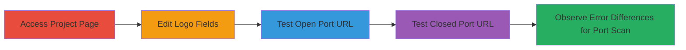

# SSRF Port Scanning via JSON Feed in Infogram Project Logo

Multi-stage attack chain demonstrating a complete attack workflow for exploiting SSRF in Infogram to scan ports on arbitrary hosts.

## Chain Metrics Dashboard

| Metric | Value |
|--------|-------|
| Chain Status | Unverified |
| Total Steps | 4 |
| Execution Time | ~5 minutes |
| Skill Level | Beginner |
| Complexity | Low |
| Impact Level | Medium |

## Attack Flow Visualization

## Prerequisites & Requirements

### Required Tools

- Web browser (e.g., Chrome or Firefox)

### Target Environment

- Infogram platform (https://infogram.com)
- Access to a user project page
- No special services or ports required on attacker's side

### Initial Access Requirements

- Valid Infogram account with access to a project
- Network access to infogram.com
- No prior credentials beyond basic user login

## Detailed Attack Procedures

### Step 1: Access Project Page
procedure: [[procedures/Access-Infogram-User-Project-Page]]

**Objective**: Navigate to the target Infogram user project to begin the editing process.

**Instructions**: Open a web browser and enter the project URL in the address bar.

**Expected Output**: The project page loads, displaying the Infogram visualization.

**Success Indicators**:
- Project page is accessible
- Edit options are visible

### Step 2: Edit Logo Fields
procedure: [[procedures/Edit-Logo-Fields-and-Add-JSON-Data-Source]]

**Objective**: Access the editing interface to input custom JSON data for the logo.

**Instructions**: Click on the edit button for logo fields and select the option to add a JSON data source.

**Expected Output**: The JSON input interface appears, ready for URL entry.

**Success Indicators**:
- Editing mode activated
- JSON data source addition prompt shown

### Step 3: Test Open Port
procedure: [[procedures/Input-JSON-URL-for-Open-Port-Testing]]

**Objective**: Input a URL pointing to an open port to trigger a connection attempt and observe the response.

**Instructions**: Enter a JSON-formatted URL targeting an open port (e.g., http://example.com:80/data.json) in the input field and submit.

**Expected Output**: Error message "Download failed" indicates successful connection to the open port.

**Success Indicators**:
- "Download failed" message appears
- Confirms server reached the target port

### Step 4: Test Closed Port
procedure: [[procedures/Input-JSON-URL-for-Closed-Port-Testing]]

**Objective**: Input a URL pointing to a closed port to differentiate error responses and map port status.

**Instructions**: Enter a JSON-formatted URL targeting a closed port (e.g., http://example.com:9999/data.json) in the input field and submit.

**Expected Output**: Error message "Invalid data source" indicates failure to connect, confirming closed port.

**Success Indicators**:
- "Invalid data source" message appears
- Port identified as closed via error distinction

## Attack Chain Summary

### Key Achievements

1. Successful navigation and editing access in Infogram project
2. Exploitation of SSRF via unvalidated JSON URLs
3. Port scanning capability demonstrated through error message differentiation
4. Identification of open/closed ports on arbitrary hosts for reconnaissance

## Technique & Tactic Coverage

### MITRE ATT&CK Techniques

- [[Exploit Public-Facing Application]] Exploit Public-Facing Application
- [[Network Service Scanning]] Network Service Scanning

### MITRE ATT&CK Tactics

- [[Reconnaissance]] Reconnaissance

---
*Last updated: 2023-10-05T00:00:00Z*
