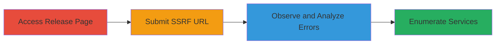

---
tags:
  - ssrf
  - port-scanning
  - nextcloud
  - localhost
  - enumeration
type: attack_chain
tools: []
tactics:
  - '[[Reconnaissance]]'
  - '[[Initial Access]]'
verified: false
platforms:
  - Web
submitted: true
complexity: medium
created_at: '2023-10-01T00:00:00Z'
procedures:
  - '[[procedures/Access-Nextcloud-App-Release-Creation-Page]]'
  - '[[procedures/Submit-Localhost-URL-for-SSRF]]'
  - '[[procedures/Analyze-SSRF-Error-Responses-for-Port-Enumeration]]'
step_count: 3
techniques:
  - '[[Exploit Public-Facing Application]]'
  - '[[Active Scanning]]'
updated_at: '2025-12-14T04:39:02.322Z'
description: >-
  A multi-step attack exploiting SSRF in the Nextcloud app release creation page
  to perform localhost port scanning and enumerate internal services.
skill_level: intermediate
impact_level: medium
id: df50c3d0-52ff-48a0-8d8a-dc9891fbe108
validated: true
mitre_tactics:
  - '[[Reconnaissance]]'
  - '[[Initial Access]]'
mitre_techniques:
  - '[[Exploit Public-Facing Application]]'
  - '[[Active Scanning]]'
---
# SSRF Port Scanning via Nextcloud App Release Download Link

Multi-stage attack chain demonstrating exploitation of a Server-Side Request Forgery (SSRF) vulnerability in the Nextcloud app release creation page to scan localhost ports and enumerate internal services like SSH and HTTP.

## Chain Metrics Dashboard

| Metric | Value |
|--------|-------|
| Chain Status | Unverified |
| Total Steps | 3 |
| Execution Time | ~5 minutes |
| Skill Level | Intermediate |
| Complexity | Medium |
| Impact Level | Medium |

## Attack Flow Visualization

## Prerequisites & Requirements

### Required Tools

- Web browser (e.g., Chrome or Firefox)

### Target Environment

- Nextcloud apps developer portal at https://apps.nextcloud.com
- Web platform with access to the release creation form
- No authentication required for public access

### Initial Access Requirements

- Internet access to the public-facing Nextcloud apps site
- No credentials needed; the form is publicly accessible

## Detailed Attack Procedures

### Step 1: Access the App Release Creation Page
procedure: [[procedures/Access-Nextcloud-App-Release-Creation-Page]]

**Objective**: Navigate to the vulnerable form to prepare for SSRF exploitation.

**Instructions**: Open a web browser and directly access the release creation endpoint.

**Expected Output**: The form page loads, displaying fields including the 'Download Link' input.

**Success Indicators**:
- Page loads without errors
- 'Download Link' field is visible and editable

### Step 2: Submit Localhost URL for SSRF
procedure: [[procedures/Submit-Localhost-URL-for-SSRF]]

**Objective**: Inject a localhost URL into the form to trigger the server-side request to internal addresses.

**Instructions**: Enter a target localhost URL (e.g., https://127.0.0.1:22) into the 'Download Link' field and submit the form.

**Expected Output**: The server processes the request and returns an error or success message based on the port status.

**Success Indicators**:
- Form submission triggers a server response
- Error message indicates connection attempt to the specified port

### Step 3: Analyze Error Responses for Port Enumeration
procedure: [[procedures/Analyze-SSRF-Error-Responses-for-Port-Enumeration]]

**Objective**: Interpret the server's error messages to determine open ports and enumerate services.

**Instructions**: Repeat submissions for different ports (e.g., 22 for SSH, 80 for HTTP, 21 for Telnet) and note the response differences.

**Expected Output**: Distinct error messages revealing open (connection successful) vs. closed (connection failed) ports.

**Success Indicators**:
- Identification of open ports like 22 (SSH) and 80 (HTTP)
- Confirmation of closed ports like 21 (Telnet)

## Attack Chain Summary

### Key Achievements

1. Successful access to the vulnerable form without authentication.
2. Triggered SSRF requests to localhost, bypassing external restrictions.
3. Enumerated internal services, enabling further reconnaissance on protected network resources.

## Technique & Tactic Coverage

### MITRE ATT&CK Techniques

- [[Exploit Public-Facing Application]] Exploit Public-Facing Application
- [[Active Scanning]] Active Scanning

### MITRE ATT&CK Tactics

- [[Reconnaissance]] Reconnaissance
- [[Initial Access]] Initial Access

---
*Last updated: 2023-10-01T00:00:00Z*
