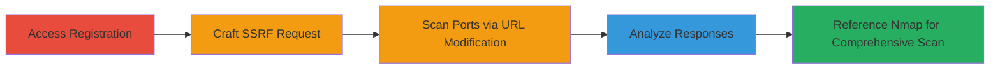

# SSRF Port Scanning via RelateIQ Registration Custom Server Option

Multi-stage attack chain demonstrating exploitation of a Server-Side Request Forgery (SSRF) vulnerability in RelateIQ's user registration process. By selecting the custom server option, attackers can trigger the validateOffice365Account RPC method to make arbitrary requests to internal and external hosts, enabling port scanning of the target's infrastructure. This reveals open ports on localhost (e.g., 80, 135, 445, 3389, 49152, 49154), exposing internal network details without direct access.

## Chain Metrics Dashboard

| Metric | Value |
|--------|-------|
| Chain Status | Unverified |
| Total Steps | 5 |
| Execution Time | ~10 minutes |
| Skill Level | Intermediate |
| Complexity | Medium |
| Impact Level | High |

## Attack Flow Visualization



## Prerequisites & Requirements

### Required Tools

- [[tools/nmap]]
- Browser or HTTP client (e.g., curl)

### Target Environment

- RelateIQ application at app.relateiq.com
- Web platform with GWT RPC endpoint (/app/GWT.rpc)
- No authentication required for registration page

### Initial Access Requirements

- Public internet access to app.relateiq.com
- No prior credentials needed; exploits public-facing registration

## Detailed Attack Procedures

### Step 1: Access Registration Page and Select Custom Server
procedure: [[procedures/Exploit-SSRF-in-RelateIQ-Registration-for-Port-Scanning]]

**Objective**: Initiate the registration process to reach the custom server configuration, which triggers the vulnerable validateOffice365Account method.

**Instructions**: Navigate to the RelateIQ registration page at https://app.relateiq.com and select the custom server option during signup. This prepares the environment for SSRF exploitation without completing full registration.

**Expected Output**: Custom server input fields appear, allowing URL specification for Office365 validation.

**Success Indicators**:
- Custom server option selected
- validateOffice365Account method is invoked on URL submission

### Step 2: Send Crafted POST Request to GWT RPC Endpoint
procedure: [[procedures/Exploit-SSRF-in-RelateIQ-Registration-for-Port-Scanning]]

**Objective**: Exploit SSRF by sending a POST request with an arbitrary URL (e.g., localhost port) to force the server to connect to attacker-specified hosts.

**Instructions**: Use [[commands/relateiq-ssrf-post]] to send the GWT-serialized RPC request targeting https://127.0.0.1:1:

```bash
curl -X POST https://app.relateiq.com/app/GWT.rpc \
  -H "Content-Type: text/x-gwt-rpc; charset=utf-8" \
  -H "X-GWT-Permutation: 95882AF82F06F7F3497A1C7BDD950153" \
  -H "X-GWT-Module-Base: https://app.relateiq.com/app/" \
  -d '7|2|10|https://app.relateiq.com/app/|11E595F5F188A97EA5C0F616EDA48ACD|com.google.gwt.user.client.rpc.XsrfToken/4254043109|18E2A3D3C932C5D49E0CF355C34327E4|com.relateiq.web.client.UtilityService|validateOffice365Account|java.lang.String/2004016611|123@123.com|123|https://127.0.0.1:1|1|2|3|4|5|6|4|7|7|7|7|8|9|9|10|'
```

**Expected Output**: Server response indicating connection attempt, such as HTTP 504 for open ports.

**Success Indicators**:
- Request accepted without validation errors
- Server makes outbound request to specified URL

### Step 3: Modify URL to Target Different IPs and Ports
procedure: [[procedures/Exploit-SSRF-in-RelateIQ-Registration-for-Port-Scanning]]

**Objective**: Iterate over target IPs and ports to perform systematic scanning of internal/external systems.

**Instructions**: Update the URL parameter in [[commands/relateiq-ssrf-post]] (e.g., change to https://127.0.0.1:80, https://internal-ip:445) and resend requests for various TCP ports.

**Expected Output**: Varied responses based on port status (e.g., timeout for open, connection error for closed).

**Success Indicators**:
- Multiple ports tested successfully
- Differences in response times/patterns observed

### Step 4: Analyze HTTP Responses for Open Ports
procedure: [[procedures/Exploit-SSRF-in-RelateIQ-Registration-for-Port-Scanning]]

**Objective**: Interpret server responses to distinguish open from closed ports, mapping the network topology.

**Instructions**: Review responses from previous requests: Open ports yield HTTP 504 Gateway Timeout or 'The underlying connection was closed'; closed ports show 'Unable to connect to the remote server'. Log results for ports like 80 (HTTP), 135 (RPC), 445 (SMB), 3389 (RDP), 49152-49154 (dynamic).

**Expected Output**: List of open ports: 80, 135, 445, 3389, 49152, 49154.

**Success Indicators**:
- Open ports identified via error patterns
- Internal services exposed (e.g., RDP on 3389)

### Step 5: Reference Nmap Top 50 Ports for Comprehensive Testing
procedure: [[procedures/Exploit-SSRF-in-RelateIQ-Registration-for-Port-Scanning]]

**Objective**: Use nmap's top 50 ports as a reference to guide SSRF-based scanning, ensuring coverage of common services.

**Instructions**: Consult [[tools/nmap]] top 50 list locally to select ports, then apply them in Step 3's URL modifications. For example, test ports 22, 80, 443, etc., via SSRF requests.

**Expected Output**: Confirmed open ports matching nmap reference: 80, 135, 445, 3389, 49152, 49154.

**Success Indicators**:
- Scan aligns with nmap's common ports
- Additional internal details revealed

## Attack Chain Summary

### Key Achievements

1. Exploited SSRF in public registration to bypass URL validation
2. Performed blind port scanning from server-side infrastructure
3. Exposed internal ports (e.g., RDP, SMB) revealing network topology

## Technique & Tactic Coverage

### MITRE ATT&CK Techniques

- [[Exploit Public-Facing Application]] Exploit Public-Facing Application
- [[Active Scanning]] Active Scanning

### MITRE ATT&CK Tactics

- [[Initial Access]] Initial Access
- [[Reconnaissance]] Reconnaissance

---
*Last updated: 2023-10-01T00:00:00Z*
