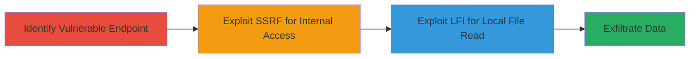

# SSRF and LFI Exploitation in Semrush Site Audit Tool via Protocol Verification Bypass

Multi-stage attack chain demonstrating exploitation of SSRF and LFI in Semrush's Site Audit tool, where the lack of connection protocol verification allows attackers to forge internal server requests and include local files, potentially leading to data exfiltration or further compromise.

## Chain Metrics Dashboard

| Metric | Value |
|--------|-------|
| Chain Status | Unverified |
| Total Steps | 2 |
| Execution Time | ~5 minutes |
| Skill Level | Intermediate |
| Complexity | Medium |
| Impact Level | High |

## Attack Flow Visualization



## Prerequisites & Requirements

### Required Tools

- Browser or proxy tool like Burp Suite for request manipulation

### Target Environment

- Web platform
- Access to Semrush Site Audit tool endpoint
- No specific ports required beyond standard HTTPS (443)

### Initial Access Requirements

- Valid user account or public access to the Site Audit tool
- Ability to submit audit URLs
- Network access to the target Semrush instance

## Detailed Attack Procedures

### Step 1: Identify Vulnerable Endpoint

procedure: [[procedures/Exploit-SSRF-in-Semrush-Site-Audit]]

**Objective**: Locate the Site Audit tool input field vulnerable to protocol manipulation for SSRF setup.

**Instructions**: Navigate to the Semrush Site Audit tool and inspect the URL submission form. Use developer tools or a proxy to monitor requests. Submit a test URL like `http://example.com` and observe if protocol checks are absent by attempting variations.

**Expected Output**: Confirmation of endpoint acceptance of non-HTTP protocols without validation.

**Success Indicators**:
- Form accepts arbitrary URL schemes
- No immediate rejection on protocol mismatch

### Step 2: Exploit SSRF and LFI

procedure: [[procedures/Exploit-LFI-in-Semrush-Site-Audit]]

**Objective**: Perform SSRF to access internal resources and LFI to read local files, chaining the vulnerabilities for maximum impact.

**Instructions**: For SSRF, use [[commands/curl-ssrf-test]] to submit an internal URL like `http://169.254.169.254/latest/meta-data/` via the audit tool:

```bash
curl -X POST 'https://semrush-site-audit-endpoint.com/audit' -d 'url=http://169.254.169.254/latest/meta-data/' -H 'Content-Type: application/x-www-form-urlencoded'
```

For LFI, modify to `file:///etc/passwd` and submit similarly with [[commands/curl-lfi-test]]:

```bash
curl -X POST 'https://semrush-site-audit-endpoint.com/audit' -d 'url=file:///etc/passwd' -H 'Content-Type: application/x-www-form-urlencoded'
```

Monitor responses for leaked internal data or file contents.

**Expected Output**: Server response containing internal metadata or local file contents.

**Success Indicators**:
- Internal service response (e.g., AWS metadata)
- Local file contents displayed or exfiltrated

## Attack Chain Summary

### Key Achievements

1. Bypassed protocol verification to enable SSRF for internal reconnaissance
2. Achieved LFI to read sensitive local files
3. Demonstrated high-impact unauthorized access without authentication escalation

## Technique & Tactic Coverage

### MITRE ATT&CK Techniques

- [[Exploit Public-Facing Application]]
- [[File and Directory Discovery]]

### MITRE ATT&CK Tactics

- [[Initial Access]]
- [[Discovery]]

---
*Last updated: 2023-10-01T00:00:00Z*
