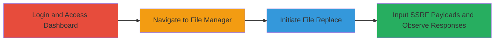

---
tags:
  - ssrf
  - port-enumeration
  - concrete-cms
  - localhost
type: attack_chain
tools: []
tactics:
  - '[[Reconnaissance]]'
verified: false
platforms:
  - Web
submitted: true
complexity: medium
created_at: '2023-10-01T00:00:00Z'
procedures:
  - '[[procedures/Exploit-SSRF-in-Concrete-CMS-File-Replace]]'
step_count: 4
techniques:
  - '[[Exploit Public-Facing Application]]'
  - '[[Network Service Scanning]]'
updated_at: '2025-12-14T04:08:48.798Z'
description: >-
  An authenticated SSRF vulnerability in Concrete CMS 8.2.0 allows port scanning
  of localhost services via the File Replace feature.
skill_level: intermediate
impact_level: high
id: 1b5035e6-9718-47b7-ba9f-0c22b2c49519
validated: true
mitre_tactics:
  - '[[Reconnaissance]]'
mitre_techniques:
  - '[[Exploit Public-Facing Application]]'
  - '[[Network Service Scanning]]'
---
# SSRF in Concrete CMS File Replace to Enumerate Internal Ports

Multi-stage attack chain demonstrating a complete attack workflow exploiting SSRF in Concrete CMS version 8.2.0 to scan localhost ports and identify internal services like web servers and databases.

## Chain Metrics Dashboard

| Metric | Value |
|--------|-------|
| Chain Status | Unverified |
| Total Steps | 4 |
| Execution Time | ~5 minutes |
| Skill Level | Intermediate |
| Complexity | Medium |
| Impact Level | High |

## Attack Flow Visualization

## Prerequisites & Requirements

### Required Tools

- Web browser (e.g., Chrome or Firefox with developer tools)

### Target Environment

- Concrete CMS version 8.2.0 running on a web server (PHP-based)
- Open ports on localhost such as 80 (web server) and 3306 (MySQL database)
- Network access to the CMS dashboard

### Initial Access Requirements

- Valid authenticated credentials for an Admin group user
- Direct access to the CMS instance (no prior network compromise needed)

## Detailed Attack Procedures

### Step 1: Login to the Dashboard

**Objective**: Gain authenticated access to the Concrete CMS dashboard to enable interaction with administrative features.

**Instructions**: Open a web browser and navigate to the Concrete CMS login page. Enter credentials for a user in the Admin group or equivalent permissions. Submit the login form to access the dashboard.

**Expected Output**: Successful redirection to the dashboard homepage, confirming authenticated session.

**Success Indicators**:
- Dashboard loads without errors
- User profile or admin menu visible

### Step 2: Navigate to Files > File Manager page

**Objective**: Access the file management interface where the vulnerable File Replace feature is located.

**Instructions**: From the dashboard, locate and click on the "Files" menu in the navigation sidebar, then select "File Manager" to open the file listing interface.

**Expected Output**: File Manager page displays a list of uploaded files or an empty directory view.

**Success Indicators**:
- File Manager interface loads
- Options to upload or manage files are available

### Step 3: Open the Replace option for any uploaded file and select Add remote files

procedure: [[procedures/Exploit-SSRF-in-Concrete-CMS-File-Replace]]

**Objective**: Initiate the file replacement process to access the remote file addition feature, setting up for SSRF exploitation.

**Instructions**: In the File Manager, select any existing uploaded file. Click the "Replace" or edit action button associated with the file. In the replacement dialog, choose the "Add remote files" option to open the URL input field for remote sources.

**Expected Output**: Dialog opens with an input field for remote URLs and a submit button.

**Success Indicators**:
- Replace dialog appears
- Remote file addition option is selectable

### Step 4: Input remote URLs targeting localhost ports and observe responses

procedure: [[procedures/Exploit-SSRF-in-Concrete-CMS-File-Replace]]

**Objective**: Exploit SSRF by submitting localhost URLs to probe ports, distinguishing open from closed based on error responses.

**Instructions**: In the remote URL input field, enter test URLs like `http://127.0.0.1:1/` for a closed port, submit, and note the error (e.g., "Unable to connect... Connection refused"). Repeat with `http://127.0.0.1:80/` for an open port (error: "Unknown mime-type: text/html; charset=UTF-8"), `http://127.0.0.1:3305/` (closed, connection refused), and `http://127.0.0.1:3306/` (open, "A valid response status line was not found"). Analyze differences to map open ports and services (e.g., port 80 for web server, 3306 for MySQL).

**Expected Output**: Varied error messages indicating connection success/failure, allowing port enumeration.

**Success Indicators**:
- Different error types for open vs. closed ports
- Identification of services like web on 80 and database on 3306

## Attack Chain Summary

### Key Achievements

1. Authenticated access to vulnerable File Replace feature
2. Successful SSRF payloads to localhost without IP validation
3. Enumeration of open TCP ports (e.g., 80, 3306) via distinguishable error responses
4. Mapping of internal services for further reconnaissance

## Technique & Tactic Coverage

### MITRE ATT&CK Techniques

- [[Exploit Public-Facing Application]] Exploit Public-Facing Application
- [[Network Service Scanning]] Network Service Scanning

### MITRE ATT&CK Tactics

- [[Reconnaissance]] Reconnaissance

---
*Last updated: 2023-10-01T00:00:00Z*
