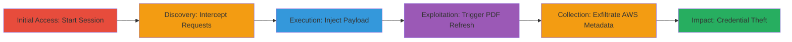

# SSRF in FAST PDF Generation to Exfiltrate AWS Instance Credentials

Multi-stage attack chain demonstrating exploitation of a Server-Side Request Forgery (SSRF) vulnerability in the DoD's Functional Administrative Support Tool (FAST) v1.0, where JavaScript payloads are injected into the PDF generation process to force server-side loading of internal AWS metadata endpoints, leading to credential theft.

## Chain Metrics Dashboard

| Metric | Value |
|--------|-------|
| Chain Status | Unverified |
| Total Steps | 6 |
| Execution Time | ~10 minutes |
| Skill Level | Intermediate |
| Complexity | Medium |
| Impact Level | High |

## Attack Flow Visualization

## Prerequisites & Requirements

### Required Tools

- [[tools/Burp-Suite]]

### Target Environment

- Web application: FAST v1.0 hosted on DoD infrastructure (e.g., URL redacted as ███/)
- Required services/ports: HTTP/HTTPS on standard ports (80/443)
- AWS environment with EC2 instances using IAM roles (e.g., EC2CloudWatchRole)
- Network access requirements: Direct access to the public-facing FAST application

### Initial Access Requirements

- No prior credentials needed; application allows anonymous session starts with MCC code (e.g., 'h99')
- Network position: External attacker with internet access to the target URL
- Prior access needed: None, but Burp Suite proxy setup for request interception

## Detailed Attack Procedures

### Step 1: Start a New Session
procedure: [[procedures/Exploit-SSRF-via-JavaScript-Injection-in-FAST-PDF]]

**Objective**: Initiate a session in the FAST application to set up the environment for form submission and PDF generation.

**Instructions**: Navigate to the target URL (redacted as ███/), select 'BEGIN NEW SESSION', enter an MCC code (e.g., 'h99'), and submit the form.

**Expected Output**: Session starts, redirecting to the main form interface.

**Success Indicators**:
- Form page loads successfully
- MCC code accepted without errors

### Step 2: Fill in Form Data with Traffic Interception
procedure: [[procedures/Exploit-SSRF-via-JavaScript-Injection-in-FAST-PDF]]

**Objective**: Complete initial form fields while intercepting HTTP traffic to prepare for payload modification.

**Instructions**: Configure Burp Suite as a proxy to intercept traffic. Select a process, fill in random data including an EDIPI code (10-digit number, e.g., 0123456789), and click CONTINUE. Monitor requests in Burp Suite.

**Expected Output**: Form progresses to point 3 (Get Action Items) with intercepted requests visible.

**Success Indicators**:
- Requests captured in Burp Suite
- Form data submitted successfully

### Step 3: Generate and View the PDF
procedure: [[procedures/Exploit-SSRF-via-JavaScript-Injection-in-FAST-PDF]]

**Objective**: Trigger the PDF generation process to identify the save request for later modification.

**Instructions**: In point 3, click PRINT (VIEW PDF) to open a new window with the dynamically generated PDF at a URL like █████/print/checklist/fast_session_XXXXXX.pdf. Observe the request in Burp Suite.

**Expected Output**: PDF loads in a new window; save request to /api/save/ is intercepted.

**Success Indicators**:
- PDF URL generated and accessible
- /api/save/ request captured

### Step 4: Intercept and Send Save Request to Repeater
procedure: [[procedures/Exploit-SSRF-via-JavaScript-Injection-in-FAST-PDF]]

**Objective**: Isolate the vulnerable save request for payload injection.

**Instructions**: In Burp Suite, locate the last request to /api/save/, right-click it, and select 'Send to Repeater'.

**Expected Output**: Request loaded into Burp Repeater tab for modification.

**Success Indicators**:
- Request successfully sent to Repeater
- JSON body visible for editing

### Step 5: Modify Request with Malicious Payload
procedure: [[procedures/Exploit-SSRF-via-JavaScript-Injection-in-FAST-PDF]]

**Objective**: Inject JavaScript payload into the globalInfo JSON to enable SSRF during PDF rendering.

**Instructions**: In Burp Repeater, modify the 'name' value in the 'globalInfo' JSON object to the payload: `</script>`. Then send the request using [[commands/inject-javascript-payload-for-ssrf]].

**Expected Output**: Server responds with 'status ok'.

**Success Indicators**:
- Response status: ok
- No validation errors from server

### Step 6: Refresh PDF URL to Trigger Exploitation
procedure: [[procedures/Exploit-SSRF-via-JavaScript-Injection-in-FAST-PDF]]

**Objective**: Execute the injected payload to fetch and display AWS metadata credentials.

**Instructions**: Refresh the PDF URL (e.g., █████/print/checklist/fast_session_XXXXXX.pdf) to trigger server-side rendering of the injected iframe, loading the AWS metadata endpoint.

**Expected Output**: PDF renders with embedded iframe content showing JSON like {"Code": "Success", "AccessKeyId": "███", "SecretAccessKey": "████", "Token": "██████"}.

**Success Indicators**:
- AWS credentials visible in the PDF output
- JSON response from metadata service captured

## Attack Chain Summary

### Key Achievements

1. Successful session initiation and form completion in FAST v1.0
2. Interception and modification of /api/save/ request with SSRF payload
3. Server-side execution leading to AWS IAM credential exfiltration

## Technique & Tactic Coverage

### MITRE ATT&CK Techniques

- [[Exploit Public-Facing Application]] Exploit Public-Facing Application
- [[Steal Application Access Token]] Steal Application Access Token

### MITRE ATT&CK Tactics

- [[Initial Access]] Initial Access
- [[Collection]] Collection

---
*Last updated: 2023-10-01T00:00:00Z*
