# SSRF in GitLab CI Runners to Access Internal GCP Metadata and Exfiltrate Sensitive Data

Multi-stage attack chain exploiting a Server-Side Request Forgery (SSRF) vulnerability in GitLab CI runners. The attack begins by setting up a malicious CI pipeline that, on initial run, appears benign but on re-run bypasses SSRF protections, allowing access to internal cloud metadata endpoints. This leads to stealing Google Cloud service account tokens, enumerating storage buckets, downloading sensitive files like private PGP keys and runtime metrics, and retrieving SSH keys, potentially compromising GitLab's internal infrastructure.

## Chain Metrics Dashboard

| Metric | Value |
|--------|-------|
| Chain Status | Unverified |
| Total Steps | 7 |
| Execution Time | ~15 minutes |
| Skill Level | Intermediate |
| Complexity | Medium |
| Impact Level | High |

## Attack Flow Visualization

```mermaid
graph LR
    A[Setup CI Pipeline] --> B[Initial Run - Benign]
    B --> C[Re-run - Bypass SSRF]
    C --> D[Access Metadata & Token]
    D --> E[Inspect Token & Project]
    E --> F[Enumerate Buckets & Download Files]
    F --> G[Retrieve SSH Keys]
    G --> H[Exfiltration Complete]

    style A fill:#e74c3c
    style B fill:#f39c12
    style C fill:#f39c12
    style D fill:#3498db
    style E fill:#3498db
    style F fill:#9b59b6
    style G fill:#9b59b6
    style H fill:#27ae60
```

## Prerequisites & Requirements

### Required Tools

- [[tools/curl]]

### Target Environment

- GitLab CI runners on Google Cloud Platform (GCP) or DigitalOcean
- Access to create and run CI pipelines in a GitLab project
- Docker images like node:latest
- Services: Google Cloud Storage, Google Compute Engine

### Initial Access Requirements

- Valid GitLab account with permissions to create repositories and run CI builds
- No special credentials needed beyond project access
- Network position: Internal to GitLab CI environment

## Detailed Attack Procedures

### Step 1: Setup CI Pipeline
procedure: [[procedures/Setup-GitLab-CI-Pipeline-for-SSRF]]

**Objective**: Create a malicious .gitlab-ci.yml and run.sh script to embed the SSRF payload in the CI pipeline.

**Instructions**: Define the pipeline stages and scripts as per the procedure, ensuring the curl command targets internal metadata.

**Expected Output**: Pipeline configuration committed to the repository.

**Success Indicators**:
- .gitlab-ci.yml and run.sh files created successfully
- No errors in syntax validation

### Step 2: Trigger Initial CI Build Run
procedure: [[procedures/Trigger-Initial-CI-Build-Run]]

**Objective**: Execute the pipeline for the first time to confirm benign behavior and SSRF protections are in place.

**Instructions**: Push the commit to trigger the build and monitor logs for normal execution without metadata leakage.

**Expected Output**: Build completes with tests passing and packing succeeding, no internal data exposed.

**Success Indicators**:
- Pipeline runs without errors
- No metadata output in logs

### Step 3: Re-run CI Build to Bypass SSRF Protections
procedure: [[procedures/Re-run-CI-Build-to-Bypass-SSRF-Protections]]

**Objective**: Re-execute the build to exploit the vulnerability, allowing access to internal metadata endpoints.

**Instructions**: Manually re-run the failed or completed job and capture the output from the curl command.

**Expected Output**: Metadata paths like id, hostname, user-data listed in the build logs.

**Success Indicators**:
- Internal metadata endpoints revealed on re-run
- SSRF protections bypassed

### Step 4: Obtain GCP Service Account Token via Metadata
procedure: [[procedures/Obtain-GCP-Service-Account-Token-via-Metadata]]

**Objective**: Use the SSRF access to fetch a service account token from Google metadata service.

**Instructions**: Execute the curl command with the Metadata-Flavor header to retrieve the token.

**Expected Output**: JSON object containing the access token.

**Success Indicators**:
- Valid token obtained
- Token usable for API calls

### Step 5: Inspect Token Scopes and Retrieve Project ID
procedure: [[procedures/Inspect-Token-Scopes-and-Retrieve-Project-ID]]

**Objective**: Validate the token's permissions and get the GCP project ID for further enumeration.

**Instructions**: Query the tokeninfo endpoint and metadata for project ID.

**Expected Output**: Scopes like devstorage.read_only and project ID (e.g., gitlab-ci-155816).

**Success Indicators**:
- Scopes confirm read access to storage
- Project ID retrieved

### Step 6: Enumerate and Access GCP Storage Buckets
procedure: [[procedures/Enumerate-and-Access-GCP-Storage-Buckets]]

**Objective**: Use the token to list buckets, enumerate objects, and download sensitive files.

**Instructions**: List buckets, then objects in specific buckets like gitlab-runner-secrets, and download files.

**Expected Output**: List of buckets and objects; downloaded files like package_signing.gpg and metrics data.

**Success Indicators**:
- Buckets enumerated (e.g., gitlab-ci-usage-outputs)
- Sensitive files downloaded

### Step 7: Retrieve Project SSH Keys from Metadata
procedure: [[procedures/Retrieve-Project-SSH-Keys-from-Metadata]]

**Objective**: Access SSH keys stored in project metadata attributes.

**Instructions**: Curl the metadata endpoint for ssh-key attribute.

**Expected Output**: SSH public keys with user emails and expiration dates.

**Success Indicators**:
- SSH keys exfiltrated
- Potential for lateral movement

## Attack Chain Summary

### Key Achievements

1. Bypassed SSRF protections in GitLab CI on re-run to access internal metadata.
2. Stolen GCP service account token enabling storage access.
3. Exfiltrated private PGP keys, runtime metrics, and SSH keys from internal buckets.
4. Demonstrated potential compromise of GitLab's production infrastructure.

## Technique & Tactic Coverage

### MITRE ATT&CK Techniques

- [[Exploit Public-Facing Application]]
- [[Steal Application Access Token]]
- [[Cloud Instance Metadata API]]
- [[File and Directory Discovery]]

### MITRE ATT&CK Tactics

- [[Initial Access]]
- [[Execution]]
- [[Discovery]]
- [[Collection]]
- [[Exfiltration]]

---
*Last updated: 2023-10-01T00:00:00Z*
