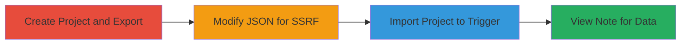

---
tags:
  - ssrf
  - gitlab
  - project-import
  - internal-access
type: attack_chain
tools:
  - '[[tools/CarrierWave]]'
  - '[[tools/GitLab]]'
tactics:
  - '[[Initial Access]]'
  - '[[Discovery]]'
commands: []
platforms:
  - Web
  - Linux
  - Ubuntu 18.04
  - Cloud (AWS/GCP)
complexity: medium
procedures:
  - '[[procedures/Create-and-Export-GitLab-Project-with-Note]]'
  - '[[procedures/Modify-Exported-Project-JSON-for-SSRF]]'
  - '[[procedures/Import-Modified-Project-to-Trigger-SSRF]]'
  - '[[procedures/Access-Imported-Note-to-View-Exfiltrated-Data]]'
step_count: 4
techniques:
  - '[[Exploit Public-Facing Application]]'
  - '[[Network Service Scanning]]'
description: >-
  Exploits an SSRF vulnerability in GitLab's project import to access internal
  resources via the remote_attachment_url parameter.
skill_level: intermediate
impact_level: high
id: 00d035c7-799e-4d97-b008-59b5a86a8311
created_at: '2025-12-11T03:47:39.491Z'
updated_at: '2025-12-11T03:47:39.491Z'
verified: false
validated: true
submitted: true
mitre_tactics:
  - '[[TA0001]]'
  - '[[TA0007]]'
mitre_techniques:
  - '[[T1190]]'
  - '[[T1046]]'
---
# SSRF in GitLab Project Import via Remote Attachment URL

Multi-stage attack chain exploiting an SSRF vulnerability in GitLab's project import feature to download and access internal resources, such as cloud metadata or services like Redis, potentially leading to remote code execution.

## Chain Metrics Dashboard

| Metric | Value |
|--------|-------|
| Chain Status | Unverified |
| Total Steps | 4 |
| Execution Time | ~15 minutes |
| Skill Level | Intermediate |
| Complexity | Medium |
| Impact Level | High |

## Attack Flow Visualization

## Prerequisites & Requirements

### Required Tools

- [[tools/CarrierWave]]
- [[tools/GitLab]]

### Target Environment

- Target OS/Platform: Ubuntu 18.04, Web
- Required services/ports: Internal services like Prometheus, Redis on localhost ports
- Network access requirements: Access to GitLab instance for project creation and import

### Initial Access Requirements

- Credential requirements: Valid GitLab account with project creation permissions
- Network position: External access to GitLab web interface
- Prior access needed: None beyond user account

## Detailed Attack Procedures

### Step 1: Create Project and Export - [[procedures/Create-and-Export-GitLab-Project-with-Note]]

**Procedure**: [[procedures/Create-and-Export-GitLab-Project-with-Note]]

**Objective**: Set up a base project with an issue and note for export and subsequent modification.

**Expected Output**: A exported tar.gz file containing project data including the note.

**Success Indicators**:
- Project successfully created and exported.
- Tar.gz file generated without errors.

### Step 2: Modify JSON for SSRF - [[procedures/Modify-Exported-Project-JSON-for-SSRF]]

**Procedure**: [[procedures/Modify-Exported-Project-JSON-for-SSRF]]

**Objective**: Edit the project.json to insert a malicious remote_attachment_url pointing to internal resources.

**Expected Output**: Modified project.json with arbitrary URL added to the note hash.

**Success Indicators**:
- JSON file updated with 'remote_attachment_url' key.
- No syntax errors in modified JSON.

### Step 3: Import Project to Trigger SSRF - [[procedures/Import-Modified-Project-to-Trigger-SSRF]]

**Procedure**: [[procedures/Import-Modified-Project-to-Trigger-SSRF]]

**Objective**: Recompress and import the modified export to trigger the SSRF via CarrierWave during note import.

**Expected Output**: Project imported successfully, with SSRF request executed to fetch internal data.

**Success Indicators**:
- Import completes without validation errors.
- Internal resource fetched and attached to note.

### Step 4: View Note for Exfiltrated Data - [[procedures/Access-Imported-Note-to-View-Exfiltrated-Data]]

**Procedure**: [[procedures/Access-Imported-Note-to-View-Exfiltrated-Data]]

**Objective**: Access the imported note to view the attached file from the SSRF request, revealing sensitive data.

**Expected Output**: Visibility of internal data like cloud metadata or service responses.

**Success Indicators**:
- Note displays attached file from internal URL.
- Sensitive information accessible in the attachment.

## Attack Chain Summary

### Key Achievements

1. Unauthorized access to internal services via SSRF.
2. Exfiltration of cloud metadata (AWS/GCP).
3. Potential RCE via exposed services like Redis.

## Technique & Tactic Coverage

### MITRE ATT&CK Techniques

- [[Exploit Public-Facing Application]]
- [[Network Service Scanning]]

### MITRE ATT&CK Tactics

- [[Initial Access]]
- [[Discovery]]

*Last updated: 2023-10-01*
