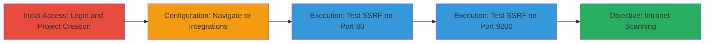

---
tags:
  - ssrf
  - gitlab
  - webhook
  - intranet-scanning
  - port-scanning
type: attack_chain
tools: []
tactics:
  - '[[Initial Access]]'
  - '[[Reconnaissance]]'
verified: false
platforms:
  - Web
submitted: true
complexity: medium
created_at: '2023-10-01T00:00:00Z'
procedures:
  - '[[procedures/Create-GitLab-Project-for-Webhook-Testing]]'
  - '[[procedures/Navigate-to-GitLab-Project-Integrations]]'
  - '[[procedures/Test-SSRF-on-Port-80-via-GitLab-Webhook]]'
  - '[[procedures/Test-SSRF-on-Port-9200-via-GitLab-Webhook]]'
step_count: 4
techniques:
  - '[[Exploit Public-Facing Application]]'
  - '[[Active Scanning]]'
updated_at: '2025-12-14T04:39:18.590Z'
description: >-
  Demonstrates a Server-Side Request Forgery (SSRF) vulnerability in GitLab's
  webhook integration, allowing attackers to scan internal ports and services by
  submitting localhost URLs.
skill_level: intermediate
impact_level: high
id: 53f3cb3c-fc9b-4645-8b14-4584aab03cab
validated: true
mitre_tactics:
  - '[[Initial Access]]'
  - '[[Reconnaissance]]'
mitre_techniques:
  - '[[Exploit Public-Facing Application]]'
  - '[[Active Scanning]]'
---
# SSRF in GitLab Webhook Integration for Intranet Port Scanning

Multi-stage attack chain demonstrating exploitation of an SSRF vulnerability in GitLab's webhook feature to scan internal network ports and reveal server details.

## Chain Metrics Dashboard

| Metric | Value |
|--------|-------|
| Chain Status | Unverified |
| Total Steps | 4 |
| Execution Time | ~5 minutes |
| Skill Level | Intermediate |
| Complexity | Medium |
| Impact Level | High |

## Attack Flow Visualization

## Prerequisites & Requirements

### Required Tools

- Web browser (e.g., Chrome or Firefox)

### Target Environment

- GitLab instance (e.g., gitlab.com)
- Valid user account with project creation permissions
- Network access to GitLab

### Initial Access Requirements

- Authenticated GitLab account
- No special privileges beyond standard user access
- Internet connectivity

## Detailed Attack Procedures

### Step 1: Initial Access
procedure: [[procedures/Create-GitLab-Project-for-Webhook-Testing]]

**Objective**: Gain access to a GitLab project where webhook integrations can be configured.

**Instructions**: Log in to GitLab and create a new project to serve as the testing ground for webhook configuration.

**Expected Output**: A new project created under the user's namespace, ready for settings access.

**Success Indicators**:
- Successful login to GitLab
- Project dashboard visible

### Step 2: Configuration
procedure: [[procedures/Navigate-to-GitLab-Project-Integrations]]

**Objective**: Access the integrations section to configure the webhook.

**Instructions**: From the project dashboard, navigate to the settings and integrations page.

**Expected Output**: Integrations configuration page loaded.

**Success Indicators**:
- URL matches https://gitlab.com/{username}/{project}/settings/integrations
- Webhook integration options visible

### Step 3: Execution - Port 80 Test
procedure: [[procedures/Test-SSRF-on-Port-80-via-GitLab-Webhook]]

**Objective**: Submit a localhost URL targeting port 80 to trigger SSRF and observe internal server responses.

**Instructions**: Enter the SSRF payload URL in the webhook field, save or test, and review the execution response for internal details.

**Expected Output**: Response indicating 'Hook executed successfully but returned HTTP 404' with nginx/1.12.1 details.

**Success Indicators**:
- HTTP 404 response from internal nginx server
- Confirmation of port 80 accessibility

### Step 4: Execution - Port 9200 Test
procedure: [[procedures/Test-SSRF-on-Port-9200-via-GitLab-Webhook]]

**Objective**: Test another internal port to further scan the intranet and identify service availability.

**Instructions**: Update the webhook URL to target port 9200, test the integration, and analyze the failure response.

**Expected Output**: Response showing 'Hook execution failed: Failed to open TCP connection to 127.0.0.1:9200 (Connection refused)'.

**Success Indicators**:
- Connection refused error indicating port 9200 is closed or filtered
- Evidence of internal network interaction

## Attack Chain Summary

### Key Achievements

1. Successful project setup and webhook configuration in GitLab
2. Triggered SSRF to probe internal port 80, revealing nginx server details
3. Probed port 9200, confirming intranet scanning capability
4. Demonstrated potential for broader internal reconnaissance

## Technique & Tactic Coverage

### MITRE ATT&CK Techniques

- [[Exploit Public-Facing Application]] Exploit Public-Facing Application
- [[Active Scanning]] Active Scanning

### MITRE ATT&CK Tactics

- [[Initial Access]] Initial Access
- [[Reconnaissance]] Reconnaissance

---
*Last updated: 2023-10-01T00:00:00Z*
