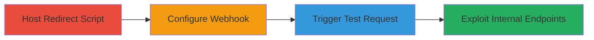

# SSRF in HackerOne Webhooks via IPv6-Mapped IPv4 Bypass to Access AWS Metadata and Internal DataDog Endpoints

Multi-stage attack chain demonstrating exploitation of a Server-Side Request Forgery (SSRF) vulnerability in HackerOne's webhook functionality. The attack bypasses anti-SSRF protections by using IPv6 addresses mapped to internal IPv4 endpoints, such as the AWS metadata service at 169.254.169.254, and extends to internal DataDog agent debug endpoints on port 5000, leading to information disclosure including system details like IP addresses, MAC addresses, hostnames, and RAM usage.

## Chain Metrics Dashboard

| Metric | Value |
|--------|-------|
| Chain Status | Unverified |
| Total Steps | 4 |
| Execution Time | ~15 minutes |
| Skill Level | Intermediate |
| Complexity | Medium |
| Impact Level | High |

## Attack Flow Visualization

## Prerequisites & Requirements

### Required Tools

- [[tools/000webhost-Free-Hosting]]

### Target Environment

- HackerOne platform with organizational access
- AWS EC2 instances (for metadata access)
- DataDog agent running on internal network (port 5000 exposed)
- Kubernetes environment (for kubelet queries)

### Initial Access Requirements

- Valid HackerOne account with permissions to manage organization program settings
- No special credentials needed beyond standard login
- Public internet access to host the redirect script

## Detailed Attack Procedures

### Step 1: Host Redirect Script
procedure: [[procedures/Host-PHP-Redirect-Script-for-SSRF]]

**Objective**: Create and host a public PHP script that redirects requests to an IPv6-mapped AWS metadata endpoint, bypassing SSRF filters.

**Instructions**: Use [[tools/000webhost-Free-Hosting]] to upload a PHP file containing CORS headers and a redirect to `http://[::ffff:a9fe:a9fe]` (IPv6 compressed form of 169.254.169.254). Save the public URL for later use.

**Expected Output**: A publicly accessible URL (e.g., https://example.000webhostapp.com/h1.php) that, when requested, redirects to the internal AWS endpoint.

**Success Indicators**:
- PHP script uploaded successfully
- Public URL responds with a 302 redirect

### Step 2: Configure Webhook
procedure: [[procedures/Configure-HackerOne-Webhook]]

**Objective**: Set up a webhook in HackerOne's organization settings using the malicious redirect URL to prepare for SSRF exploitation.

**Instructions**: Log in to HackerOne, navigate to the organization's program settings, locate the webhooks section, and create a new webhook targeting the hosted PHP URL.

**Expected Output**: Webhook configured without errors, ready for testing.

**Success Indicators**:
- Webhook added to settings
- No validation errors on URL input

### Step 3: Trigger and Verify SSRF
procedure: [[procedures/Trigger-Webhook-and-Verify-SSRF]]

**Objective**: Send a test request via the webhook to trigger the SSRF and confirm access to AWS metadata.

**Instructions**: Edit the webhook settings and click the 'Test request' button. Check the webhook logs for the response.

**Expected Output**: Logs show a response header like `server: EC2ws`, indicating successful access to the AWS metadata service.

**Success Indicators**:
- Presence of `server: EC2ws` in logs
- No external errors in webhook delivery

### Step 4: Exploit Internal Endpoints
procedure: [[procedures/Exploit-Internal-DataDog-Endpoints-via-SSRF]]

**Objective**: Use the SSRF to access additional internal debug endpoints on the DataDog agent, disclosing sensitive system information.

**Instructions**: Modify the redirect URL in the PHP script to target IPv6-mapped internal endpoints like `http://[::ffff:7f00:1]:5000/debug/pprof/heap?debug=1`. Trigger additional test requests and review logs for disclosed data.

**Expected Output**: Logs reveal DataDog agent details, including kubeletQueries, IP, MAC, hostname, and RAM usage.

**Success Indicators**:
- Debug endpoint responses in logs
- Exposure of internal system metrics

## Attack Chain Summary

### Key Achievements

1. Bypassed anti-SSRF protections using IPv6-mapped IPv4 addresses
2. Accessed AWS EC2 instance metadata, confirming internal network reach
3. Disclosed sensitive DataDog agent information, enabling further reconnaissance or DoS
4. Demonstrated potential for port scanning and unauthorized internal actions

## Technique & Tactic Coverage

### MITRE ATT&CK Techniques

- [[Exploit Public-Facing Application]]
- [[Steal Application Access Token]]

### MITRE ATT&CK Tactics

- [[Initial Access]]
- [[Discovery]]

---

*Last updated: 2023-10-01T00:00:00Z*
