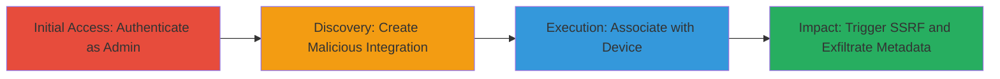

---
tags:
  - ssrf
  - aws
  - metadata
  - helium
  - lorawan
type: attack_chain
tools: []
tactics:
  - '[[Initial Access]]'
verified: false
platforms:
  - Web
  - AWS
submitted: true
complexity: medium
created_at: '2023-10-01T00:00:00Z'
procedures:
  - '[[procedures/Authenticate-as-Admin-to-Helium-Console]]'
  - '[[procedures/Create-Custom-HTTP-Integration-with-SSRF-Payload]]'
  - '[[procedures/Associate-Integration-with-LoRaWAN-Device]]'
  - '[[procedures/Trigger-SSRF-via-Device-Packet]]'
step_count: 4
techniques:
  - '[[Exploit Public-Facing Application]]'
updated_at: '2025-12-14T03:46:09.136Z'
description: >-
  Multi-stage attack exploiting SSRF in Helium Console's custom integration
  feature to force server requests to internal AWS metadata endpoints, enabling
  unauthorized access to sensitive instance data.
skill_level: intermediate
impact_level: high
id: 0e57a003-d949-445b-b9f7-0d116146b90b
validated: true
mitre_tactics:
  - '[[Initial Access]]'
mitre_techniques:
  - '[[Exploit Public-Facing Application]]'
---
# SSRF in Helium Console Custom Integration to Access AWS Metadata

Multi-stage attack chain demonstrating exploitation of a Server-Side Request Forgery (SSRF) vulnerability in the Helium Console's custom integration feature. An authenticated administrator can configure a custom HTTP integration to point to internal AWS metadata endpoints. When a connected LoRaWAN device sends a packet, the server forwards the request to the malicious endpoint, exposing sensitive AWS EC2 instance metadata such as IAM roles and credentials.

## Chain Metrics Dashboard

| Metric | Value |
|--------|-------|
| Chain Status | Unverified |
| Total Steps | 4 |
| Execution Time | ~5 minutes |
| Skill Level | Intermediate |
| Complexity | Medium |
| Impact Level | High |

## Attack Flow Visualization

## Prerequisites & Requirements

### Required Tools

- Web browser (e.g., Chrome with developer tools for inspection)

### Target Environment

- Helium Console at https://console.helium.com
- Active organization with admin credentials
- At least one connected LoRaWAN device
- AWS-hosted backend (EC2 instances with metadata service)

### Initial Access Requirements

- Valid admin credentials for an organization with devices
- Network access to the public Helium Console
- No prior internal access needed; exploits public-facing web app

## Detailed Attack Procedures

### Step 1: Authenticate as Admin
procedure: [[procedures/Authenticate-as-Admin-to-Helium-Console]]

**Objective**: Gain authenticated access to the Helium Console as an administrator to access integration features.

**Instructions**: Open a web browser and navigate to the Helium Console login page. Enter admin credentials for an organization that has at least one LoRaWAN device.

**Expected Output**: Successful login redirect to the organization dashboard.

**Success Indicators**:
- Dashboard displays organization details and devices
- Access to 'Integrations' tab is available

### Step 2: Create Malicious Integration
procedure: [[procedures/Create-Custom-HTTP-Integration-with-SSRF-Payload]]

**Objective**: Configure a custom HTTP integration with an internal AWS metadata URL to set up the SSRF vector.

**Instructions**: From the dashboard, navigate to the Integrations section and add a new custom HTTP integration. Set the endpoint to the AWS metadata service URL and method to GET. Add a label and save.

**Expected Output**: Integration created successfully with the specified label.

**Success Indicators**:
- Integration appears in the list with the malicious endpoint
- No validation errors on internal URL

### Step 3: Associate with Device
procedure: [[procedures/Associate-Integration-with-LoRaWAN-Device]]

**Objective**: Link the malicious integration to a LoRaWAN device to route device packets through the SSRF endpoint.

**Instructions**: Go to the Devices section, select a LoRaWAN device, and apply the integration label from the previous step.

**Expected Output**: Device configuration updated to use the custom integration.

**Success Indicators**:
- Device details show the associated integration label
- No errors in association

### Step 4: Trigger SSRF
procedure: [[procedures/Trigger-SSRF-via-Device-Packet]]

**Objective**: Force the server to make an internal request by simulating a device packet transmission, retrieving AWS metadata.

**Instructions**: Have the connected LoRaWAN device send an uplink packet (e.g., via device transmission). Monitor the console for the uplink message, which will include the response from the AWS metadata endpoint.

**Expected Output**: Uplink message in the console displays AWS EC2 metadata (e.g., instance ID, IAM role details).

**Success Indicators**:
- Metadata retrieved and visible in the console
- Confirmation of internal network access

## Attack Chain Summary

### Key Achievements

1. Authenticated access to Helium Console integrations
2. Bypassed URL validation to target internal AWS services
3. Exfiltrated sensitive EC2 metadata via device-triggered requests
4. Demonstrated potential for broader internal network pivoting

## Technique & Tactic Coverage

### MITRE ATT&CK Techniques

- [[Exploit Public-Facing Application]] Exploit Public-Facing Application

### MITRE ATT&CK Tactics

- [[Initial Access]] Initial Access

---
*Last updated: 2023-10-01T00:00:00Z*
