# SSRF in Kubernetes Admission Webhooks to Leak Cloud Metadata via Redirects

Multi-stage attack chain demonstrating exploitation of SSRF in Kubernetes kube-apiserver when using admission webhooks in cloud environments like GKE, AKS, EKS. An attacker with cluster access creates a malicious ValidatingWebhookConfiguration pointing to a controlled server that redirects to internal metadata endpoints. Triggering the webhook causes the apiserver to follow the redirect, and at high verbosity, logs leak full responses including credentials.

## Chain Metrics Dashboard

| Metric | Value |
|--------|-------|
| Chain Status | Unverified |
| Total Steps | 7 |
| Execution Time | ~15 minutes |
| Skill Level | Intermediate |
| Complexity | Medium |
| Impact Level | High |

## Attack Flow Visualization

```mermaid
graph LR
    A[Setup Vulnerable Cluster] --> B[Configure Logging]
    B --> C[Create Malicious Webhook]
    C --> D[Setup Redirect Server]
    D --> E[Enable Debug Proxy]
    E --> F[Trigger Webhook]
    F --> G[Exfiltrate via Logs]

    style A fill:#e74c3c
    style B fill:#f39c12
    style C fill:#f39c12
    style D fill:#3498db
    style E fill:#3498db
    style F fill:#9b59b6
    style G fill:#27ae60
```



## Prerequisites & Requirements

### Required Tools

- [[tools/minikube]]
- [[tools/kubectl]]
- [[tools/Flask]]
- [[tools/curl]]

### Target Environment

- Kubernetes cluster version 1.18.6 or vulnerable equivalent
- Cloud provider (GKE, AKS, EKS) for metadata leak impact
- Local host access for minikube simulation
- Ports 8001 (proxy) and 8067 (Flask server) available

### Initial Access Requirements

- Attacker must have cluster-admin or equivalent RBAC permissions to create ValidatingWebhookConfigurations and service accounts
- Network access to external URLs for webhook server
- No prior credentials needed beyond cluster access

## Detailed Attack Procedures

### Step 1: Setup Vulnerable Kubernetes Cluster
procedure: [[procedures/Setup-Vulnerable-Kubernetes-Cluster]]

**Objective**: Create a local Kubernetes cluster matching the vulnerable version to simulate the environment.

**Instructions**: Start minikube with the specified vulnerable version and no VM driver for direct host execution. Use [[commands/start-minikube-vulnerable]]:

```bash
minikube start --vm-driver=none --kubernetes-version='v1.18.6'
```

Wait for the cluster to initialize.

**Expected Output**: Minikube cluster starts successfully, kubeconfig updated.

**Success Indicators**:
- `kubectl cluster-info` shows running cluster
- Version confirmed as v1.18.6

### Step 2: Enable Verbose Logging in Kube-Apiserver
procedure: [[procedures/Enable-Verbose-Logging-in-Kube-Apiserver]]

**Objective**: Modify the apiserver manifest to enable detailed logging for capturing full HTTP responses.

**Instructions**: Edit the kube-apiserver manifest file to add logging flags. Access `/etc/kubernetes/manifests/kube-apiserver.yaml` and append `--log-dir=/var/log --logtostderr=false` to the container command.

**Expected Output**: Manifest updated; apiserver pod restarts with new flags.

**Success Indicators**:
- Pod logs show logging configuration applied
- No errors in apiserver startup

### Step 3: Create Malicious Admission Webhook
procedure: [[procedures/Create-Malicious-Admission-Webhook]]

**Objective**: Deploy a ValidatingWebhookConfiguration that points to an attacker-controlled external URL for service account operations.

**Instructions**: Apply the YAML configuration using [[commands/create-malicious-webhook]]:

```bash
kubectl create -f poc1.yaml
```

The YAML defines a webhook for `serviceaccounts` with `clientConfig.url: https://lazydog.me/aa`.

**Expected Output**: Webhook resource created successfully.

**Success Indicators**:
- `kubectl get validatingwebhookconfigurations` lists the new webhook
- No validation errors

### Step 4: Setup Attacker-Controlled Redirect Server
procedure: [[procedures/Setup-Attacker-Controlled-Redirect-Server]]

**Objective**: Launch a Flask server to receive webhook requests and redirect to internal endpoints like metadata servers.

**Instructions**: Install Flask with [[commands/install-flask]]:

```bash
pip install Flask
```

Then run the server using [[commands/run-flask-redirect-server]]:

```bash
FLASK_ENV=development FLASK_APP=poc1 flask run
```

The server (poc2.py) listens on port 8067, prints headers, and redirects non-/test paths to http://www.tencent.com/ (modify for metadata targets).

**Expected Output**: Server starts on http://127.0.0.1:8067.

**Success Indicators**:
- Server logs incoming requests
- Redirects function as expected

### Step 5: Enable Kubectl Proxy and Debug Flags
procedure: [[procedures/Enable-Kubectl-Proxy-and-Debug-Flags]]

**Objective**: Start proxy for debug access and set high verbosity to log full responses.

**Instructions**: Run proxy in background with [[commands/start-kubectl-proxy]]:

```bash
kubectl proxy &
```

Set verbosity to 10 using [[commands/set-klog-verbosity]]:

```bash
curl -XPUT --data "10" http://localhost:8001/debug/flags/v
```

**Expected Output**: Proxy on 8001; verbosity set to 10.

**Success Indicators**:
- `curl http://localhost:8001/version` responds
- Logs show v=10 enabled

### Step 6: Trigger Webhook with Service Account Creation
procedure: [[procedures/Trigger-Webhook-with-Service-Account-Creation]]

**Objective**: Create a service account to invoke the webhook, causing SSRF via redirect.

**Instructions**: Use [[commands/create-test-service-account]]:

```bash
kubectl create sa testpoc
```

This matches the webhook rule, sending AdmissionReview to the external URL.

**Expected Output**: Service account created; webhook invoked.

**Success Indicators**:
- `kubectl get sa testpoc` shows account
- Server receives request and redirects

### Step 7: Inspect Apiserver Logs for Leaked Responses
procedure: [[procedures/Inspect-Apiserver-Logs-for-Leaked-Responses]]

**Objective**: Retrieve logs to observe full SSRF response bodies, including potential credential leaks.

**Instructions**: Fetch logs using [[commands/retrieve-apiserver-logs]]:

```bash
curl http://localhost:8001/logs/kube-apiserver.INFO
```

Search for 'Response Body:' strings containing internal responses.

**Expected Output**: Log content with full HTTP responses from redirected endpoints.

**Success Indicators**:
- Logs include metadata or internal service data
- Evidence of SSRF exfiltration

## Attack Chain Summary

### Key Achievements

1. Simulated vulnerable Kubernetes environment
2. Forced apiserver SSRF to internal endpoints via webhook redirects
3. Leaked sensitive cloud metadata through verbose logging

## Technique & Tactic Coverage

### MITRE ATT&CK Techniques

- [[Exploit Public-Facing Application]] Exploit Public-Facing Application
- [[Cloud Instance Metadata API]] Cloud Instance Metadata API
- [[Steal Application Access Token]] Steal Application Access Token

### MITRE ATT&CK Tactics

- [[Collection]] Collection
- [[Command and Control]] Command and Control
- [[Discovery]] Discovery

---

*Last updated: 2024-10-01T00:00:00Z*
