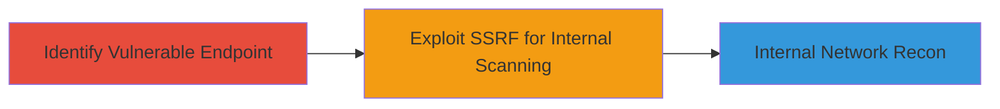

---
tags:
  - ssrf
  - internal-scanning
  - lark
  - web
type: attack_chain
tools: []
tactics:
  - '[[Reconnaissance]]'
verified: false
platforms:
  - Web
submitted: true
complexity: medium
created_at: '2023-10-01T00:00:00Z'
procedures:
  - '[[procedures/Exploit-SSRF-in-Lark-URL-Parameter]]'
step_count: 1
techniques:
  - '[[Exploit Public-Facing Application]]'
updated_at: '2025-12-14T04:39:09.748Z'
description: >-
  A Server-Side Request Forgery vulnerability in the Lark endpoint's 'URL'
  parameter allows attackers to make arbitrary requests to internal resources,
  facilitating host and port scanning on the internal network.
skill_level: intermediate
impact_level: high
id: 4232d238-33da-46a7-91b6-3ce9c6feba74
validated: true
mitre_tactics:
  - '[[Reconnaissance]]'
mitre_techniques:
  - '[[Exploit Public-Facing Application]]'
---
# SSRF in Lark Endpoint Enabling Internal Network Scanning

Multi-stage attack chain demonstrating exploitation of an SSRF vulnerability in a Lark endpoint to perform internal network reconnaissance.

## Chain Metrics Dashboard

| Metric | Value |
|--------|-------|
| Chain Status | Unverified |
| Total Steps | 1 |
| Execution Time | ~5 minutes |
| Skill Level | Intermediate |
| Complexity | Medium |
| Impact Level | High |

## Attack Flow Visualization



## Prerequisites & Requirements

### Required Tools

- [[commands/curl-ssrf-test]]

### Target Environment

- Web application (Lark platform)
- Access to the public-facing Lark endpoint
- No specific ports required beyond standard HTTPS (443)

### Initial Access Requirements

- Valid user session or public access to the Lark endpoint
- Network position: External attacker with internet access
- No prior credentials needed if endpoint is unauthenticated

## Detailed Attack Procedures

### Step 1: Exploit SSRF for Internal Scanning
procedure: [[procedures/Exploit-SSRF-in-Lark-URL-Parameter]]

**Objective**: Leverage the SSRF vulnerability in the 'URL' parameter to send requests to internal network resources, enabling host and port scanning.

**Instructions**: Identify the Lark endpoint vulnerable to SSRF, typically an API or integration point that accepts a 'URL' parameter. Use [[commands/curl-ssrf-test]] to craft a request that forces the server to fetch an internal URL, such as a local metadata service or internal host.

```bash
curl -X POST 'https://lark-endpoint.example.com/api/webhook' -d 'url=http://169.254.169.254/latest/meta-data/' -H 'Content-Type: application/json'
```

Monitor the response for internal data leakage or timing differences to confirm scanning capability. Iterate with variations like http://localhost:8080 or http://internal-host:port to map the network.

**Expected Output**: Server response containing internal resource data, error messages indicating internal access, or delayed responses suggesting port probing.

**Success Indicators**:
- Receipt of internal metadata or service responses
- Variations in response times confirming open ports/hosts
- No external blocking on internal requests

## Attack Chain Summary

### Key Achievements

1. Successful SSRF exploitation via 'URL' parameter
2. Ability to scan internal hosts and ports
3. Potential for further internal pivoting if deeper access is gained

## Technique & Tactic Coverage

### MITRE ATT&CK Techniques

- [[Exploit Public-Facing Application]]

### MITRE ATT&CK Tactics

- [[Reconnaissance]]

---
*Last updated: 2023-10-01T00:00:00Z*
