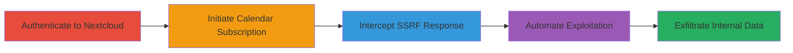

# SSRF in Nextcloud Calendar New Subscription to Exfiltrate Internal Data

Multi-stage attack chain demonstrating a complete attack workflow exploiting Server-Side Request Forgery (SSRF) in the New Subscription feature of the Nextcloud Calendar app. An authenticated user can trick the server into making arbitrary HTTP requests to internal or external URLs, leading to data exfiltration, internal service interactions, and network scanning.

## Chain Metrics Dashboard

| Metric | Value |
|--------|-------|
| Chain Status | Unverified |
| Total Steps | 4 |
| Execution Time | ~5 minutes |
| Skill Level | Intermediate |
| Complexity | Medium |
| Impact Level | High |

## Attack Flow Visualization



## Prerequisites & Requirements

### Required Tools

- [[tools/Burp-Suite]]
- Python 3 with requests library (for automation)

### Target Environment

- Nextcloud instance with Calendar app enabled
- Web platform running PHP
- Services: Calendar App on port 80/443
- Network access: Authenticated user account with standard permissions

### Initial Access Requirements

- Valid Nextcloud user credentials (no admin required)
- Direct access to the Nextcloud web interface
- No prior elevated access needed

## Detailed Attack Procedures

### Step 1: Authenticate to Nextcloud
procedure: [[procedures/Authenticate-to-Nextcloud]]

**Objective**: Gain authenticated access to the Nextcloud instance to enable interaction with the Calendar app.

**Instructions**: Log in using valid user credentials via the web interface.

**Expected Output**: Successful login redirect to the dashboard.

**Success Indicators**:
- User session established
- Access to apps like Calendar granted

### Step 2: Initiate SSRF via Calendar Subscription
procedure: [[procedures/Initiate-SSRF-via-Calendar-Subscription]]

**Objective**: Trigger the SSRF by subscribing to a malicious URL that points to an internal resource.

**Instructions**: Navigate to the Calendar app, create a new subscription with a URL like `http://localhost/secret`, using Burp Suite to intercept if needed.

Execute the request using [[commands/nextcloud-calendar-ssrf-proxy]]:

```bash
GET /nextcloud/nextcloud/index.php/apps/calendar/v1/proxy?url=http%3A%2F%2Flocalhost%2Fsecret HTTP/1.1
```

**Expected Output**: Server fetches and returns the content of the internal resource.

**Success Indicators**:
- Proxy endpoint invoked
- Malicious URL processed without validation

### Step 3: Intercept and Observe SSRF Response
procedure: [[procedures/Intercept-and-Observe-SSRF-Response]]

**Objective**: Capture the full HTTP response from the SSRF request to view exfiltrated internal data.

**Instructions**: Use Burp Suite to intercept the response from the proxy endpoint.

**Expected Output**: Full content of the internal file or resource displayed in the response body.

**Success Indicators**:
- Internal data visible in intercepted traffic
- No errors in request processing

### Step 4: Automate SSRF Exploitation with Python Script
procedure: [[procedures/Automate-SSRF-Exploitation-with-Python-Script]]

**Objective**: Automate the attack to bypass filters and fetch internal files using scripted requests with CSRF tokens and variations like IPv6 or case sensitivity.

**Instructions**: Run the Python script for IPv6 bypass using [[commands/python-nextcloud-ssrf-ipv6-bypass]]:

```bash
python nextcloud_ssrf.py http://192.168.0.104/nextcloud/nextcloud/ admin [pass] http://[::]/secret.ics
```

Or for case-sensitivity bypass using [[commands/python-nextcloud-ssrf-case-bypass]]:

```bash
python nextcloud_ssrf.py http://192.168.0.104/nextcloud/nextcloud/ admin [pass] http://LocalHost/secret.ics
```

**Expected Output**: Contents of the internal secret.ics file exfiltrated and displayed.

**Success Indicators**:
- Script executes without errors
- Internal file contents retrieved

## Attack Chain Summary

### Key Achievements

1. Authenticated SSRF exploitation without elevated privileges
2. Exfiltration of internal files like /secret or secret.ics
3. Bypass of post-fix filters using IPv6 notation and case variations
4. Potential for internal network scanning and service interactions

## Technique & Tactic Coverage

### MITRE ATT&CK Techniques

- [[Exploit Public-Facing Application]]

### MITRE ATT&CK Tactics

- [[Initial Access]]

---

*Last updated: 2023-10-01T00:00:00Z*
