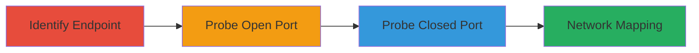

# SSRF in Nextcloud Federation for Internal Network Port Scanning

Multi-stage attack chain demonstrating exploitation of Server-Side Request Forgery (SSRF) in Nextcloud's federation feature to add trusted servers, allowing unauthenticated internal network mapping via port scanning on localhost.

## Chain Metrics Dashboard

| Metric | Value |
|--------|-------|
| Chain Status | Unverified |
| Total Steps | 3 |
| Execution Time | ~5 minutes |
| Skill Level | Intermediate |
| Complexity | Medium |
| Impact Level | High |

## Attack Flow Visualization



## Prerequisites & Requirements

### Required Tools

- [[tools/curl]]

### Target Environment

- Nextcloud instance with federation feature enabled
- Web platform, ports 80 and 8080 for testing
- No authentication required for the endpoint

### Initial Access Requirements

- Network access to the Nextcloud server
- Ability to send unauthenticated POST requests
- No prior credentials needed

## Detailed Attack Procedures

### Step 1: Identify Trusted Servers Endpoint
procedure: [[procedures/Identify-Nextcloud-Trusted-Servers-Endpoint]]

**Objective**: Locate and understand the federation endpoint vulnerable to SSRF.

**Instructions**: Examine the POST endpoint at `/nextcloud/index.php/apps/federation/trusted-servers` which accepts a 'url' parameter and triggers a server-side cURL request without validation.

**Expected Output**: Confirmation of endpoint behavior via documentation or initial testing.

**Success Indicators**:
- Endpoint identified
- Parameter 'url' confirmed as user-controlled

### Step 2: Probe Localhost Port 80 via SSRF
procedure: [[procedures/Probe-Localhost-Port-80-via-SSRF]]

**Objective**: Test for open ports by observing successful connections and HTTP responses.

**Instructions**: Send a POST request using [[commands/add-trusted-server-normal]] to a legitimate URL first, then switch to internal: execute [[commands/ssrf-probe-port-80]] to target http://127.0.0.1:80.

```bash
curl -X POST -d "url=http://127.0.0.1:80" https://target-nextcloud/index.php/apps/federation/trusted-servers
```

**Expected Output**: JSON response with 'Client error response' and 404 status, indicating port is open.

**Success Indicators**:
- 404 response on /status.php fetch
- No connection refused error

### Step 3: Probe Localhost Port 8080 via SSRF
procedure: [[procedures/Probe-Localhost-Port-8080-via-SSRF]]

**Objective**: Confirm closed ports by detecting connection failures.

**Instructions**: Execute [[commands/ssrf-probe-port-8080]] to target http://127.0.0.1:8080.

```bash
curl -X POST -d "url=http://127.0.0.1:8080" https://target-nextcloud/index.php/apps/federation/trusted-servers
```

**Expected Output**: JSON with cURL error 7: Connection refused.

**Success Indicators**:
- Connection refused error
- Differentiation from open port responses

## Attack Chain Summary

### Key Achievements

1. Identified SSRF vulnerability in trusted-servers endpoint
2. Mapped open services on localhost port 80
3. Confirmed closed ports like 8080 for network topology

## Technique & Tactic Coverage

### MITRE ATT&CK Techniques

- [[Active Scanning]]
- [[Exploit Public-Facing Application]]

### MITRE ATT&CK Tactics

- [[Reconnaissance]]
- [[Discovery]]

---

*Last updated: 2023-10-01T00:00:00Z*
