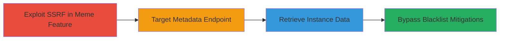

---
tags:
  - ssrf
  - cloud-metadata
  - phabricator
  - aws-ec2
  - openstack
type: attack_chain
tools:
  - '[[tools/dnschef]]'
tactics:
  - '[[Initial Access]]'
  - '[[Discovery]]'
verified: false
platforms:
  - Web
  - AWS
  - OpenStack
submitted: true
created_at: '2023-10-01T00:00:00Z'
procedures:
  - '[[procedures/Exploit-SSRF-in-Phabricator-Meme-Feature]]'
  - '[[procedures/Target-Cloud-Metadata-Endpoint-via-SSRF]]'
  - '[[procedures/Retrieve-Sensitive-Instance-Data]]'
  - '[[procedures/Bypass-IP-Blacklist-with-DNS-Rebinding]]'
step_count: 4
techniques:
  - '[[Exploit Public-Facing Application]]'
  - '[[Steal Application Access Token]]'
updated_at: '2025-12-14T04:39:02.355Z'
description: >-
  Multi-stage SSRF attack exploiting Phabricator's meme creation feature to
  access sensitive cloud instance metadata on AWS EC2 and OpenStack, including
  potential bypasses of IP blacklists.
id: 77aafb8d-1574-446e-8ae1-b875996182a8
validated: true
mitre_tactics:
  - '[[Initial Access]]'
  - '[[Discovery]]'
mitre_techniques:
  - '[[Exploit Public-Facing Application]]'
  - '[[Steal Application Access Token]]'
---
# SSRF in Phabricator Meme Creation to Access Cloud Metadata Services

Multi-stage attack chain demonstrating exploitation of an SSRF vulnerability in Phabricator's meme creation section to access internal cloud metadata services, retrieve sensitive instance data, and bypass proposed mitigations.

## Chain Metrics Dashboard

| Metric | Value |
|--------|-------|
| Chain Status | Unverified |
| Total Steps | 4 |
| Execution Time | ~5 minutes |
| Skill Level | Intermediate |
| Complexity | Medium |
| Impact Level | High |

## Attack Flow Visualization

## Prerequisites & Requirements

### Required Tools

- [[tools/dnschef]]

### Target Environment

- Web application running Phabricator (PHP-based)
- Cloud platforms: AWS EC2 or OpenStack
- Services: EC2/OpenStack Instance Metadata Service on port 80
- Network access: Public access to Phabricator's web interface

### Initial Access Requirements

- Valid user access to Phabricator (authenticated or unauthenticated depending on config)
- No special credentials needed beyond app access
- Server-side execution context on cloud instance

## Detailed Attack Procedures

### Step 1: Exploit SSRF in Phabricator Meme Feature
procedure: [[procedures/Exploit-SSRF-in-Phabricator-Meme-Feature]]

**Objective**: Leverage the known SSRF vulnerability in the meme creation section to initiate arbitrary HTTP GET requests from the server.

**Instructions**: Access the meme creation feature in Phabricator and input a URL that triggers the SSRF, building on the previously reported issue in ticket T6755.

**Expected Output**: Server performs the requested HTTP GET without validation.

**Success Indicators**:
- No error on invalid external URLs
- Server logs show outbound request

### Step 2: Target Cloud Metadata Endpoint via SSRF
procedure: [[procedures/Target-Cloud-Metadata-Endpoint-via-SSRF]]

**Objective**: Direct the SSRF payload to the link-local metadata IP address used by cloud providers.

**Instructions**: Modify the meme URL input to point to http://169.254.169.254/latest/meta-data/, exploiting the lack of private IP validation.

**Expected Output**: Server fetches metadata from the internal service.

**Success Indicators**:
- Response includes metadata content
- No access denied from app

### Step 3: Retrieve Sensitive Instance Data
procedure: [[procedures/Retrieve-Sensitive-Instance-Data]]

**Objective**: Extract hostname, IPs, and user-data scripts containing credentials or keys.

**Instructions**: Chain SSRF requests to specific endpoints like /latest/meta-data/hostname and /latest/user-data to pull sensitive info.

**Expected Output**: Disclosure of instance details, passwords, or private keys in the response.

**Success Indicators**:
- Visible sensitive data in meme output or logs
- Confirmation of internal service access

### Step 4: Bypass IP Blacklist with DNS Rebinding
procedure: [[procedures/Bypass-IP-Blacklist-with-DNS-Rebinding]]

**Objective**: Circumvent proposed blacklist mitigations using DNS rebinding or HTTP redirects.

**Instructions**: Use [[tools/dnschef]] to serve dynamic DNS records that resolve to private IPs mid-request, or trigger 302 redirects to internal targets.

**Expected Output**: Successful access to blacklisted IPs despite patch D12136.

**Success Indicators**:
- Request succeeds after initial validation
- Metadata retrieved post-bypass

## Attack Chain Summary

### Key Achievements

1. Exploited SSRF to access otherwise unreachable internal metadata services
2. Retrieved sensitive cloud instance information including credentials
3. Demonstrated bypass techniques for IP blacklisting mitigations

## Technique & Tactic Coverage

### MITRE ATT&CK Techniques

- [[Exploit Public-Facing Application]] Exploit Public-Facing Application
- [[Steal Application Access Token]] Steal Application Access Token

### MITRE ATT&CK Tactics

- [[Initial Access]] Initial Access
- [[Discovery]] Discovery

---
*Last updated: 2023-10-01T00:00:00Z*
