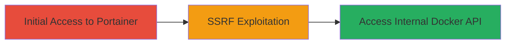

---
tags:
  - ssrf
  - docker
  - portainer
  - internal-access
  - uber
type: attack_chain
tools: []
tactics:
  - '[[Initial Access]]'
  - '[[Lateral Movement]]'
verified: false
platforms:
  - Web
  - Docker
submitted: true
complexity: medium
created_at: '2024-10-01T00:00:00Z'
procedures:
  - '[[procedures/Access-Portainer-Web-Interface]]'
  - '[[procedures/Exploit-SSRF-in-Portainer-for-Docker-API-Access]]'
step_count: 2
techniques:
  - '[[Exploit Public-Facing Application]]'
updated_at: '2025-12-14T17:32:38.624Z'
description: >-
  An attack chain exploiting a Server-Side Request Forgery vulnerability in the
  Portainer application to bypass authentication and access the internal Docker
  API on Uber's infrastructure.
skill_level: intermediate
impact_level: high
id: 5697c356-a776-44a1-a797-70eeef47204c
validated: true
mitre_tactics:
  - '[[Initial Access]]'
  - '[[Lateral Movement]]'
mitre_techniques:
  - '[[Exploit Public-Facing Application]]'
---
---
id: 123e4567-e89b-12d3-a456-426614174000
name: SSRF in Portainer Leading to Unauthorized Access to Internal Docker API
type: attack_chain
description: An attack chain exploiting a Server-Side Request Forgery vulnerability in the Portainer application to bypass authentication and access the internal Docker API on Uber's infrastructure.
verified: false
submitted: false
step_count: 2
created_at: 2024-10-01T00:00:00Z
updated_at: 2024-10-01T00:00:00Z
procedures: [[procedures/Access-Portainer-Web-Interface]], [[procedures/Exploit-SSRF-in-Portainer-for-Docker-API-Access]]
techniques: [[Exploit Public-Facing Application]]
tactics: [[Initial Access]], [[Lateral Movement]]
tags: ssrf, docker, portainer, internal-access, uber
platforms: Web, Docker
tools: []
---

# SSRF in Portainer Leading to Unauthorized Access to Internal Docker API

Multi-stage attack chain demonstrating a complete attack workflow exploiting SSRF in Portainer to gain unauthorized access to the internal Docker API.

## Chain Metrics Dashboard

| Metric | Value |
|--------|-------|
| Chain Status | Unverified |
| Total Steps | 2 |
| Execution Time | ~5 minutes |
| Skill Level | Intermediate |
| Complexity | Medium |
| Impact Level | High |

## Attack Flow Visualization



## Prerequisites & Requirements

### Required Tools

- Browser or [[commands/curl-portainer-request]]

### Target Environment

- Target OS/Platform: Web-based Docker management (Portainer on Linux/Docker host)
- Required services/ports: Portainer UI (typically port 9000 or 9443), internal Docker API (port 2375 or 2376)
- Network access requirements: Access to the external-facing Portainer instance on data-07.uberinternal.com

### Initial Access Requirements

- Credential requirements: Valid Portainer login credentials (assumed obtained via prior access or exposure)
- Network position: External or semi-external access to uberinternal.com domain
- Prior access needed: Ability to interact with Portainer web interface

## Detailed Attack Procedures

### Step 1: Access Portainer Web Interface
procedure: [[procedures/Access-Portainer-Web-Interface]]

**Objective**: Gain entry to the Portainer management interface to prepare for SSRF exploitation.

**Instructions**: Navigate to the Portainer login page using a browser or curl to verify accessibility. Log in with valid credentials to access the dashboard where request manipulation can occur.

Use [[commands/curl-portainer-login]] to test login:

```bash
curl -X POST https://data-07.uberinternal.com:9443/api/auth -H "Content-Type: application/json" -d '{"username":"admin","password":"password"}'
```

Then access the endpoint configuration or stack deployment section in the UI.

**Expected Output**: Successful authentication response with JWT token or dashboard access.

**Success Indicators**:
- HTTP 200 response with auth token
- Access to Portainer UI sections for container or endpoint management

### Step 2: Exploit SSRF to Access Internal Docker API
procedure: [[procedures/Exploit-SSRF-in-Portainer-for-Docker-API-Access]]

**Objective**: Manipulate Portainer requests to forge internal server requests, bypassing authentication to interact with the Docker API.

**Instructions**: In the Portainer UI, navigate to the "Endpoints" or "Stacks" section. Modify a request payload to include an internal URL pointing to the Docker API (e.g., http://localhost:2375 or internal IP). Submit the request to trigger SSRF.

Use [[commands/curl-portainer-ssrf]] to simulate the forged request:

```bash
curl -X POST https://data-07.uberinternal.com:9443/api/endpoints -H "Authorization: Bearer YOUR_JWT" -H "Content-Type: application/json" -d '{"name":"test","endpoint":"http://internal-docker-host:2375"}'
```

Monitor the response for Docker API data leakage or execute a simple Docker command via the forged endpoint.

**Expected Output**: Portainer forwards the request internally, returning Docker API responses like container lists without additional auth.

**Success Indicators**:
- Unauthorized Docker API responses (e.g., JSON with container info)
- Ability to list or manipulate containers via SSRF

## Attack Chain Summary

### Key Achievements

1. Bypassed Portainer's input validation to make arbitrary internal requests
2. Gained unauthenticated access to the internal Docker API
3. Potential for container manipulation or data exfiltration from Uber's infrastructure

## Technique & Tactic Coverage

### MITRE ATT&CK Techniques

- [[Exploit Public-Facing Application]]

### MITRE ATT&CK Tactics

- [[Initial Access]]
- [[Lateral Movement]]

---
*Last updated: 2024-10-01T00:00:00Z*
