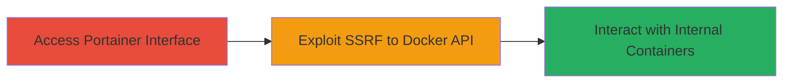

---
tags:
  - ssrf
  - docker
  - portainer
  - internal-access
  - uber
type: attack_chain
tools: []
tactics:
  - '[[Initial Access]]'
commands:
  - '[[commands/curl-portainer-ssrf]]'
platforms:
  - Web
  - Docker
complexity: medium
procedures:
  - '[[procedures/Exploit-SSRF-in-Portainer-for-Docker-API-Access]]'
step_count: 1
techniques:
  - '[[Exploit Public-Facing Application]]'
description: >-
  A server-side request forgery vulnerability in the Portainer application
  allows attackers to bypass authentication and access the internal Docker API,
  enabling unauthorized container management on Uber's internal infrastructure.
skill_level: intermediate
impact_level: high
id: bd3fd08f-92db-49d8-b841-63b99c520a5d
created_at: '2025-12-14T03:53:38.614Z'
updated_at: '2025-12-14T03:53:38.614Z'
verified: false
validated: true
submitted: true
mitre_tactics:
  - '[[Initial Access]]'
mitre_techniques:
  - '[[Exploit Public-Facing Application]]'
---
# SSRF in Portainer Leading to Unauthorized Internal Docker API Access

## Overview

This attack chain exploits a Server-Side Request Forgery (SSRF) vulnerability in the Portainer application hosted on an internal Uber domain (data-07.uberinternal.com). Portainer, a web-based Docker management tool, fails to properly validate user-supplied URLs, allowing attackers to forge requests to internal services like the Docker API. This bypasses authentication controls, granting unauthorized access to manage containers, inspect images, or execute commands within the Docker environment. The vulnerability was reported via Uber's HackerOne bug bounty program (Report #366638), earning a $500 bounty, and highlights risks in misconfigured container orchestration tools exposed to the internet or internal networks.

## Chain Metrics Dashboard

| Metric | Value |
|--------|-------|
| Chain Status | Unverified |
| Total Steps | 1 |
| Execution Time | ~5 minutes |
| Skill Level | Intermediate |
| Complexity | Medium |
| Impact Level | High |

## Attack Flow Visualization



## Prerequisites & Requirements

### Required Tools

- Web browser or [[commands/curl-portainer-ssrf]]

### Target Environment

- Target OS/Platform: Web application on Linux/Docker host
- Required services/ports: Portainer on port 9000 (default), Docker API on port 2375 or 2376 (internal)
- Network access requirements: Ability to reach the Portainer endpoint (e.g., data-07.uberinternal.com:9000)

### Initial Access Requirements

- Credential requirements: None (publicly accessible or low-priv endpoint)
- Network position: External or semi-external access to the Portainer UI
- Prior access needed: None, but internal network knowledge helps for targeting Docker API

## Detailed Attack Procedures

### Step 1: Exploit SSRF to Access Docker API
procedure: [[procedures/Exploit-SSRF-in-Portainer-for-Docker-API-Access]]

**Objective**: Forge a server-side request through Portainer to the internal Docker API, bypassing authentication and gaining unauthorized access to container controls.

**Instructions**: Access the Portainer web interface at the target URL (e.g., https://data-07.uberinternal.com:9000). Navigate to a feature that accepts URL inputs, such as endpoint configuration or image pull requests. Use [[commands/curl-portainer-ssrf]] to simulate or directly trigger the SSRF by supplying an internal URL pointing to the Docker API (e.g., http://localhost:2375 or http://127.0.0.1:2375). For example, attempt to pull an image or list containers via the forged request.

```bash
curl -X POST 'https://data-07.uberinternal.com:9000/api/endpoints' \
  -H 'Content-Type: application/json' \
  -d '{"name":"test","endpoint":"http://127.0.0.1:2375"}'
```

Monitor the response for successful connection to the Docker API, which may return JSON data about containers or endpoints without requiring auth.

**Expected Output**: JSON response from Docker API, such as {"Containers":[...]} or endpoint creation success, indicating access granted.

**Success Indicators**:
- HTTP 200/201 response with Docker API data
- Ability to list or manipulate containers via subsequent requests
- No authentication prompt for internal API interactions

## Attack Chain Summary

### Key Achievements

1. Bypassed Portainer's input validation to reach internal Docker socket/API
2. Achieved unauthorized read/write access to Docker containers
3. Demonstrated potential for container escape or data exfiltration from internal services

## Technique & Tactic Coverage

### MITRE ATT&CK Techniques

- [[Exploit Public-Facing Application]]

### MITRE ATT&CK Tactics

- [[Initial Access]]

---
*Last updated: 2023-10-01*
