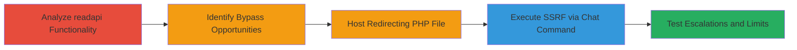

---
tags:
  - ssrf
  - aws
  - ec2
  - metadata
  - streamlabs
  - cloudbot
type: attack_chain
tools: []
tactics:
  - '[[Initial Access]]'
  - '[[Discovery]]'
commands:
  - '[[commands/php-redirect-to-aws-metadata]]'
verified: false
platforms:
  - Web
  - AWS
submitted: true
complexity: medium
created_at: '2023-10-01T00:00:00Z'
procedures:
  - '[[procedures/Analyze-readapi-Variable-Functionality]]'
  - '[[procedures/Identify-SSRF-Bypass-Opportunities]]'
  - '[[procedures/Host-Redirecting-PHP-File-for-Bypass]]'
  - '[[procedures/Execute-SSRF-to-Retrieve-AWS-Metadata]]'
  - '[[procedures/Test-Further-Escalations-and-Limitations]]'
step_count: 5
techniques:
  - '[[Exploit Public-Facing Application]]'
  - '[[System Information Discovery]]'
updated_at: '2025-12-14T03:53:38.748Z'
description: >-
  Multi-stage attack exploiting SSRF in Streamlabs Cloudbot's readapi variable
  to bypass HTTPS restrictions and access internal AWS EC2 metadata via
  redirects.
skill_level: intermediate
impact_level: high
id: f69b43ce-8fa4-4f7f-8aba-48335e7c015a
validated: true
mitre_tactics:
  - '[[Initial Access]]'
  - '[[Discovery]]'
mitre_techniques:
  - '[[Exploit Public-Facing Application]]'
  - '[[System Information Discovery]]'
---
# SSRF in Streamlabs Cloudbot readapi Variable to Retrieve AWS EC2 Metadata

Multi-stage attack chain demonstrating exploitation of a Server-Side Request Forgery (SSRF) vulnerability in Streamlabs Cloudbot's 'readapi' variable, allowing injection of custom URLs into chat commands that the backend fetches and inserts into chat. The attack bypasses HTTPS-only restrictions by leveraging redirects to access internal AWS EC2 metadata, such as instance ID and security groups.

## Chain Metrics Dashboard

| Metric | Value |
|--------|-------|
| Chain Status | Unverified |
| Total Steps | 5 |
| Execution Time | ~10 minutes |
| Skill Level | Intermediate |
| Complexity | Medium |
| Impact Level | High |

## Attack Flow Visualization



## Prerequisites & Requirements

### Required Tools

- Web server (e.g., Apache with PHP) for hosting redirect file
- Access to Streamlabs Cloudbot dashboard and chat

### Target Environment

- Streamlabs Cloudbot service
- AWS EC2 instance hosting the backend (link-local metadata at 169.254.169.254)
- Required services/ports: HTTPS (443) for initial requests, internal HTTP for metadata
- Network access requirements: Ability to send chat commands and host external HTTPS content

### Initial Access Requirements

- Valid Streamlabs account with Cloudbot enabled
- No special credentials needed beyond chat access
- Prior access: None, public-facing chat interface

## Detailed Attack Procedures

### Step 1: Analyze readapi Variable Functionality
procedure: [[procedures/Analyze-readapi-Variable-Functionality]]

**Objective**: Understand the readapi variable's behavior to identify potential SSRF entry points.

**Instructions**: Review the official documentation and test basic functionality of the {readapi.<url>} variable in custom chat commands. This variable sends an HTTPS request to the provided URL and inserts the response into the chat.

**Expected Output**: Confirmation that the backend fetches and returns content from HTTPS URLs.

**Success Indicators**:
- Variable responds with fetched content for valid HTTPS URLs
- Documentation reviewed showing integration in chat commands

### Step 2: Identify SSRF Bypass Opportunities
procedure: [[procedures/Identify-SSRF-Bypass-Opportunities]]

**Objective**: Test restrictions and discover bypass methods, such as redirect following to HTTP endpoints.

**Instructions**: Test non-HTTPS URLs to confirm enforcement errors, then verify if redirects to HTTP are followed. Note limitations like content-type validation, 2xx requirement, timeout (~3000ms), and content length limits.

**Expected Output**: Error messages like [Https required] for direct HTTP, but successful fetch via redirects.

**Success Indicators**:
- HTTPS-only enforcement confirmed
- Redirect to HTTP succeeds without errors
- Limitations documented (e.g., no curly braces in response)

### Step 3: Host Redirecting PHP File for Bypass
procedure: [[procedures/Host-Redirecting-PHP-File-for-Bypass]]

**Objective**: Create and host a PHP file that redirects to the internal AWS metadata endpoint to bypass HTTPS restrictions.

**Instructions**: Create a PHP file named slpoc.php with a redirect header to http://169.254.169.254/latest/meta-data/. Host it on an HTTPS-enabled domain (e.g., https://mydomain/slpoc.php). Use [[commands/php-redirect-to-aws-metadata]] for the script content:

```php
<?php header('Location: http://169.254.169.254/latest/meta-data/'); ?>
```

**Expected Output**: The file serves a 302 redirect when accessed via HTTPS.

**Success Indicators**:
- PHP file hosted successfully on HTTPS server
- Direct access triggers redirect to metadata URL

### Step 4: Execute SSRF to Retrieve AWS Metadata
procedure: [[procedures/Execute-SSRF-to-Retrieve-AWS-Metadata]]

**Objective**: Trigger the SSRF by injecting the redirect URL into a chat command, causing the backend to fetch and expose AWS metadata.

**Instructions**: In the Streamlabs chat, execute a custom command like A{readapi.https://mydomain/slpoc.php}B. The backend will fetch the URL, follow the redirect, and insert the metadata response into the chat.

**Expected Output**: Chat displays AWS metadata listing, e.g., 'ami-id ami-launch-index ... security-groups'.

**Success Indicators**:
- Metadata retrieved and visible in chat
- No errors like [Bad Server Response / Too slow]

### Step 5: Test Further Escalations and Limitations
procedure: [[procedures/Test-Further-Escalations-and-Limitations]]

**Objective**: Attempt additional exploits and confirm boundaries to assess full impact.

**Instructions**: Test redirects to other protocols (gopher://, ftp://, etc.) and JSON metadata endpoints. Verify failures due to limitations like curly braces or non-2xx responses.

**Expected Output**: Errors for unsupported protocols and JSON (e.g., due to curly braces); no IAM role limits further access.

**Success Indicators**:
- Failed escalations confirm scope (no RCE or takeover)
- Metadata access limited to basic instance info

## Attack Chain Summary

### Key Achievements

1. Bypassed HTTPS-only restriction via PHP redirect
2. Retrieved sensitive AWS EC2 metadata including instance ID and security groups
3. Demonstrated SSRF impact without IAM role for escalation

## Technique & Tactic Coverage

### MITRE ATT&CK Techniques

- [[Exploit Public-Facing Application]]
- [[System Information Discovery]]

### MITRE ATT&CK Tactics

- [[Initial Access]]
- [[Discovery]]

---

*Last updated: 2023-10-01T00:00:00Z*
