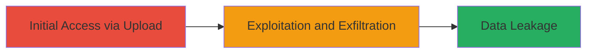

---
tags:
  - ssrf
  - google-cloud
  - data-leak
  - ssh-keys
  - upload-vulnerability
type: attack_chain
tools: []
tactics:
  - '[[Initial Access]]'
commands:
  - '[[commands/curl-vimeo-ssrf-upload]]'
platforms:
  - Web
  - Cloud (Google Cloud)
complexity: medium
procedures:
  - '[[procedures/Exploit-SSRF-in-Vimeo-Upload-Function]]'
step_count: 1
techniques:
  - '[[Exploit Public-Facing Application]]'
description: >-
  Exploiting a Server-Side Request Forgery vulnerability in Vimeo's upload
  feature to access and leak sensitive internal Google Cloud resources,
  including SSH keys and metadata.
skill_level: intermediate
impact_level: high
id: 32d3d2b2-dcba-45bb-9896-c87f4bd175e9
created_at: '2025-12-14T17:28:36.521Z'
updated_at: '2025-12-14T17:28:36.521Z'
verified: false
validated: true
submitted: true
mitre_tactics:
  - '[[Initial Access]]'
mitre_techniques:
  - '[[Exploit Public-Facing Application]]'
---
# SSRF in Vimeo Upload Function to Leak Google Cloud Internal Data

Multi-stage attack chain demonstrating a complete attack workflow.

## Chain Metrics Dashboard

| Metric | Value |
|--------|-------|
| Chain Status | Unverified |
| Total Steps | 1 |
| Execution Time | ~5 minutes |
| Skill Level | Intermediate |
| Complexity | Medium |
| Impact Level | High |

## Attack Flow Visualization



## Prerequisites & Requirements

### Required Tools

- Browser or [[commands/curl-vimeo-ssrf-upload]] for testing uploads

### Target Environment

- Web platform with Vimeo upload functionality
- Access to Google Cloud internal resources via SSRF
- No specific ports required; operates over HTTP/HTTPS

### Initial Access Requirements

- Valid user account on Vimeo (authenticated session)
- Network access to Vimeo's public upload endpoint
- No prior internal access needed

## Detailed Attack Procedures

### Step 1: Exploit Upload Feature for SSRF
procedure: [[procedures/Exploit-SSRF-in-Vimeo-Upload-Function]]

**Objective**: Identify and exploit the SSRF vulnerability in the upload function to force the server to make requests to internal Google Cloud endpoints, leaking sensitive data like SSH keys and metadata.

**Instructions**: Authenticate to Vimeo's platform and use the upload feature to submit malicious input, such as a URL pointing to internal resources (e.g., metadata endpoints). Test with [[commands/curl-vimeo-ssrf-upload]] to simulate the upload and observe the server's response for leaked internal data:

```bash
curl -X POST -H "Authorization: Bearer YOUR_TOKEN" -F "upload_url=http://internal-metadata.google.cloud/" https://vimeo.com/api/upload
```

Analyze the response for any internal data leakage. If successful, the server will fetch the internal resource and return sensitive information in the upload response or logs.

**Expected Output**: Server response containing internal Google Cloud data, such as JSON with SSH keys or metadata.

**Success Indicators**:
- Unauthorized access to internal endpoints confirmed
- Sensitive data (e.g., SSH keys) visible in response
- No direct error from the upload endpoint, indicating SSRF success

## Attack Chain Summary

### Key Achievements

1. Discovered SSRF in upload function through input manipulation
2. Forced server-side requests to internal Google Cloud resources
3. Leaked critical sensitive data including SSH keys and metadata

## Technique & Tactic Coverage

### MITRE ATT&CK Techniques

- [[Exploit Public-Facing Application]]

### MITRE ATT&CK Tactics

- [[Initial Access]]

---
*Last updated: 2023-10-01*
