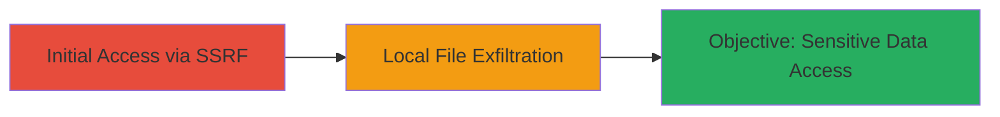

---
tags:
  - ssrf
  - web
  - file-read
  - local-file-inclusion
type: attack_chain
tools: []
tactics:
  - '[[Initial Access]]'
  - '[[Discovery]]'
verified: false
platforms:
  - Web
submitted: true
complexity: medium
created_at: '2023-10-01T00:00:00Z'
procedures:
  - '[[procedures/Exploit-SSRF-for-Local-File-Access]]'
step_count: 1
techniques:
  - '[[Exploit Public-Facing Application]]'
  - '[[File and Directory Discovery]]'
updated_at: '2025-12-14T03:53:38.477Z'
description: >-
  A Server-Side Request Forgery vulnerability in the Zomato website enables
  attackers to read sensitive local files from the web server, including source
  code and system files, due to insufficient validation of user-supplied URLs.
skill_level: intermediate
impact_level: high
id: 24a64abe-0759-4d76-a3e2-011c1370a5fa
validated: true
mitre_tactics:
  - '[[Initial Access]]'
  - '[[Discovery]]'
mitre_techniques:
  - '[[Exploit Public-Facing Application]]'
  - '[[File and Directory Discovery]]'
---
# SSRF in Zomato Website Allowing Local File Read

Multi-stage attack chain demonstrating a complete attack workflow exploiting an SSRF vulnerability to access local server files.

## Chain Metrics Dashboard

| Metric | Value |
|--------|-------|
| Chain Status | Unverified |
| Total Steps | 1 |
| Execution Time | ~5 minutes |
| Skill Level | Intermediate |
| Complexity | Medium |
| Impact Level | High |

## Attack Flow Visualization



## Prerequisites & Requirements

### Required Tools

- [[commands/curl-ssrf-exploit]]

### Target Environment

- Target OS/Platform: Web application (e.g., Zomato website)
- Required services/ports: HTTP/HTTPS on port 80/443
- Network access requirements: Public internet access to the target URL

### Initial Access Requirements

- Credential requirements: None (unauthenticated)
- Network position: External attacker
- Prior access needed: None

## Detailed Attack Procedures

### Step 1: Exploit SSRF for Local File Access
procedure: [[procedures/Exploit-SSRF-for-Local-File-Access]]

**Objective**: Leverage the SSRF vulnerability to make the server request and return contents of local files, such as /etc/passwd or application source code.

**Instructions**: Identify the vulnerable endpoint on the Zomato website (e.g., a feature that processes user-supplied URLs for server-side requests). Use [[commands/curl-ssrf-exploit]] to send a crafted request pointing to a local file URI like file:///etc/passwd:

```bash
curl -X POST 'https://www.zomato.com/vulnerable-endpoint' -d 'url=file:///etc/passwd' -H 'Content-Type: application/x-www-form-urlencoded'
```

If successful, chain additional requests to read other files, such as source code:

```bash
curl -X POST 'https://www.zomato.com/vulnerable-endpoint' -d 'url=file:///var/www/html/index.php' -H 'Content-Type: application/x-www-form-urlencoded'
```

**Expected Output**: The server responds with the contents of the requested local file, e.g., user account listings from /etc/passwd or PHP source code.

**Success Indicators**:
- Response contains file contents (e.g., usernames, source code snippets)
- No error indicating blocked internal requests
- HTTP status 200 with leaked data

## Attack Chain Summary

### Key Achievements

1. Unauthorized access to server-side local files
2. Exposure of sensitive system information and source code
3. Critical impact leading to potential further exploitation

## Technique & Tactic Coverage

### MITRE ATT&CK Techniques

- [[Exploit Public-Facing Application]]
- [[File and Directory Discovery]]

### MITRE ATT&CK Tactics

- [[Initial Access]]
- [[Discovery]]

---
*Last updated: 2023-10-01T00:00:00Z*
