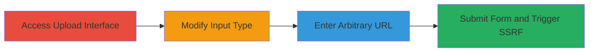

# SSRF via Client-Side Input Type Bypass in Profile Photo Upload

Multi-stage attack chain demonstrating a complete SSRF exploitation workflow in a web application by modifying client-side HTML to bypass file upload restrictions.

## Chain Metrics Dashboard

| Metric | Value |
|--------|-------|
| Chain Status | Unverified |
| Total Steps | 4 |
| Execution Time | ~2 minutes |
| Skill Level | Intermediate |
| Complexity | Medium |
| Impact Level | High |

## Attack Flow Visualization

## Prerequisites & Requirements

### Required Tools

- [[tools/Browser-Developer-Tools]]

### Target Environment

- Web application with profile photo upload feature
- No specific services/ports required beyond standard HTTPS (443)
- Network access to the target site

### Initial Access Requirements

- Valid user account on the target platform (e.g., HackerOne)
- Browser access to the profile update page
- No prior elevated access needed

## Detailed Attack Procedures

### Step 1: Access Profile Photo Upload Interface
procedure: [[procedures/Access-Profile-Photo-Upload-Interface]]

**Objective**: Navigate to the profile photo upload section to prepare for modification.

**Instructions**: Log in to the target web application and locate the profile settings where the photo upload form is available.

**Expected Output**: The upload form is visible, containing a file input element.

**Success Indicators**:
- Profile update page loaded successfully
- File input field for photo upload is present in the DOM

### Step 2: Modify HTML Input Type with Developer Tools
procedure: [[procedures/Modify-HTML-Input-Type-with-Developer-Tools]]

**Objective**: Bypass client-side restrictions by changing the input type from 'file' to 'url'.

**Instructions**: Open browser developer tools, inspect the file input element, and edit its 'type' attribute to 'url'.

**Expected Output**: The input field now accepts text/URL input instead of file selection.

**Success Indicators**:
- Input type changed successfully without errors
- Field now behaves as a URL input

### Step 3: Enter Arbitrary Image URL
procedure: [[procedures/Enter-Arbitrary-Image-URL]]

**Objective**: Provide a remote URL to an image that the server will fetch.

**Instructions**: Paste a valid image URL (e.g., https://example.com/image.jpg) into the modified input field.

**Expected Output**: URL is entered and ready for submission.

**Success Indicators**:
- URL is accepted in the field
- No client-side validation errors

### Step 4: Submit Form to Trigger SSRF
procedure: [[procedures/Submit-Form-to-Trigger-SSRF]]

**Objective**: Send the request to the server, causing it to fetch the arbitrary URL and potentially access internal resources.

**Instructions**: Submit the form by clicking 'Update Profile' or pressing enter.

**Expected Output**: Profile photo updated with the remote image; server logs may show fetch attempt.

**Success Indicators**:
- Profile photo changes to the remote image
- No server-side rejection of the URL

## Attack Chain Summary

### Key Achievements

1. Bypassed client-side file upload enforcement
2. Forced server to perform SSRF by fetching attacker-controlled URLs
3. Demonstrated potential for internal resource access via unvalidated URL handling

## Technique & Tactic Coverage

### MITRE ATT&CK Techniques

- [[Exploit Public-Facing Application]]

### MITRE ATT&CK Tactics

- [[Initial Access]]

---
*Last updated: 2023-10-01T00:00:00Z*
