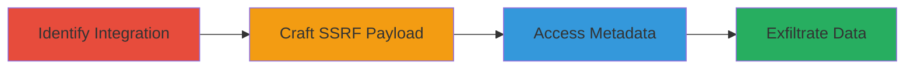

# SSRF via Google Drive to Exfiltrate AWS Metadata

Multi-stage attack chain demonstrating a complete SSRF workflow in a web application with Google Drive integration, leading to internal network access and AWS metadata exfiltration.

## Chain Metrics Dashboard

| Metric | Value |
|--------|-------|
| Chain Status | Unverified |
| Total Steps | 3 |
| Execution Time | ~5 minutes |
| Skill Level | Intermediate |
| Complexity | Medium |
| Impact Level | High |

## Attack Flow Visualization



## Prerequisites & Requirements

### Required Tools

- [[tools/Burp-Suite]]
- [[tools/curl]]

### Target Environment

- Web application with Google Drive file upload/share functionality
- AWS-hosted backend services
- Internal metadata endpoint (e.g., 169.254.169.254)

### Initial Access Requirements

- Valid user account on the target web application
- Network access to the public-facing web app
- No prior internal access needed

## Detailed Attack Procedures

### Step 1: Identify Google Drive Integration
procedure: [[procedures/Identify-Google-Drive-Integration]]

**Objective**: Locate features in the web application that integrate with Google Drive, such as file import or preview, which may allow server-side requests.

**Instructions**: Navigate to the target web application's file upload or import section. Use [[commands/inspect-element]] to examine network requests during Google Drive interactions:

```bash
# No direct command; use browser dev tools or Burp proxy
```

Intercept requests with [[tools/Burp-Suite]] to identify endpoints that proxy requests to Google Drive APIs.

**Expected Output**: Identification of an endpoint (e.g., /api/import-from-drive) that fetches Google Drive content server-side.

**Success Indicators**:
- Endpoint found that makes server-side HTTP requests to drive.google.com
- No IP restrictions enforced on the proxy logic

### Step 2: Craft SSRF Payload via Google Drive
procedure: [[procedures/Craft-SSRF-Payload-via-Google-Drive]]

**Objective**: Manipulate the Google Drive URL parameter to redirect the server-side request to internal resources, bypassing IP whitelisting.

**Instructions**: Modify the Google Drive share link in the import request to point to an internal IP. Use [[commands/curl-ssrf-test]] to simulate:

```bash
curl -X POST 'https://target.com/api/import-from-drive' \
  -H 'Content-Type: application/json' \
  -d '{"url": "https://drive.google.com/uc?id=internal&redirect=169.254.169.254/latest/meta-data/"}'
```

Capture and replay with [[tools/Burp-Suite]] to adjust the redirect parameter.

**Expected Output**: Server responds with internal resource content instead of Google Drive file.

**Success Indicators**:
- Server fetches from internal IP (e.g., 169.254.169.254)
- No error on non-whitelisted IPs

### Step 3: Exfiltrate AWS Metadata
procedure: [[procedures/Exfiltrate-AWS-Metadata]]

**Objective**: Retrieve sensitive AWS instance metadata, including IAM credentials, via the SSRF'd request.

**Instructions**: Chain the SSRF to query specific metadata paths. Use [[commands/curl-metadata-fetch]] to test the payload:

```bash
curl -X POST 'https://target.com/api/import-from-drive' \
  -H 'Content-Type: application/json' \
  -d '{"url": "https://drive.google.com/uc?id=internal&redirect=http://169.254.169.254/latest/meta-data/iam/security-credentials/"}'
```

Parse the response for temporary credentials.

**Expected Output**: JSON or text containing AWS metadata like role names and access keys.

**Success Indicators**:
- AWS IAM role details retrieved
- Temporary credentials obtained for further access

## Attack Chain Summary

### Key Achievements

1. Bypassed IP restrictions using Google Drive proxy
2. Achieved SSRF to internal AWS metadata endpoint
3. Exfiltrated sensitive credentials without authentication

## Technique & Tactic Coverage

### MITRE ATT&CK Techniques

- [[Exploit Public-Facing Application]]
- [[Cloud Instance Metadata API]]

### MITRE ATT&CK Tactics

- [[Initial Access]]
- [[Discovery]]
- [[Collection]]

---
*Last updated: 2023-10-01T12:00:00Z*
