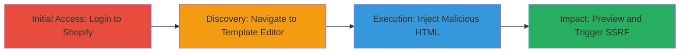

---
tags:
  - ssrf
  - html-injection
  - sanitization-bypass
  - shopify
  - kubernetes
type: attack_chain
tools: []
tactics:
  - '[[Initial Access]]'
  - '[[Discovery]]'
verified: false
platforms:
  - Web
  - Cloud
  - Kubernetes
submitted: true
complexity: medium
created_at: '2023-10-01T00:00:00Z'
procedures:
  - '[[procedures/Access-Shopify-Admin-Dashboard]]'
  - '[[procedures/Navigate-to-Packing-Slip-Template-Editor]]'
  - '[[procedures/Inject-Malicious-HTML-Payload-for-Sanitization-Bypass]]'
  - '[[procedures/Trigger-SSRF-via-Template-Preview]]'
step_count: 4
techniques:
  - '[[Exploit Public-Facing Application]]'
  - '[[JavaScript]]'
updated_at: '2025-12-14T04:08:54.979Z'
description: >-
  Multi-stage attack exploiting HTML sanitization bypass in Shopify's Packing
  Slip Template to inject iframes, enabling SSRF to internal Kubernetes
  endpoints and potential external redirects.
skill_level: intermediate
impact_level: high
id: 1fd6df5a-e077-40ec-bed1-4b33482a1b32
validated: true
mitre_tactics:
  - '[[Initial Access]]'
  - '[[Discovery]]'
mitre_techniques:
  - '[[Exploit Public-Facing Application]]'
  - '[[JavaScript]]'
---
# SSRF via HTML Sanitization Bypass in Shopify Packing Slip Template

Multi-stage attack chain demonstrating exploitation of Shopify's Packing Slip Template feature to bypass HTML sanitization, inject malicious iframes or meta tags, and achieve Server-Side Request Forgery (SSRF) against internal Kubernetes endpoints like /version and /livez, potentially disclosing internal service information or redirecting to external sites for limited order data exposure.

## Chain Metrics Dashboard

| Metric | Value |
|--------|-------|
| Chain Status | Unverified |
| Total Steps | 4 |
| Execution Time | ~5 minutes |
| Skill Level | Intermediate |
| Complexity | Medium |
| Impact Level | High |

## Attack Flow Visualization

## Prerequisites & Requirements

### Required Tools

- Web browser (e.g., Chrome with developer tools for inspection)

### Target Environment

- Shopify merchant account with admin access
- Access to Packing Slip Template editor at https://[store].myshopify.com/admin/settings/packing_slip_template
- Internal network exposure to Kubernetes services (for SSRF impact)

### Initial Access Requirements

- Valid Shopify admin credentials
- Direct internet access to the target store's admin panel
- No prior access needed beyond login

## Detailed Attack Procedures

### Step 1: Initial Access
procedure: [[procedures/Access-Shopify-Admin-Dashboard]]

**Objective**: Gain authenticated access to the Shopify admin dashboard to reach the vulnerable Packing Slip Template feature.

**Instructions**: Open a web browser and navigate to the Shopify login page. Enter valid admin credentials to log in.

**Expected Output**: Successful login redirecting to the admin dashboard homepage.

**Success Indicators**:
- Dashboard loads with admin menu visible
- No authentication errors

### Step 2: Discovery
procedure: [[procedures/Navigate-to-Packing-Slip-Template-Editor]]

**Objective**: Locate the Packing Slip Template editor where HTML injection is possible.

**Instructions**: From the admin dashboard, click on Settings > Shipping and delivery, then select the Packing Slip Template option.

**Expected Output**: The template editor interface loads, allowing HTML input.

**Success Indicators**:
- URL matches https://[store].myshopify.com/admin/settings/packing_slip_template
- Editor fields are editable

### Step 3: Execution
procedure: [[procedures/Inject-Malicious-HTML-Payload-for-Sanitization-Bypass]]

**Objective**: Bypass the HTML sanitization filter by prefixing malicious tags with <svg><style><h1/> to inject iframes targeting internal endpoints or meta redirects.

**Instructions**: In the template editor, insert payloads such as <svg><style><h1/><iframe src="https://kubernetes.default.svc/version" width=1001 height=1001> or <svg><style><h1/><iframe src="https://kubernetes.default.svc/livez?verbose" width=1001 height=1001> or <svg><style><h1/><meta http-equiv="refresh" content="0;URL='https://www.google.com'" /> into the HTML content area.

**Expected Output**: Payload accepted without sanitization errors; template saves successfully.

**Success Indicators**:
- No filter rejection messages
- Template preview option becomes available

### Step 4: Impact
procedure: [[procedures/Trigger-SSRF-via-Template-Preview]]

**Objective**: Generate a PDF preview to trigger the renderer, causing SSRF requests to internal Kubernetes endpoints or external redirects, potentially exposing order info.

**Instructions**: Click the Preview button in the template editor to initiate PDF generation, which processes the injected HTML and loads the specified URLs server-side.

**Expected Output**: PDF preview loads, but server logs or responses indicate requests to internal services; possible redirect to external site.

**Success Indicators**:
- Internal endpoint responses (e.g., Kubernetes version info) visible in network traces
- Limited order data potentially disclosed via redirect

## Attack Chain Summary

### Key Achievements

1. Bypassed HTML sanitization using SVG prefix to inject iframes and meta tags.
2. Achieved SSRF accessing internal Kubernetes endpoints like /version and /livez.
3. Enabled potential external redirects for unauthorized order information exposure to staff.

## Technique & Tactic Coverage

### MITRE ATT&CK Techniques

- [[Exploit Public-Facing Application]]
- [[JavaScript]]

### MITRE ATT&CK Tactics

- [[Initial Access]]
- [[Discovery]]

---

*Last updated: 2023-10-01T00:00:00Z*
