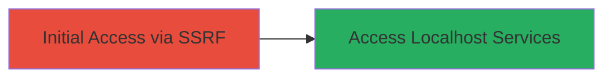

# SSRF via Host Header Manipulation to Access Localhost Services on IBM Application

Multi-stage attack chain demonstrating a complete attack workflow exploiting an SSRF vulnerability in IBM's application.

## Chain Metrics Dashboard

| Metric | Value |
|--------|-------|
| Chain Status | Unverified |
| Total Steps | 1 |
| Execution Time | ~5 minutes |
| Skill Level | Intermediate |
| Complexity | Medium |
| Impact Level | Medium |

## Attack Flow Visualization



## Prerequisites & Requirements

### Required Tools

- [[commands/curl-ssrf-host-header]]

### Target Environment

- Web application hosted on https://go.dialexa.com
- Requires network access to the public endpoint
- No specific ports beyond standard HTTPS (443)

### Initial Access Requirements

- No credentials required
- Direct internet access to the target URL
- No prior access needed

## Detailed Attack Procedures

### Step 1: Exploit SSRF via Host Header
procedure: [[procedures/Exploit-SSRF-via-Host-Header-Manipulation]]

**Objective**: Manipulate the Host header in a request to https://go.dialexa.com to redirect to localhost services, gaining unauthorized access to internal resources.

**Instructions**: Use [[commands/curl-ssrf-host-header]] to send a crafted request that overrides the Host header to point to localhost, exploiting the SSRF vulnerability.

```bash
curl -H "Host: localhost" https://go.dialexa.com/endpoint
```

Verify the response for signs of internal service access, such as localhost metadata or error messages revealing internal details.

**Expected Output**: Response from internal localhost service, potentially including sensitive data or confirmation of access.

**Success Indicators**:
- Response contains localhost-specific content (e.g., internal API responses or errors)
- No external redirection; direct internal access confirmed

## Attack Chain Summary

### Key Achievements

1. Successful manipulation of Host header to bypass validation
2. Unauthorized access to localhost services
3. Identification of medium-severity impact on internal resources

## Technique & Tactic Coverage

### MITRE ATT&CK Techniques

- [[Exploit Public-Facing Application]]

### MITRE ATT&CK Tactics

- [[Initial Access]]

---
*Last updated: 2024-10-04T00:00:00Z*
