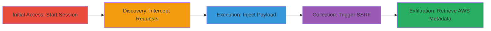

---
tags:
  - ssrf
  - aws
  - credentials
  - pdf-generation
  - javascript-injection
type: attack_chain
tools:
  - '[[tools/Burp-Suite]]'
tactics:
  - '[[Initial Access]]'
  - '[[Collection]]'
verified: false
platforms:
  - Web
  - AWS
submitted: true
complexity: medium
created_at: '2023-10-01T00:00:00Z'
procedures:
  - '[[procedures/Initiate-FAST-Session-and-Form-Submission]]'
  - '[[procedures/Intercept-API-Save-Request-with-Burp-Suite]]'
  - '[[procedures/Inject-JavaScript-Payload-for-SSRF]]'
  - '[[procedures/Trigger-PDF-Regeneration-to-Execute-SSRF]]'
step_count: 6
techniques:
  - '[[Exploit Public-Facing Application]]'
  - '[[Credentials In Files]]'
updated_at: '2025-12-14T17:28:28.653Z'
description: >-
  Multi-stage exploitation of a Server-Side Request Forgery (SSRF) vulnerability
  in the Functional Administrative Support Tool (FAST) v1.0 PDF generator,
  allowing injection of JavaScript payloads to force server-side requests to
  internal AWS metadata services and steal sensitive credentials.
skill_level: intermediate
impact_level: high
id: 8f08f7a7-6ec3-420c-aa12-d773ea23ef65
validated: true
mitre_tactics:
  - '[[Initial Access]]'
  - '[[Collection]]'
mitre_techniques:
  - '[[Exploit Public-Facing Application]]'
  - '[[Credentials In Files]]'
---
# SSRF via JavaScript Injection in FAST PDF Generator to Exfiltrate AWS Credentials

Multi-stage attack chain demonstrating the exploitation of an SSRF vulnerability in the FAST v1.0 tool's PDF generation feature. An attacker intercepts and modifies a JSON payload during form submission to inject JavaScript that, when executed server-side during PDF rendering, forces the server to request internal AWS EC2 instance metadata, leaking temporary IAM credentials including AccessKeyId, SecretAccessKey, and Token. This enables full compromise of the AWS environment.

## Chain Metrics Dashboard

| Metric | Value |
|--------|-------|
| Chain Status | Unverified |
| Total Steps | 6 |
| Execution Time | ~10 minutes |
| Skill Level | Intermediate |
| Complexity | Medium |
| Impact Level | High |

## Attack Flow Visualization

## Prerequisites & Requirements

### Required Tools

- [[tools/Burp-Suite]]

### Target Environment

- Web application running FAST v1.0 on AWS EC2 instance
- Services: EC2, IAM (with instance role like EC2CloudWatchRole)
- Ports: Standard HTTP/HTTPS (80/443)
- Network access: External access to the public-facing web app

### Initial Access Requirements

- No credentials required; anonymous access to the FAST application
- Ability to submit forms and view generated PDFs
- Proxy setup for traffic interception (e.g., Burp Suite)

## Detailed Attack Procedures

### Step 1: Initiate FAST Session
procedure: [[procedures/Initiate-FAST-Session-and-Form-Submission]]

**Objective**: Establish a new session in the FAST application and begin the form submission process to set up for PDF generation.

**Instructions**: Navigate to the target URL (e.g., https://target.example.com/), select 'BEGIN NEW SESSION', enter an MCC code such as 'h99', and submit to start the workflow.

**Expected Output**: Application advances to the form input stage.

**Success Indicators**:
- New session started successfully
- Form fields (e.g., process selection) are presented

### Step 2: Fill Form and Intercept Traffic
procedure: [[procedures/Initiate-FAST-Session-and-Form-Submission]]

**Objective**: Complete initial form fields while configuring Burp Suite to capture outgoing requests for later modification.

**Instructions**: Select a process, enter random data including a 10-digit EDIPI code (e.g., 0123456789), and click CONTINUE. Ensure Burp Suite is proxying traffic to intercept the submission.

**Expected Output**: Form progresses to the 'Get Action Items' stage.

**Success Indicators**:
- Form data submitted without errors
- Burp Suite logs the request

### Step 3: Trigger Initial PDF Generation
procedure: [[procedures/Initiate-FAST-Session-and-Form-Submission]]

**Objective**: Generate the initial PDF to identify the save endpoint and prepare for payload injection.

**Instructions**: In the 'Get Action Items' section, click PRINT (VIEW PDF) to open the dynamic PDF at a URL like /print/checklist/fast_session_XXXXXX.pdf.

**Expected Output**: PDF loads in the browser.

**Success Indicators**:
- PDF URL generated and accessible
- No errors in PDF rendering

### Step 4: Isolate Save Request
procedure: [[procedures/Intercept-API-Save-Request-with-Burp-Suite]]

**Objective**: Capture the /api/save/ request from Burp Suite's history for modification in Repeater.

**Instructions**: In Burp Suite, locate the POST request to /api/save/, right-click it, and select 'Send to Repeater' to isolate it for editing.

**Expected Output**: Request loaded into Burp Repeater tab.

**Success Indicators**:
- /api/save/ request identified in proxy history
- Request body visible, containing JSON with 'globalInfo'

### Step 5: Inject Malicious Payload
procedure: [[procedures/Inject-JavaScript-Payload-for-SSRF]]

**Objective**: Modify the JSON payload to inject a JavaScript script that embeds an iframe sourcing the AWS metadata endpoint, causing SSRF during server-side execution.

**Instructions**: In Burp Repeater, edit the 'name' field in the 'globalInfo' JSON object to: '</script>'. Forward the request and confirm server response 'status ok'.

**Expected Output**: Server acknowledges the modified save with 'status ok'.

**Success Indicators**:
- Modified request sent successfully
- No validation errors from server

### Step 6: Refresh PDF to Exploit
procedure: [[procedures/Trigger-PDF-Regeneration-to-Execute-SSRF]]

**Objective**: Regenerate the PDF to trigger server-side execution of the injected script, resulting in the SSRF request to AWS metadata.

**Instructions**: Refresh the PDF URL (e.g., /print/checklist/fast_session_XXXXXX.pdf) in the browser. Monitor network traffic or the iframe content for the fetched AWS metadata response containing AccessKeyId, SecretAccessKey, and Token.

**Expected Output**: PDF regenerates, and AWS credentials appear in the rendered content or network logs.

**Success Indicators**:
- PDF reloads with embedded iframe content
- Sensitive AWS IAM credentials retrieved

## Attack Chain Summary

### Key Achievements

1. Successful session initiation and form traversal in FAST application
2. Interception and modification of API payload to inject SSRF-enabling JavaScript
3. Server-side execution leading to exfiltration of AWS EC2 instance role credentials

## Technique & Tactic Coverage

### MITRE ATT&CK Techniques

- [[Exploit Public-Facing Application]] Exploit Public-Facing Application
- [[Credentials In Files]] Credentials In Files (for metadata service access)

### MITRE ATT&CK Tactics

- [[Initial Access]] Initial Access
- [[Collection]] Collection

---
*Last updated: 2023-10-01T00:00:00Z*
