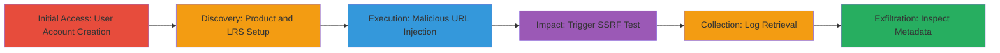

---
tags:
  - ssrf
  - aws
  - metadata
  - lrs
  - xapi
type: attack_chain
tools: []
tactics:
  - '[[Initial Access]]'
commands:
  - '[[commands/curl-post-xapi-to-metadata]]'
  - '[[commands/curl-get-xapi-from-metadata]]'
verified: false
platforms:
  - Web
  - AWS
submitted: true
complexity: medium
created_at: '2023-10-01T00:00:00Z'
procedures:
  - '[[procedures/Create-and-Verify-User-Account]]'
  - '[[procedures/Create-New-Product]]'
  - '[[procedures/Configure-Malicious-LRS-Endpoint]]'
  - '[[procedures/Test-LRS-Configuration-to-Trigger-SSRF]]'
  - '[[procedures/Retrieve-and-Download-Test-Log]]'
  - '[[procedures/Inspect-Exfiltrated-AWS-Metadata]]'
step_count: 6
techniques:
  - '[[Exploit Public-Facing Application]]'
updated_at: '2025-12-14T04:39:10.055Z'
description: >-
  Multi-stage attack exploiting SSRF in the LRS URL field of a web application's
  product creation workflow to access internal AWS metadata service.
skill_level: intermediate
impact_level: high
id: 9180cd12-9648-4d38-a0a0-667a0447dc02
validated: true
mitre_tactics:
  - '[[Initial Access]]'
mitre_techniques:
  - '[[Exploit Public-Facing Application]]'
---
# SSRF via LRS Configuration to Access AWS Instance Metadata

Multi-stage attack chain demonstrating exploitation of a Server-Side Request Forgery (SSRF) vulnerability in the LRS (Learning Record Store) Configurations feature of a web application hosted on AWS. An authenticated user creates a product, configures an LRS with a malicious URL pointing to the AWS instance metadata endpoint (http://169.254.169.254/latest/meta-data?), and triggers a test that causes the server to fetch internal metadata, exfiltrating sensitive details like AMI ID, instance ID, and security groups via downloadable logs.

## Chain Metrics Dashboard

| Metric | Value |
|--------|-------|
| Chain Status | Unverified |
| Total Steps | 6 |
| Execution Time | ~10 minutes |
| Skill Level | Intermediate |
| Complexity | Medium |
| Impact Level | High |

## Attack Flow Visualization

## Prerequisites & Requirements

### Required Tools

- Web browser (e.g., Chrome or Firefox)
- Email client for verification

### Target Environment

- Web application hosted on AWS EC2
- LRS Configurations feature accessible post-authentication
- Internal access to AWS Metadata Service (169.254.169.254)

### Initial Access Requirements

- No prior credentials needed; self-registration allowed
- Valid email for verification (Gmail recommended if issues arise)
- Network access to the target web app (https://█████)

## Detailed Attack Procedures

### Step 1: Create and Verify User Account
procedure: [[procedures/Create-and-Verify-User-Account]]

**Objective**: Gain authenticated access to the application to enable product creation and LRS configuration.

**Instructions**: Navigate to the user registration page and complete the form. Check email for verification and log in.

**Expected Output**: Successful login to the dashboard.

**Success Indicators**:
- Verification email received and account activated
- Dashboard accessible post-login

### Step 2: Create New Product
procedure: [[procedures/Create-New-Product]]

**Objective**: Set up a product entity required for accessing LRS Configurations.

**Instructions**: From the dashboard, visit the product creation page and fill in required details like name and description.

**Expected Output**: Product created and listed in the user's products.

**Success Indicators**:
- Confirmation message for product creation
- Product page accessible for further configuration

### Step 3: Configure Malicious LRS Endpoint
procedure: [[procedures/Configure-Malicious-LRS-Endpoint]]

**Objective**: Inject the SSRF payload by setting the LRS URL to the AWS metadata endpoint and configuring basic auth.

**Instructions**: Access LRS Configurations for the new product, enter the malicious URL http://169.254.169.254/latest/meta-data? (note the question mark), set Basic Auth to 'test:test', and create the configuration.

**Expected Output**: New LRS configuration saved without errors.

**Success Indicators**:
- Configuration listed under LRS section
- No validation errors on URL input

### Step 4: Test LRS Configuration to Trigger SSRF
procedure: [[procedures/Test-LRS-Configuration-to-Trigger-SSRF]]

**Objective**: Execute the test to force the server to make the SSRF request to internal AWS resources.

**Instructions**: Click the 'Test' button next to the new configuration. This sends xAPI statements to the malicious URL via the server.

**Expected Output**: Redirect to homepage; test initiated in background.

**Success Indicators**:
- Test button clickable without restrictions
- New entry appears in 'Past Results'

### Step 5: Retrieve and Download Test Log
procedure: [[procedures/Retrieve-and-Download-Test-Log]]

**Objective**: Access the results of the SSRF test to obtain the exfiltrated response.

**Instructions**: Navigate back to the product page, go to 'Past Results', select 'Manage Test record' > 'Download log', check 'Include HTTP', select 'Plain text' format, and download the log file.

**Expected Output**: 'log' file downloaded containing HTTP requests and responses.

**Success Indicators**:
- Log download option available
- File contains HTTP traffic details

### Step 6: Inspect Exfiltrated AWS Metadata
procedure: [[procedures/Inspect-Exfiltrated-AWS-Metadata]]

**Objective**: Analyze the log to extract sensitive AWS instance details obtained via SSRF.

**Instructions**: Open the downloaded log file in a text editor to view the response from the metadata endpoint, including paths like ami-id, instance-id, and security groups.

**Expected Output**: Text listing internal metadata paths and details.

**Success Indicators**:
- Response shows AWS metadata directory (e.g., 200 OK with ami-id, etc.)
- Potential for credential dumping if IAM roles present

## Attack Chain Summary

### Key Achievements

1. Authenticated access to exploit SSRF in LRS feature
2. Server-side request to AWS metadata service triggered
3. Exfiltration of instance details via downloadable logs, enabling further attacks like key dumping

## Technique & Tactic Coverage

### MITRE ATT&CK Techniques

- [[Exploit Public-Facing Application]] Exploit Public-Facing Application

### MITRE ATT&CK Tactics

- [[Initial Access]] Initial Access

---

*Last updated: 2023-10-01T00:00:00Z*
