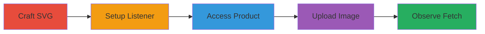

# SSRF via SVG Image Upload in Shopify Product Creation

Multi-stage attack chain exploiting Shopify's SVG parser to perform Server-Side Request Forgery (SSRF) by uploading images that trigger fetches to external URLs or internal files, potentially disclosing sensitive information like local server files.

## Chain Metrics Dashboard

| Metric | Value |
|--------|-------|
| Chain Status | Unverified |
| Total Steps | 5 |
| Execution Time | ~10 minutes |
| Skill Level | Intermediate |
| Complexity | Medium |
| Impact Level | High |

## Attack Flow Visualization



## Prerequisites & Requirements

### Required Tools

- [[tools/Inkscape]]
- [[tools/netcat]]

### Target Environment

- Shopify store with product image upload enabled
- Access to a test server or public URL for verification
- Network access to upload images to the target Shopify instance

### Initial Access Requirements

- Valid Shopify admin credentials for the target store
- No special network position required beyond internet access
- Prior access to create/edit products

## Detailed Attack Procedures

### Step 1: Craft Malicious SVG
procedure: [[procedures/Craft-Malicious-SVG-with-External-Reference]]

**Objective**: Create an SVG file that references an external or internal resource to trigger SSRF upon parsing.

**Instructions**: Use [[tools/Inkscape]] to generate an SVG with an <image> tag containing an xlink:href attribute pointing to a target, such as a public Google image for testing or a local file like /lib/plymouth/ubuntu_logo.png.

**Expected Output**: A valid .svg file ready for upload.

**Success Indicators**:
- SVG file created without errors
- XML structure includes the malicious xlink:href

### Step 2: Set Up Listener
procedure: [[procedures/Set-Up-Netcat-Listener-for-SSRF]]

**Objective**: Prepare a server to capture incoming requests from the Shopify parser to verify SSRF.

**Instructions**: Execute [[commands/netcat-listen-on-port]] to listen on port 3001:

```bash
netcat -l -p 3001 -v
```

**Expected Output**: Listener active, ready to log connections.

**Success Indicators**:
- Netcat reports listening on port 3001
- No port conflicts

### Step 3: Access Product Creation
procedure: [[procedures/Access-Shopify-Product-Creation]]

**Objective**: Navigate to the Shopify interface for uploading product images.

**Instructions**: Log into the Shopify admin at a store like https://whitehatgsl.myshopify.com/ and go to Products > Add Product.

**Expected Output**: Product creation form loaded with image upload section.

**Success Indicators**:
- Admin dashboard accessible
- Image upload field visible

### Step 4: Upload SVG Image
procedure: [[procedures/Upload-SVG-to-Trigger-SSRF]]

**Objective**: Upload the crafted SVG to force the server to fetch the referenced resource.

**Instructions**: In the product image section, select and upload the .svg file; the parser will process it immediately.

**Expected Output**: Image upload succeeds, and server-side fetch occurs.

**Success Indicators**:
- Upload completes without errors
- No SVG rejection by the parser

### Step 5: Observe Results
procedure: [[procedures/Observe-SSRF-Fetch-and-Rendering]]

**Objective**: Verify the SSRF by checking fetches to external, private, or local resources.

**Instructions**: For private tests, monitor [[commands/netcat-listen-on-port]] logs; for public, view the rendered image; for local, confirm internal file display.

**Expected Output**: Logs show GET requests or image renders fetched content.

**Success Indicators**:
- Incoming request captured in netcat
- Image displays external/local content
- Potential internal file disclosure

## Attack Chain Summary

### Key Achievements

1. Successful SSRF triggering via SVG upload
2. Demonstration of external URL fetching
3. Access to local files like ubuntu_logo.png

## Technique & Tactic Coverage

### MITRE ATT&CK Techniques

- [[Exploit Public-Facing Application]]
- [[File and Directory Discovery]]

### MITRE ATT&CK Tactics

- [[Initial Access]]
- [[Discovery]]

---
*Last updated: 2023-10-01T00:00:00Z*
