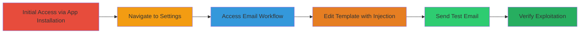

---
tags:
  - ssti
  - shopify
  - rce
  - node-js
type: attack_chain
tools: []
tactics:
  - '[[Initial Access]]'
  - '[[Execution]]'
commands: []
platforms:
  - Web
  - Shopify
complexity: medium
procedures:
  - '[[procedures/Exploit-SSTI-in-Shopify-Return-Magic-Email-Templates]]'
step_count: 6
techniques:
  - '[[Exploit Public-Facing Application]]'
  - '[[Command-Line Interface]]'
description: >-
  Multi-stage attack chain exploiting Server Side Template Injection in
  Shopify's Return Magic app email templates, potentially leading to remote code
  execution.
skill_level: intermediate
impact_level: high
id: 2eed7c88-980e-4e1c-b952-0c332c11a431
created_at: '2025-12-13T09:01:17.074Z'
updated_at: '2025-12-13T09:01:17.074Z'
verified: false
validated: true
submitted: true
mitre_tactics:
  - '[[Initial Access]]'
  - '[[Execution]]'
mitre_techniques:
  - '[[Exploit Public-Facing Application]]'
  - '[[Command-Line Interface]]'
---
# SSTI in Shopify Return Magic Email Templates Leading to Potential RCE

Multi-stage attack chain demonstrating a complete attack workflow exploiting a Server Side Template Injection vulnerability in the Return Magic app on Shopify, allowing arbitrary template expressions to be evaluated server-side in a Node.js environment, potentially leading to remote code execution and server takeover.

## Chain Metrics Dashboard

| Metric | Value |
|--------|-------|
| Chain Status | Unverified |
| Total Steps | 6 |
| Execution Time | ~10 minutes |
| Skill Level | Intermediate |
| Complexity | Medium |
| Impact Level | High |

## Attack Flow Visualization

## Prerequisites & Requirements

### Required Tools

- None (web browser access sufficient)

### Target Environment

- Platform: Web (Shopify)
- Required services: Shopify store with Return Magic app
- Network access: Access to Shopify admin interface

### Initial Access Requirements

- Shopify store ownership or admin access
- Ability to install apps via Shopify admin

## Detailed Attack Procedures

### Step 1: Install Return Magic App
procedure: [[procedures/Exploit-SSTI-in-Shopify-Return-Magic-Email-Templates]]

**Objective**: Gain initial access by installing the vulnerable Return Magic app on a Shopify store.

**Instructions**: Navigate to the Shopify admin interface and install the Return Magic app.

**Expected Output**: App successfully installed and accessible.

**Success Indicators**:
- App appears in Shopify admin apps list
- No installation errors

### Step 2: Navigate to App Settings
procedure: [[procedures/Exploit-SSTI-in-Shopify-Return-Magic-Email-Templates]]

**Objective**: Access the settings page of the Return Magic app.

**Instructions**: Open the app at https://<shop>.myshopify.com/admin/apps/returnmagic.

**Expected Output**: Settings page loads successfully.

**Success Indicators**:
- Settings tab is visible
- Navigation menus appear

### Step 3: Open Email Workflow Settings
procedure: [[procedures/Exploit-SSTI-in-Shopify-Return-Magic-Email-Templates]]

**Objective**: Access the email template configuration area.

**Instructions**: Select the Settings tab, then choose Emails > Workflow from the left menu.

**Expected Output**: Workflow page with email templates displayed.

**Success Indicators**:
- List of editable email templates shown
- Edit options available

### Step 4: Edit Email Template with Test Expression
procedure: [[procedures/Exploit-SSTI-in-Shopify-Return-Magic-Email-Templates]]

**Objective**: Inject a test expression to check for SSTI vulnerability.

**Instructions**: Click Edit on any template, switch to code view, and insert '{{this}}' into the template.

**Expected Output**: Template saved with injected expression.

**Success Indicators**:
- No validation errors on save
- Expression persists in template code

### Step 5: Send Test Email
procedure: [[procedures/Exploit-SSTI-in-Shopify-Return-Magic-Email-Templates]]

**Objective**: Trigger the template rendering by sending a test email.

**Instructions**: Return to the Workflow page, click 'Send me a test email', and enter a valid email address.

**Expected Output**: Test email sent successfully.

**Success Indicators**:
- Confirmation of email sent
- Email arrives in inbox

### Step 6: Verify Rendered Output
procedure: [[procedures/Exploit-SSTI-in-Shopify-Return-Magic-Email-Templates]]

**Objective**: Confirm SSTI by checking the email content for evaluated expressions.

**Instructions**: Check the received email for rendered output like '[Object Object]', indicating server-side evaluation in Node.js.

**Expected Output**: Email contains evidence of template injection, such as '[Object Object]'.

**Success Indicators**:
- Injected expression is evaluated and visible
- Confirms potential for RCE escalation

## Attack Chain Summary

### Key Achievements

1. Identification of SSTI vulnerability in email templates
2. Confirmation of Node.js server-side evaluation
3. Potential path to remote code execution and server takeover

## Technique & Tactic Coverage

### MITRE ATT&CK Techniques

- [[Exploit Public-Facing Application]]
- [[Command-Line Interface]]

### MITRE ATT&CK Tactics

- [[Initial Access]]
- [[Execution]]

*Last updated: 2023-10-01*
