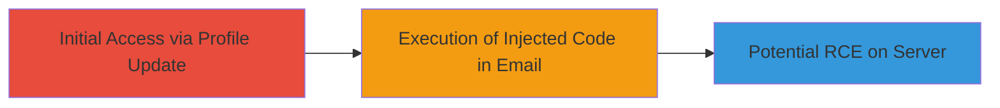

# SSTI in Uber Profile Name via Jinja2 for Potential RCE

Multi-stage attack chain demonstrating exploitation of a Server-Side Template Injection vulnerability in Uber's rider.uber.com profile name field, which is rendered unsanitized in Jinja2 email templates, allowing arbitrary Python code execution and potential RCE.

## Chain Metrics Dashboard

| Metric | Value |
|--------|-------|
| Chain Status | Unverified |
| Total Steps | 2 |
| Execution Time | ~5 minutes |
| Skill Level | Intermediate |
| Complexity | Medium |
| Impact Level | High |

## Attack Flow Visualization



## Prerequisites & Requirements

### Required Tools

- None (browser-based)

### Target Environment

- Web platform (rider.uber.com)
- Required services/ports: HTTPS access to rider.uber.com and email receipt
- Network access requirements: Valid Uber account

### Initial Access Requirements

- Credential requirements: Valid Uber rider account
- Network position: Internet access
- Prior access needed: Ability to update profile name

## Detailed Attack Procedures

### Step 1: Test Basic SSTI Injection - [[procedures/Test-Basic-SSTI-Injection-in-Profile-Name]]

**Procedure**: [[procedures/Test-Basic-SSTI-Injection-in-Profile-Name]]

**Objective**: Confirm the presence of SSTI by injecting a simple Jinja2 expression into the profile name and observing evaluation in the confirmation email.

**Expected Output**: The email body renders the injected expression, e.g., '7777777'.

**Success Indicators**:
- Email received from support@uber.com
- Injected expression evaluated in email content

First, update the profile name on rider.uber.com using [[commands/jinja2-basic-expression]]:

```
{{ '7'*7 }}
```

Trigger the profile update to send a confirmation email and check for the rendered output '7777777'.

### Step 2: Explore Advanced SSTI Payloads - [[procedures/Explore-Advanced-SSTI-Payloads-for-Exploitation]]

**Procedure**: [[procedures/Explore-Advanced-SSTI-Payloads-for-Exploitation]]

**Objective**: Confirm full SSTI capabilities by injecting advanced payloads to list classes, subclasses, and execute loops, exploring potential for RCE.

**Expected Output**: Email renders lists of classes/subclasses or loop outputs.

**Success Indicators**:
- Advanced expressions evaluated in email
- Access to internal Python classes demonstrated

Update the profile name with advanced payloads. Start with [[commands/jinja2-list-classes]] to list classes:

```
{{ [].__class__.__bases__[0].__subclasses__() }}
```

Then use [[commands/jinja2-list-subclasses-mro]]:

```
{{''.__class__.mro()[1].__subclasses__()}}
```

Finally, test control flow with [[commands/jinja2-loop-construct]]:

```
{{c,c,c}}
```

Observe the rendered results in the confirmation email to confirm exploitation potential.

## Attack Chain Summary

### Key Achievements

1. Confirmed SSTI vulnerability in profile name rendering
2. Demonstrated arbitrary code execution in email templates
3. Explored paths to potential RCE despite input length limits

## Technique & Tactic Coverage

### MITRE ATT&CK Techniques

- [[Exploit Public-Facing Application]]
- [[Command-Line Interface]]

### MITRE ATT&CK Tactics

- [[Initial Access]]
- [[Execution]]

---

*Last updated: 2023-10-01T00:00:00Z*
